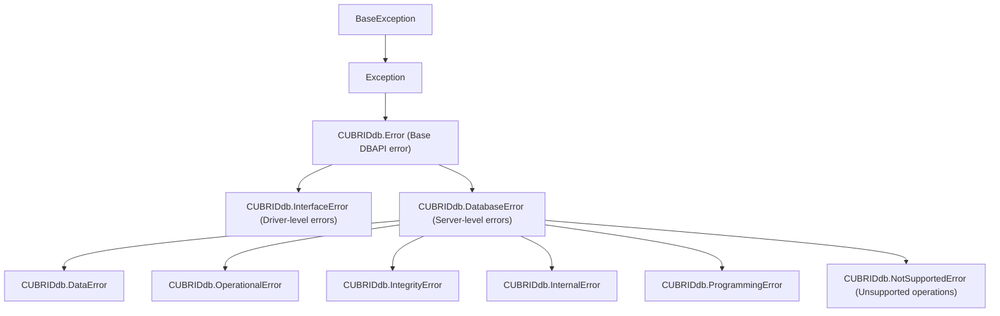

# CUBRID-Python Driver Compatibility

This document describes the tested compatibility matrix between `sqlalchemy-cubrid`,
the CUBRID Python driver (`CUBRIDdb`), and CUBRID server versions.

---

## Table of Contents

- [Driver Overview](#driver-overview)
- [Version Compatibility Matrix](#version-compatibility-matrix)
- [Exception Hierarchy](#exception-hierarchy)
- [Driver API Usage](#driver-api-usage)
- [Known Issues](#known-issues)
- [Installation Notes](#installation-notes)

---

## Driver Overview

| Property | Value |
|---|---|
| Supported install | Built from source, [cubrid-python](https://github.com/CUBRID/cubrid-python) v11.3.0.51 or later ([how](#building-cubriddb-from-source)) |
| PyPI package | `CUBRID-Python`, newest release 9.3.x (2015): **untested, not supported** ([details](#pypi-cubrid-python-93x-is-not-supported)) |
| Import name | `CUBRIDdb` |
| Type | C extension (CPython only) |
| DBAPI level | DB-API 2.0 (PEP 249) |
| Parameter style | `qmark` |
| Source | [github.com/CUBRID/cubrid-python](https://github.com/CUBRID/cubrid-python) |

The driver wraps the CUBRID CCI (C Client Interface) library. It is **not** a pure
Python driver and requires compilation against the CCI headers.

---

## Version Compatibility Matrix

### Tested Configurations

| sqlalchemy-cubrid | CUBRID-Python Driver | CUBRID Server | Python | Status |
|---|---|---|---|---|
| 0.4.0 | v11.3.0.51 | 11.4 | 3.10 – 3.14 | ✅ Tested in CI |
| 0.4.0 | v11.3.0.51 | 11.2 | 3.10 – 3.14 | ✅ Tested in CI |
| 0.4.0 | v11.3.0.51 | 11.0 | 3.10 – 3.14 | ✅ Tested in CI |
| 0.4.0 | v11.3.0.51 | 10.2 | 3.10 – 3.14 | ✅ Tested in CI |
| 0.3.x | v11.3.0.51 | 10.2 – 11.4 | 3.10 – 3.13 | ✅ Tested |
| any | PyPI `CUBRID-Python` 9.3.x | any | any | ❌ Not tested, not supported ([details](#pypi-cubrid-python-93x-is-not-supported)) |

### CUBRID Server Version Support

| Server Version | Driver Version | Notes |
|---|---|---|
| 11.4 | v11.3.0.51 | Latest stable |
| 11.2 | v11.3.0.51 | LTS release |
| 11.0 | v11.3.0.51 | Legacy support |
| 10.2 | v11.3.0.51 | Minimum supported |
| 12.x | — | Not yet released; will be tested when available |

### Python Version Support

| Python | Status | Notes |
|---|---|---|
| 3.10 | ✅ Fully supported | Minimum version |
| 3.11 | ✅ Fully supported | |
| 3.12 | ✅ Fully supported | |
| 3.13 | ✅ Fully supported | |
| 3.14 | 🔄 CI matrix added | Pre-release; depends on driver C extension compatibility |

---

## Exception Hierarchy

CUBRIDdb 11.3.0.51 (module `_cubrid`) provides every PEP 249 exception class
except `Warning`:



The class a server error gets comes from the driver's error-code mapping.
Observed on CUBRID 11.4:

| Error (native code) | CUBRIDdb class |
|---|---|
| Syntax error or unknown table (-493) | `ProgrammingError` |
| NOT NULL (-631), foreign key (-922), unique (-670) | `IntegrityError` |
| Division by zero (-494) | `IntegrityError` |
| Failed `CAST` (-181) | `DatabaseError` |
| Reading a result after `rollback()` (CCI -20040) | `InterfaceError` |

SQLAlchemy wraps the class it receives, so `cubrid://` raises
`sqlalchemy.exc.IntegrityError` for constraint violations; see
[Known Issue 9](#9-not-null--foreign-key-violations-on-pycubrid-171-and-earlier) for
pycubrid. The `sqlalchemy-cubrid` dialect uses **string-based message matching**
to distinguish disconnect errors from other failures.

---

## Driver API Usage

The dialect relies on these driver-specific APIs:

### Connection Methods

| Method | Purpose | Used by |
|---|---|---|
| `conn.ping()` | Check connection liveness | `CubridDialect.do_ping()` |
| `conn.get_last_insert_id()` | Get auto-increment value | `CubridExecutionContext.get_lastrowid()` |
| `conn.set_autocommit(bool)` / `conn.autocommit` | Control autocommit | `CubridDialect.on_connect()`, `set_isolation_level()` (`AUTOCOMMIT` and back), `detect_autocommit_setting()` |
| `conn.cursor()` | Create cursor | Standard DB-API |

### Error Code Extraction

```python
# Error codes are in exception.args[0]
try:
    cursor.execute("invalid sql")
except CUBRIDdb.DatabaseError as e:
    code = e.args[0]  # int
```

The dialect's `_extract_error_code()` reads only an integer `args[0]`. A string
`args[0]` never carries a code, even when it starts with a number (e.g.
`"-20004 rows rejected ..."` quoted from application data); releases up to 1.8.0
parsed such a leading number as a code and could invalidate a working connection
(#608).

pycubrid keeps only the message in `args` and the server error code in `errno`
(and `code`). `is_disconnect()` reads `errno` for the server codes listed in
[Known Issue 1](#1-disconnect-detection-does-not-use-operationalerror). pycubrid's
`str()` also appends a description of `errno` (for example `Communication error`
for -4 and -671), so the message patterns are matched against `args[0]`, the
driver's own message, instead.

---

## Known Issues

### 1. Disconnect detection does not use `OperationalError`

CUBRIDdb 11.3.0.51 defines `OperationalError` (see
[Exception Hierarchy](#exception-hierarchy)), but the dialect's
`is_disconnect()` does not classify disconnects by exception class. Instead, it uses:
- String pattern matching against 16 known disconnect messages
- Numeric error code matching, on `args[0]` (CUBRIDdb only), for the CCI and CAS
  codes of a dead or unusable connection: -20004 (`CCI_ER_COMMUNICATION`), -10003
  (`CAS_ER_COMMUNICATION`; CCI treats both as communication errors), -20002
  (`CCI_ER_CON_HANDLE`), -20016 (`CCI_ER_CONNECT`) and -10002
  (`CAS_ER_NO_MORE_MEMORY`; the CAS closes the connection after sending it). Releases
  up to 1.8.0 listed -4, -10005, -10007, -21003 and -21005 instead (#572): -4 is the
  server's `ER_INTERRUPTED` (a query interrupted by `KILL QUERY`), so CUBRIDdb
  invalidated a working connection; -10005 and -10007 are `CAS_ER_TRAN_TYPE` and
  `CAS_ER_NUM_BIND`; -21003 and -21005 are CUBRID JDBC codes that neither Python
  driver raises. -20004, which CUBRIDdb raises when its CAS dies mid-transaction, and
  -10002 were missing (#578).
- Numeric error code matching, on both drivers, for the server errors that make the
  broker reset the CAS because its session with `cub_server` is gone: -111
  (`ER_TM_SERVER_DOWN_UNILATERALLY_ABORTED`), -199 (`ER_NET_SERVER_CRASHED`), -224
  (`ER_OBJ_NO_CONNECT`) and -677 (`ER_BO_CONNECT_FAILED`). After `cub_server` stops or
  crashes, a connection in a transaction gets -111 and then -224 on every statement
  until the transaction ends, even after the server is back (#565). -671
  (`ER_CSS_RECV_OR_SEND`) is not included: the broker does not reset the CAS for it.
  See [Troubleshooting](TROUBLESHOOTING.md#errors-after-a-cub_server-restart-or-crash).
- Numeric error code matching, on pycubrid's `errno` only, for CAS codes as pycubrid
  actually receives them: CUBRID's CAS legacy-renumbers `cas_error.h` codes (adds 9000)
  for a driver, like pycubrid, that never advertises understanding the renewed
  error-code protocol. -1002 (legacy `CAS_ER_NO_MORE_MEMORY`, i.e. -10002 + 9000) is
  matched this way (#578).

### 2. CCI Library Dependency

The driver requires the CCI library to be compiled from source. In CI, this is handled by:
```bash
git clone --branch v11.3.0.51 --depth 1 --recurse-submodules https://github.com/CUBRID/cubrid-python.git
cd cubrid-python/cci-src && mkdir build_x86_64_release && cd build_x86_64_release
cmake ../ && make -j$(nproc)
```

### 3. `cursor.lastrowid` Not Available

The standard DB-API `cursor.lastrowid` attribute is not implemented. The dialect
uses `connection.get_last_insert_id()` instead, with a `SELECT LAST_INSERT_ID()`
SQL fallback.

The fallback opens a regular cursor on the active DBAPI connection and closes it
after fetching the ID, including when execution, fetching, or integer conversion
raises. It does not require server-side cursor support. The pycubrid execution
context uses the same fallback when `cursor.lastrowid` is unavailable. A native
driver result of `None` is returned directly without running the fallback query.

### 4. CUBRID 12.x Compatibility

CUBRID 12 has not yet been released. When available, the driver and dialect will be
tested and the CI matrix updated. Potential concerns:
- CCI API changes may require driver recompilation
- New SQL features may need compiler updates
- New data types may need type mapping additions

### 5. `NUMERIC` / `DECIMAL` fractional precision is lost

The `CUBRIDdb` C-extension driver truncates the fractional part of
`NUMERIC` / `DECIMAL` values *below* the DB-API layer: a column storing
`15.7563` comes back as `15`. Because the digits are discarded inside the
driver before SQLAlchemy receives the value, no dialect result processor can
recover them. This is an upstream driver limitation, not a dialect bug.

Use the pure-Python `cubrid+pycubrid://` driver for correct `Decimal`
round-trips — it returns `Decimal` values natively with full precision
(verified on CUBRID 11.4). This is one of the reasons `pycubrid` is the
recommended driver for new projects.

### 6. `BLOB` / `CLOB` reads return a LOB locator

Verified live on CUBRID 10.2 and 11.4 (#485). With every released driver, binding
`bytes` / `str` into a `BLOB` / `CLOB` column stores the full value and `NULL`
round-trips as `None`. Selecting a non-NULL `BLOB` / `CLOB` column, however,
returns the driver's LOB locator instead of `bytes` / `str`:

| Driver URL | Non-NULL `BLOB` / `CLOB` read returns |
|---|---|
| `cubrid://` (`CUBRIDdb` 11.3) | server file-locator `str` (`'file:...'`) |
| `cubrid+pycubrid://` (pycubrid 1.3.2 to 1.7.1) | LOB-handle `dict` (`lob_type`, `lob_length`, `file_locator`, ...) |
| `cubrid+aiopycubrid://` (pycubrid 1.7.1) | LOB-handle `dict` (binding `LargeBinary` / `BLOB` values, including `None`, works since #500) |

For `LargeBinary` / `BLOB`, SQLAlchemy's result processor then raises `TypeError`.
To read content, convert on the server (`CLOB_TO_CHAR(col)`, `BLOB_TO_BIT(col)`),
or store large text in `sqlalchemy.Text` (CUBRID `STRING`), which round-trips as
`str`. Official pycubrid LOB fetch is tracked in cubrid-lab/pycubrid#441. See also
[Types](TYPES.md).

### 7. `executemany` reuses the previous row's value for `None` (dialect guard)

`CUBRIDdb` 11.3.0.51 (the `cubrid://` driver) has two `executemany()` bugs:

- **Wrong data.** Its `_bind_params` skips `None`, and `executemany` prepares
  the statement once. A `None` parameter therefore keeps the previous row's
  bound value, so `[(1, 'a'), (2, None)]` stores `(2, 'a')`.
- **Wrong rowcount.** `cursor.rowcount` reports only the last row's count.

Through SQLAlchemy, these bugs made `text()` and Core `UPDATE`/`DELETE`
executemany store wrong data. Batched ORM UPDATEs raised `StaleDataError`
(`expected to update 3 row(s); 1 were matched`). The driver cannot be worked
around from the outside because `bind_param(i, None)` raises `SystemError`.

**Dialect guard (#502).** `CubridDialect.do_executemany` runs each parameter set
with `cursor.execute()` and sets `cursor.rowcount` to the total. Each
`execute()` prepares the statement again, so an unbound `None` becomes NULL. The
guard always applies, not only when a row contains `None`, because the
last-row rowcount is wrong for every statement. With the guard,
`supports_sane_multi_rowcount` is accurate on both drivers. The cost is one
statement prepare per row on plain executemany. A multi-row Core `insert()`
that uses insertmanyvalues goes through `do_execute` and does not use the
guard. An INSERT into a table with a column whose type defines
`bind_expression()` falls back to executemany (#421), so on `cubrid://` it
does use the per-row guard. Code that calls `CUBRIDdb`'s `cursor.executemany()` directly, without
SQLAlchemy, is still affected.

`cubrid+pycubrid://` and `cubrid+aiopycubrid://` bind `None` correctly and sum
the rowcount, so they keep the driver's prepare-once `executemany`.

The guard will be removed once a fixed `CUBRIDdb` release is the minimum
supported version. An upstream report to CUBRID/cubrid-python is pending, and
#502 tracks it.

### 8. Unfinished results after `commit()` / `rollback()`

Verified live on CUBRID 10.2 and 11.4 (#481) with a 500-row result that needs
several FETCH round trips (pycubrid fetches 100 rows per batch; the broker's
first response held 16 of these 1000-byte rows). Reading the rest of a sync
`Result` after `Connection.commit()` / `rollback()` behaves differently per
driver:

| Driver | After `commit()` | After `rollback()` |
|---|---|---|
| `cubrid://` (`CUBRIDdb` 11.3) | all rows | `InterfaceError` (CCI -20040) |
| `cubrid+pycubrid://` (pycubrid 1.7.1) | **silently returns only the rows already buffered** on a connection that completed an earlier query (the normal state of a pooled connection); `OperationalError` otherwise | same as commit |
| `cubrid+aiopycubrid://` | all rows: `AsyncConnection.execute()` buffers the whole result before it returns | all rows |
| raw `pycubrid.aio` cursor (pycubrid 1.7.1) | **silently returns only the buffered rows** | same as commit |

**Fixed in pycubrid 1.8.0:** cubrid-lab/pycubrid#395 makes pycubrid raise
`InterfaceError` instead of returning a partial result, and the contract tests
require that behavior. With pycubrid 1.7.1 or earlier, fully consume a result
before ending its transaction. `AsyncConnection.stream()` is not
available because the dialect does not support server-side cursors.

### 9. NOT NULL / foreign-key violations on pycubrid 1.7.1 and earlier

Verified live on CUBRID 10.2 and 11.4 (#480). SQLAlchemy wraps the DB-API
exception class it receives, so the SQLAlchemy exception class depends on the
driver:

| Violation (native code) | `cubrid://` (`CUBRIDdb` 11.3) | `cubrid+pycubrid://` / `cubrid+aiopycubrid://` (pycubrid 1.7.1) |
|---|---|---|
| NOT NULL (-631) | `IntegrityError` | `DatabaseError` |
| Foreign key (-922) | `IntegrityError` | `DatabaseError` |
| Unique / primary key (-670) | `IntegrityError` | `IntegrityError` |

**Fixed in pycubrid 1.8.0:** cubrid-lab/pycubrid#390 raises `IntegrityError`
for NOT NULL and foreign-key violations, matching `CUBRIDdb`, and the contract
tests require that behavior. With pycubrid 1.7.1 or earlier, catch
`sqlalchemy.exc.DatabaseError` (the base of `IntegrityError`) for NOT NULL and
foreign-key failures through pycubrid. The dialect deliberately does not
reclassify exceptions by message. On every driver the connection or `Session`
remains usable after `rollback()`.

### 10. pycubrid replaces the session after a CAS restart (dialect re-applies the isolation level)

**Fixed in pycubrid 1.8.0** (cubrid-lab/pycubrid#468, #472), the minimum
supported version. Before 1.8.0, pycubrid opened a new broker session after
every driver `commit()` / `rollback()` (the broker reports the CAS as out of
transaction then), so the level dropped to the server default (READ COMMITTED)
and session variables were lost (#505). pycubrid 1.8.0 keeps the CAS session
across `commit()` / `rollback()` and in autocommit mode: before the next request
it probes an out-of-transaction CAS with `CHECK_CAS` and reconnects only when
the CAS is gone. `CUBRIDdb` has always kept the same session.

**Residual case: a replaced CAS.** When the CAS does go away (for example a CAS
restart after a transaction, such as the `APPL_SERVER_MAX_SIZE` memory restart,
or a broker reset), pycubrid 1.8.0 opens a new session. That session starts at
the server default isolation level, pycubrid restores only `autocommit`, and
session state set with raw SQL (`SET @var`, a `SET TRANSACTION` statement you
run yourself) is lost. Set the level server-side (`isolation_level` in
`cubrid.conf`) if it must survive this without the dialect.

**Dialect re-apply.** `cubrid+pycubrid://` and `cubrid+aiopycubrid://`
remember the isolation level they set on each connection and re-apply it
(`SET TRANSACTION ISOLATION LEVEL` + `COMMIT`) after every commit and rollback,
only on connections with a configured level. An engine-level
`isolation_level` survives commits, rollbacks and pool checkins. A
connection-level `execution_options(isolation_level=...)` survives commits and
rollbacks while that `Connection` stays open; on checkin SQLAlchemy restores
the engine level (or the server default when none is configured), and on an
engine without a configured level checkin stops the re-apply for that
connection. The re-apply is the first request after the end of the
transaction, so when the CAS is replaced at that point, it runs on the new
session and the level is kept (verified with pycubrid 1.8.0 on CUBRID 11.4 by
killing the CAS right after `commit()`: the level stays SERIALIZABLE, and drops
to READ COMMITTED without the re-apply). If the re-apply itself fails, the
commit or rollback still reports success (or the rollback's original exception
still propagates): the failure is logged as a warning and retried at the start
of the next transaction, where a second failure raises before any statement
runs.

**Idle connections with a configured level.** The re-apply's SQL `COMMIT`
leaves the CAS marked as in transaction, so the broker keeps that CAS bound to
the pooled connection while it sits idle (`CLIENT_WAIT` in
`cubrid broker status`; `CLOSE_WAIT` without a configured level). Size the
broker's `MAX_NUM_APPL_SERVER` for the pool. It also means pycubrid does not
reconnect such a connection by itself if its CAS is killed while idle: the next
statement raises `OperationalError`, which the dialect reports as a disconnect,
so SQLAlchemy discards the connection instead of silently running at the server
default level. With `create_engine(..., pool_pre_ping=True)` the pool replaces
it at checkout, and the new connection gets the engine level.

**`AUTOCOMMIT` on pycubrid.** pycubrid 1.8.0 keeps the session in autocommit
mode, so statements keep the server level that was in effect and session
variables survive between statements, as on `CUBRIDdb`. The dialect stops
re-applying a level once a connection is switched to `AUTOCOMMIT`.

### 11. Collection parameters (SET, MULTISET, SEQUENCE)

The drivers bind a Python `list`, `tuple` or `set` for a collection column
differently (#484; verified on CUBRID 10.2 and 11.4):

| Driver | Binding a `list` / `tuple` / `set` | Reading a collection |
|---|---|---|
| pycubrid main (typed collection parameters, cubrid-lab/pycubrid#567) | The dialect wraps the value in `pycubrid.types.Set`, `Multiset` or `Sequence` to match the column type. `SET`, `MULTISET` and `SEQUENCE` semantics are kept. A `SEQUENCE` takes only a `list` or `tuple`: a `set`/`frozenset` raises `TypeError` ("SEQUENCE is ordered; pass a list or tuple"). | `frozenset` (`SET`) or `list` (`MULTISET`, `SEQUENCE`) with `?decode_collections=true`; raw `bytes` without it |
| pycubrid 1.8.0 (released) | `ProgrammingError`: pycubrid rejects collection parameters. A `set`/`frozenset` for a `SEQUENCE` raises the same `TypeError` as above, from the dialect. | Same as above |
| CUBRIDdb 11.3.0.51 | CUBRIDdb binds the value itself, always as a SET host variable. A MULTISET loses its duplicates and a SEQUENCE its order (`[3, 1, 2, 1]` is stored as `{1, 2, 3}`). `None` elements are not supported: `[None]` fails inside the driver with an `UnboundLocalError`, and `[1, None]` with `-494 Cannot coerce host var to type sequence`. | `set` (`SET`) or `list` (`MULTISET`, `SEQUENCE`) of `str` elements, whatever the element type |

The dialect does not change what CUBRIDdb does. On CUBRIDdb, keep collections
that need duplicates or order out of bound parameters: write the collection
literal in SQL (`MULTISET{1, 1}`, `SEQUENCE{3, 1, 2}`), or use
`cubrid+pycubrid://`. See [Type Mapping, Collection values](TYPES.md#collection-values).

---

## Installation Notes

For the pure Python pycubrid dialect variants, install `sqlalchemy-cubrid[pycubrid]` with `pycubrid>=1.8.0,<2.0`. pycubrid 1.8.0 is the minimum because it keeps the CAS session across `commit()` / `rollback()` and ships the fixes the contract tests require ([Known Issues 8 to 10](#8-unfinished-results-after-commit--rollback)); it also provides the native sync and async `ping(False)` used by `pool_pre_ping`.

The `[pycubrid]` extra supports both sync and async connections. It includes
`SQLAlchemy[asyncio]`, which supplies `greenlet` on SQLAlchemy 2.0 and 2.1. The
`[dev]` extra also includes this bridge for async test imports. Bare installation
keeps its existing SQLAlchemy dependency. The pycubrid driver remains pure Python,
but `greenlet` may require build tools when no compatible wheel is available.

### PyPI `CUBRID-Python` 9.3.x is not supported

The newest `CUBRID-Python` release on PyPI is 9.3.0.2 (sdist only, uploaded in 2015).
There is no 11.x release on PyPI. The `[cubrid]` and `[cubriddb]` extras depend on
`CUBRID-Python` without a version bound, so they install 9.3.x. That driver is not
tested with this dialect. On CUBRID 11.4 it returns `BIGINT` values (including
`COUNT(*)`) as `str` (#583) and fails parts of the integration suite: autocommit,
large-object round-trips, fetch shapes, ping and recursive CTEs (#585).

- **The `[cubrid]` and `[cubriddb]` extras are deprecated.** They are kept so that
  existing installs keep resolving, but they cannot install a supported driver.
- At the first connection, a `cubrid://` or `cubrid+cubriddb://` engine reads the loaded
  driver's version (`_cubrid.__version__`) and emits a `sqlalchemy.exc.SAWarning` if it is
  older than 11.3. It warns rather than refusing to connect, so existing deployments
  keep working. To fail fast instead, turn the warning into an error:
  `warnings.filterwarnings("error", message="CUBRIDdb .* is older", category=SAWarning)`.
- Supported paths: use the recommended pure-Python driver
  (`pip install "sqlalchemy-cubrid[pycubrid]"`, `cubrid+pycubrid://`), or build CUBRIDdb
  from source as shown below.

### Building CUBRIDdb from Source

This is the recipe CI uses:

```bash
# Clone the driver with its CCI submodule
git clone --branch v11.3.0.51 --depth 1 --recurse-submodules \
  https://github.com/CUBRID/cubrid-python.git
cd cubrid-python

# Build the CCI library
mkdir -p cci-src/build_x86_64_release && cd cci-src/build_x86_64_release
cmake ../ && make -j$(nproc)
cd ../..

# Skip setup.py's own CCI rebuild, then install
printf '#!/bin/bash\nexit 0\n' > build_cci.sh
pip install .
```

A build from source installs the `cubrid_python` distribution. Its fourth version
component is a git commit count, not the release tag, so a shallow clone of v11.3.0.51
reports `11.3.0.0001`.

### Verify Installation

```python
import CUBRIDdb
print(CUBRIDdb._cubrid.__version__)  # b'11.3.0.0001' for a v11.3.0.51 build; b'9.3.0.0001' is the PyPI release
```

---

*See also: [Connection Guide](CONNECTION.md) · [Development](DEVELOPMENT.md) · [Feature Support](FEATURE_SUPPORT.md)*
