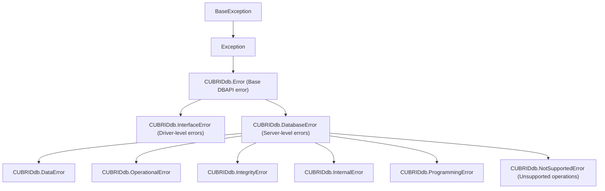

# CUBRID-Python Driver Compatibility

This document describes the tested compatibility matrix between `sqlalchemy-cubrid`,
the CUBRID Python driver (`CUBRIDdb`), and CUBRID server versions.

---

## Table of Contents

- [Driver Overview](#driver-overview)
- [Version Compatibility Matrix](#version-compatibility-matrix)
- [Exception Hierarchy](#exception-hierarchy)
- [Driver API Usage](#driver-api-usage)
- [Known Issues](#known-issues)
- [Installation Notes](#installation-notes)

---

## Driver Overview

| Property | Value |
|---|---|
| PyPI package | `CUBRID-Python` |
| Import name | `CUBRIDdb` |
| Type | C extension (CPython only) |
| DBAPI level | DB-API 2.0 (PEP 249) |
| Parameter style | `qmark` |
| Source | [github.com/CUBRID/cubrid-python](https://github.com/CUBRID/cubrid-python) |

The driver wraps the CUBRID CCI (C Client Interface) library. It is **not** a pure
Python driver and requires compilation against the CCI headers.

---

## Version Compatibility Matrix

### Tested Configurations

| sqlalchemy-cubrid | CUBRID-Python Driver | CUBRID Server | Python | Status |
|---|---|---|---|---|
| 0.4.0 | v11.3.0.51 | 11.4 | 3.10 – 3.14 | ✅ Tested in CI |
| 0.4.0 | v11.3.0.51 | 11.2 | 3.10 – 3.14 | ✅ Tested in CI |
| 0.4.0 | v11.3.0.51 | 11.0 | 3.10 – 3.14 | ✅ Tested in CI |
| 0.4.0 | v11.3.0.51 | 10.2 | 3.10 – 3.14 | ✅ Tested in CI |
| 0.3.x | v11.3.0.51 | 10.2 – 11.4 | 3.10 – 3.13 | ✅ Tested |

### CUBRID Server Version Support

| Server Version | Driver Version | Notes |
|---|---|---|
| 11.4 | v11.3.0.51 | Latest stable |
| 11.2 | v11.3.0.51 | LTS release |
| 11.0 | v11.3.0.51 | Legacy support |
| 10.2 | v11.3.0.51 | Minimum supported |
| 12.x | — | Not yet released; will be tested when available |

### Python Version Support

| Python | Status | Notes |
|---|---|---|
| 3.10 | ✅ Fully supported | Minimum version |
| 3.11 | ✅ Fully supported | |
| 3.12 | ✅ Fully supported | |
| 3.13 | ✅ Fully supported | |
| 3.14 | 🔄 CI matrix added | Pre-release; depends on driver C extension compatibility |

---

## Exception Hierarchy

CUBRIDdb 11.3.0.51 (module `_cubrid`) provides every PEP 249 exception class
except `Warning`:



The class a server error gets comes from the driver's error-code mapping.
Observed on CUBRID 11.4:

| Error (native code) | CUBRIDdb class |
|---|---|
| Syntax error or unknown table (-493) | `ProgrammingError` |
| NOT NULL (-631), foreign key (-922), unique (-670) | `IntegrityError` |
| Division by zero (-494) | `IntegrityError` |
| Failed `CAST` (-181) | `DatabaseError` |
| Reading a result after `rollback()` (CCI -20040) | `InterfaceError` |

SQLAlchemy wraps the class it receives, so `cubrid://` raises
`sqlalchemy.exc.IntegrityError` for constraint violations; see
[Known Issue 9](#9-not-null--foreign-key-violations-on-released-pycubrid) for
pycubrid. The `sqlalchemy-cubrid` dialect uses **string-based message matching**
to distinguish disconnect errors from other failures.

---

## Driver API Usage

The dialect relies on these driver-specific APIs:

### Connection Methods

| Method | Purpose | Used by |
|---|---|---|
| `conn.ping()` | Check connection liveness | `CubridDialect.do_ping()` |
| `conn.get_last_insert_id()` | Get auto-increment value | `CubridExecutionContext.get_lastrowid()` |
| `conn.set_autocommit(bool)` | Control autocommit | `CubridDialect.on_connect()` |
| `conn.cursor()` | Create cursor | Standard DB-API |

### Error Code Extraction

```python
# Error codes are in exception.args[0]
try:
    cursor.execute("invalid sql")
except CUBRIDdb.DatabaseError as e:
    code = e.args[0]  # int or str
```

The dialect's `_extract_error_code()` handles both integer codes and string-embedded
codes (e.g., `"-21003 Cannot communicate with broker"`).

---

## Known Issues

### 1. Disconnect detection does not use `OperationalError`

CUBRIDdb 11.3.0.51 defines `OperationalError` (see
[Exception Hierarchy](#exception-hierarchy)), but the dialect's
`is_disconnect()` does not classify disconnects by exception class. Instead, it uses:
- String pattern matching against 15 known disconnect messages
- Numeric error code matching for CCI communication errors

### 2. CCI Library Dependency

The driver requires the CCI library to be compiled from source. In CI, this is handled by:
```bash
git clone --branch v11.3.0.51 --depth 1 https://github.com/CUBRID/cubrid-python.git
cd cubrid-python/cci-src && mkdir build_x86_64_release && cd build_x86_64_release
cmake ../ && make -j$(nproc)
```

### 3. `cursor.lastrowid` Not Available

The standard DB-API `cursor.lastrowid` attribute is not implemented. The dialect
uses `connection.get_last_insert_id()` instead, with a `SELECT LAST_INSERT_ID()`
SQL fallback.

The fallback opens a regular cursor on the active DBAPI connection and closes it
after fetching the ID, including when execution, fetching, or integer conversion
raises. It does not require server-side cursor support. The pycubrid execution
context uses the same fallback when `cursor.lastrowid` is unavailable. A native
driver result of `None` is returned directly without running the fallback query.

### 4. CUBRID 12.x Compatibility

CUBRID 12 has not yet been released. When available, the driver and dialect will be
tested and the CI matrix updated. Potential concerns:
- CCI API changes may require driver recompilation
- New SQL features may need compiler updates
- New data types may need type mapping additions

### 5. `NUMERIC` / `DECIMAL` fractional precision is lost

The `CUBRIDdb` C-extension driver truncates the fractional part of
`NUMERIC` / `DECIMAL` values *below* the DB-API layer: a column storing
`15.7563` comes back as `15`. Because the digits are discarded inside the
driver before SQLAlchemy receives the value, no dialect result processor can
recover them. This is an upstream driver limitation, not a dialect bug.

Use the pure-Python `cubrid+pycubrid://` driver for correct `Decimal`
round-trips — it returns `Decimal` values natively with full precision
(verified on CUBRID 11.4). This is one of the reasons `pycubrid` is the
recommended driver for new projects.

### 6. `BLOB` / `CLOB` reads return a LOB locator

Verified live on CUBRID 10.2 and 11.4 (#485). With every released driver, binding
`bytes` / `str` into a `BLOB` / `CLOB` column stores the full value and `NULL`
round-trips as `None`. Selecting a non-NULL `BLOB` / `CLOB` column, however,
returns the driver's LOB locator instead of `bytes` / `str`:

| Driver URL | Non-NULL `BLOB` / `CLOB` read returns |
|---|---|
| `cubrid://` (`CUBRIDdb` 11.3) | server file-locator `str` (`'file:...'`) |
| `cubrid+pycubrid://` (pycubrid 1.3.2 to 1.7.1) | LOB-handle `dict` (`lob_type`, `lob_length`, `file_locator`, ...) |
| `cubrid+aiopycubrid://` (pycubrid 1.7.1) | LOB-handle `dict` (binding `LargeBinary` / `BLOB` values, including `None`, works since #500) |

For `LargeBinary` / `BLOB`, SQLAlchemy's result processor then raises `TypeError`.
To read content, convert on the server (`CLOB_TO_CHAR(col)`, `BLOB_TO_BIT(col)`),
or store large text in `sqlalchemy.Text` (CUBRID `STRING`), which round-trips as
`str`. Official pycubrid LOB fetch is tracked in cubrid-lab/pycubrid#441. See also
[Types](TYPES.md).

### 7. `executemany` reuses the previous row's value for `None` (dialect guard)

`CUBRIDdb` 11.3.0.51 (the `cubrid://` driver) has two `executemany()` bugs:

- **Wrong data.** Its `_bind_params` skips `None`, and `executemany` prepares
  the statement once. A `None` parameter therefore keeps the previous row's
  bound value, so `[(1, 'a'), (2, None)]` stores `(2, 'a')`.
- **Wrong rowcount.** `cursor.rowcount` reports only the last row's count.

Through SQLAlchemy, these bugs made `text()` and Core `UPDATE`/`DELETE`
executemany store wrong data. Batched ORM UPDATEs raised `StaleDataError`
(`expected to update 3 row(s); 1 were matched`). The driver cannot be worked
around from the outside because `bind_param(i, None)` raises `SystemError`.

**Dialect guard (#502).** `CubridDialect.do_executemany` runs each parameter set
with `cursor.execute()` and sets `cursor.rowcount` to the total. Each
`execute()` prepares the statement again, so an unbound `None` becomes NULL. The
guard always applies, not only when a row contains `None`, because the
last-row rowcount is wrong for every statement. With the guard,
`supports_sane_multi_rowcount` is accurate on both drivers. The cost is one
statement prepare per row on plain executemany. A multi-row Core `insert()`
that uses insertmanyvalues goes through `do_execute` and does not use the
guard. An INSERT into a table with a column whose type defines
`bind_expression()` falls back to executemany (#421), so on `cubrid://` it
does use the per-row guard. Code that calls `CUBRIDdb`'s `cursor.executemany()` directly, without
SQLAlchemy, is still affected.

`cubrid+pycubrid://` and `cubrid+aiopycubrid://` bind `None` correctly and sum
the rowcount, so they keep the driver's prepare-once `executemany`.

The guard will be removed once a fixed `CUBRIDdb` release is the minimum
supported version. An upstream report to CUBRID/cubrid-python is pending, and
#502 tracks it.

### 8. Unfinished results after `commit()` / `rollback()`

Verified live on CUBRID 10.2 and 11.4 (#481) with a 500-row result that needs
several FETCH round trips (pycubrid fetches 100 rows per batch; the broker's
first response held 16 of these 1000-byte rows). Reading the rest of a sync
`Result` after `Connection.commit()` / `rollback()` behaves differently per
driver:

| Driver | After `commit()` | After `rollback()` |
|---|---|---|
| `cubrid://` (`CUBRIDdb` 11.3) | all rows | `InterfaceError` (CCI -20040) |
| `cubrid+pycubrid://` (pycubrid 1.7.1) | **silently returns only the rows already buffered** on a connection that completed an earlier query (the normal state of a pooled connection); `OperationalError` otherwise | same as commit |
| `cubrid+aiopycubrid://` | all rows: `AsyncConnection.execute()` buffers the whole result before it returns | all rows |

cubrid-lab/pycubrid#395 makes pycubrid raise `InterfaceError` instead of
returning a partial result; until that release is adopted, fully consume a
result before ending its transaction. `AsyncConnection.stream()` is not
available because the dialect does not support server-side cursors.

### 9. NOT NULL / foreign-key violations on released pycubrid

Verified live on CUBRID 10.2 and 11.4 (#480). SQLAlchemy wraps the DB-API
exception class it receives, so the SQLAlchemy exception class depends on the
driver:

| Violation (native code) | `cubrid://` (`CUBRIDdb` 11.3) | `cubrid+pycubrid://` / `cubrid+aiopycubrid://` (pycubrid 1.7.1) |
|---|---|---|
| NOT NULL (-631) | `IntegrityError` | `DatabaseError` |
| Foreign key (-922) | `IntegrityError` | `DatabaseError` |
| Unique / primary key (-670) | `IntegrityError` | `IntegrityError` |

Until the pycubrid release fixing cubrid-lab/pycubrid#390 is adopted, catch
`sqlalchemy.exc.DatabaseError` (the base of `IntegrityError`) for NOT NULL and
foreign-key failures through pycubrid. The dialect deliberately does not
reclassify exceptions by message. On every driver the connection or `Session`
remains usable after `rollback()`.

---

## Installation Notes

For the pure Python pycubrid dialect variants, install `sqlalchemy-cubrid[pycubrid]` with `pycubrid>=1.3.2,<2.0`. That minimum version is required for native sync and async `ping(False)` support used by `pool_pre_ping`.

The `[pycubrid]` extra supports both sync and async connections. It includes
`SQLAlchemy[asyncio]`, which supplies `greenlet` on SQLAlchemy 2.0 and 2.1. The
`[dev]` extra also includes this bridge for async test imports. Bare installation
keeps its existing SQLAlchemy dependency. The pycubrid driver remains pure Python,
but `greenlet` may require build tools when no compatible wheel is available.

### From Source (Required for CI)

```bash
# Clone the driver
git clone --branch v11.3.0.51 --depth 1 \
  https://github.com/CUBRID/cubrid-python.git

# Build CCI library
cd cubrid-python/cci-src
mkdir -p build_x86_64_release && cd build_x86_64_release
cmake ../ && make -j$(nproc)

# Install
cd /path/to/cubrid-python
pip install .
```

### Verify Installation

```python
import CUBRIDdb
print(CUBRIDdb.__version__)  # Should print version string
```

---

*See also: [Connection Guide](CONNECTION.md) · [Development](DEVELOPMENT.md) · [Feature Support](FEATURE_SUPPORT.md)*
