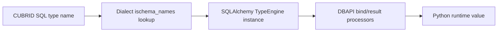

# Type Mapping

This document covers the full type mapping between SQLAlchemy types, CUBRID SQL types, and the CUBRID-specific type extensions provided by this dialect.

---

## Table of Contents

- [Standard SQL Types](#standard-sql-types)
- [CUBRID-Specific Types](#cubrid-specific-types)
  - [Numeric Types](#numeric-types)
  - [String Types](#string-types)
  - [Bit String Types](#bit-string-types)
  - [LOB Types](#lob-types)
  - [Collection Types](#collection-types)
- [Type Reflection (ischema_names)](#type-reflection-ischema_names)
- [Boolean Handling](#boolean-handling)
- [Text and STRING](#text-and-string)
- [Usage Examples](#usage-examples)

---

## Standard SQL Types

The dialect maps standard SQLAlchemy types to CUBRID SQL types:

| SQLAlchemy Type      | CUBRID SQL Type   | Notes                                      |
|----------------------|-------------------|--------------------------------------------|
| `Integer`            | `INTEGER`         | 32-bit signed integer                      |
| `SmallInteger`       | `SMALLINT`        | 16-bit signed integer                      |
| `BigInteger`         | `BIGINT`          | 64-bit signed integer                      |
| `Float`              | `FLOAT`           | 7-digit precision (single precision)       |
| `Double` / `REAL`    | `DOUBLE`          | 15-digit precision (double precision)      |
| `Numeric(p, s)`      | `NUMERIC(p, s)`   | Exact numeric, up to 38 digits             |
| `String(n)`          | `VARCHAR(n)`      | Variable-length character data             |
| `Text`               | `STRING`          | Alias for `VARCHAR(1,073,741,823)`         |
| `Unicode(n)`         | `VARCHAR(n)`      | Database charset (no `NCHAR` needed)       |
| `UnicodeText`        | `STRING`          | Same as `Text`; CUBRID has no `TEXT` type  |
| `LargeBinary`        | `BLOB`            | Binary Large Object                        |
| `BINARY(n)`          | `BIT(n*8)`        | Fixed-length bytes; CUBRID has no `BINARY` |
| `VARBINARY(n)`       | `BIT VARYING(n*8)`| Variable-length bytes; no `VARBINARY`      |
| `Uuid` / `UUID`      | `CHAR(32)`        | No native UUID; stored as 32-char hex      |
| `Boolean`            | `SMALLINT`        | ⚠️ No native boolean — mapped to 0/1      |
| `Date`               | `DATE`            | Calendar date                              |
| `Time`               | `TIME`            | Time of day                                |
| `DateTime`           | `DATETIME`        | Date and time combined                     |
| `TIMESTAMP`          | `TIMESTAMP`       | Timestamp with auto-update behavior        |

> **VARCHAR default length**: When `String()` is used without a length, the dialect defaults to `VARCHAR(4096)`. An explicit non-positive length (`String(0)`, `VARCHAR(0)`, `NVARCHAR(0)`) is not a valid CUBRID length and raises `CompileError` instead of being widened to the default.

> **BINARY / VARBINARY**: CUBRID has no `BINARY` or `VARBINARY` type, so the dialect stores them as bit strings, whose length is in bits: `BINARY(n)` compiles to `BIT(n*8)` (`BINARY()` to `BIT(8)`), `VARBINARY(n)` to `BIT VARYING(n*8)` and `VARBINARY()` to `BIT VARYING` (up to 1,073,741,823 bits). Values bind and return as `bytes` on both drivers. `BINARY` is fixed-length, so a shorter value comes back padded with `\x00` bytes. An empty `b""` is not preserved: depending on the driver it reads back as `None` (or as zero bytes for `BINARY` on pycubrid). A non-positive length (`BINARY(0)`, `VARBINARY(0)`) raises `CompileError`. These columns reflect as `BIT(n*8)` / `BIT VARYING(n*8)`, so Alembic autogenerate reports no type change for them.

> **UUID**: CUBRID has no `UUID` type. `sa.Uuid` and `sa.UUID` both compile to `CHAR(32)` and use SQLAlchemy's non-native UUID handling: values are stored as 32-character hex strings, and read back as `uuid.UUID` (default) or as a hyphenated `str` with `as_uuid=False`. The column reflects as `CHAR(32)`.

> **Character set and collation**: the dialect does not render a column-level `CHARSET` or `COLLATE` clause for string and text types. A `collation=` argument (for example `String(50, collation="utf8_bin")`, `Text(collation=...)` or `UnicodeText(collation=...)`) is dropped, and the column uses the database charset and collation. `Unicode` / `UnicodeText` do not select a different charset either: they compile to `VARCHAR(n)` / `STRING` like `String` / `Text`, so non-ASCII text (for example Korean, Japanese, Chinese or emoji) round-trips only when the database was created with a UTF-8 charset (for example `cubrid createdb testdb en_US.utf8`).

---

## CUBRID-Specific Types

Import CUBRID-specific types from the dialect package:

```python
from sqlalchemy_cubrid import (
    # Numeric
    SMALLINT, BIGINT, NUMERIC, DECIMAL, FLOAT, REAL,
    DOUBLE, DOUBLE_PRECISION,
    # String
    CHAR, VARCHAR, NCHAR, NVARCHAR, STRING,
    # Binary
    BIT,
    # LOB
    BLOB, CLOB,
    # Collections
    SET, MULTISET, SEQUENCE,
    # JSON
    JSON,
)
```

### Numeric Types

| Type               | CUBRID SQL        | Description                                  |
|--------------------|-------------------|----------------------------------------------|
| `SMALLINT`         | `SMALLINT`        | 16-bit signed integer (-32,768 to 32,767)    |
| `BIGINT`           | `BIGINT`          | 64-bit signed integer                        |
| `NUMERIC(p, s)`    | `NUMERIC(p, s)`   | Exact numeric with precision (1–38) and scale |
| `DECIMAL(p, s)`    | `DECIMAL(p, s)`   | Synonym for `NUMERIC`                        |
| `FLOAT(p)`         | `FLOAT(p)`        | Approximate numeric, default precision 7     |
| `REAL`             | `REAL`            | Synonym for single-precision float           |
| `DOUBLE`           | `DOUBLE`          | Double-precision floating point              |
| `DOUBLE_PRECISION` | `DOUBLE PRECISION`| Synonym for `DOUBLE`                         |

```python
from sqlalchemy import Column, MetaData, Table
from sqlalchemy_cubrid import NUMERIC, DOUBLE, BIGINT

metadata = MetaData()
products = Table(
    "products", metadata,
    Column("id", BIGINT, primary_key=True),
    Column("price", NUMERIC(10, 2)),
    Column("weight", DOUBLE),
)
```

### String Types

| Type          | CUBRID SQL                  | Description                              |
|---------------|-----------------------------|------------------------------------------|
| `CHAR(n)`     | `CHAR(n)`                   | Fixed-length character data              |
| `VARCHAR(n)`  | `VARCHAR(n)`                | Variable-length character data           |
| `NCHAR(n)`    | `NCHAR(n)`                  | Fixed-length national character data     |
| `NVARCHAR(n)` | `NCHAR VARYING(n)`          | Variable-length national character data  |
| `STRING`      | `STRING`                    | `VARCHAR(1,073,741,823)` — max length    |

```python
from sqlalchemy_cubrid import CHAR, VARCHAR, NVARCHAR, STRING

metadata = MetaData()
users = Table(
    "users", metadata,
    Column("code", CHAR(10)),
    Column("name", VARCHAR(255)),
    Column("name_ko", NVARCHAR(255)),
    Column("bio", STRING),
)
```

> **NCHAR / NVARCHAR**: CUBRID has first-class national character types for multi-language support. The dialect renders `NVARCHAR(n)` as `NCHAR VARYING(n)` to match CUBRID's preferred DDL syntax.

### Bit String Types

| Type                | CUBRID SQL         | Description                   |
|---------------------|--------------------|-------------------------------|
| `BIT(n)`            | `BIT(n)`           | Fixed-length bit string       |
| `BIT(n, varying=True)` | `BIT VARYING(n)` | Variable-length bit string   |

```python
from sqlalchemy_cubrid import BIT

metadata = MetaData()
flags = Table(
    "flags", metadata,
    Column("fixed_bits", BIT(8)),          # BIT(8)
    Column("var_bits", BIT(256, varying=True)),  # BIT VARYING(256)
)
```

### LOB Types

| Type   | CUBRID SQL | Description                |
|--------|------------|----------------------------|
| `BLOB` | `BLOB`     | Binary Large Object        |
| `CLOB` | `CLOB`     | Character Large Object     |

```python
from sqlalchemy_cubrid import BLOB, CLOB

metadata = MetaData()
documents = Table(
    "documents", metadata,
    Column("content", CLOB),
    Column("attachment", BLOB),
)
```

### Collection Types

CUBRID provides three collection types that have no direct equivalent in standard SQL:

| Type             | CUBRID SQL          | Description                                    |
|------------------|---------------------|------------------------------------------------|
| `SET(type)`      | `SET(type)`         | Unordered collection of **unique** elements    |
| `MULTISET(type)` | `MULTISET(type)`    | Unordered collection, **duplicates** allowed   |
| `SEQUENCE(type)` | `SEQUENCE(type)`    | **Ordered** collection, **duplicates** allowed |

```python
from sqlalchemy_cubrid import SET, MULTISET, SEQUENCE, VARCHAR

metadata = MetaData()
tagged_items = Table(
    "tagged_items", metadata,
    Column("tags", SET("VARCHAR")),
    Column("scores", MULTISET("INTEGER")),
    Column("history", SEQUENCE("DOUBLE")),
)
```

**DDL output:**

```sql
CREATE TABLE tagged_items (
    tags SET(VARCHAR),
    scores MULTISET(INTEGER),
    history SEQUENCE(DOUBLE)
)
```

> **Note**: Collection types are CUBRID-specific. Standard SQL uses `ARRAY[]` (PostgreSQL) or has no collection support. If portability is a concern, use `SET`/`MULTISET`/`SEQUENCE` only when targeting CUBRID.

> **`LIST` is a synonym for `SEQUENCE`.** CUBRID accepts `LIST(type)` in DDL but
> normalizes it to `SEQUENCE` at parse time — a `LIST(INTEGER)` column is stored
> and reflected as `SEQUENCE OF INTEGER` (verified on CUBRID 11.2). The dialect
> therefore exposes only the canonical `SEQUENCE` type; declare `SEQUENCE(...)`
> in your models and reflection will round-trip cleanly. There is intentionally
> no separate `LIST` type, since a type compiling to `LIST(...)` would produce
> spurious Alembic autogenerate diffs against the reflected `SEQUENCE(...)`.

#### Collection values

Bind a `SET` or `MULTISET` column's value as a Python `list`, `tuple`, `set`
or `frozenset`. A `SEQUENCE` is ordered, so bind it as a `list` or `tuple`: on
the pycubrid drivers a `set` or `frozenset` for a `SEQUENCE` column raises
`TypeError` ("SEQUENCE is ordered; pass a list or tuple", wrapped in
SQLAlchemy's `StatementError`) whatever the pycubrid version, and the dialect
never sorts it for you. What happens next depends on the driver:

| | `cubrid+pycubrid://`, `cubrid+aiopycubrid://` with typed collection parameters (pycubrid main) | Released pycubrid 1.8.0 | `cubrid://` (CUBRIDdb) |
|---|---|---|---|
| Binding a `list`/`tuple` (and a `set`/`frozenset` for `SET`/`MULTISET`) | Wrapped in `pycubrid.types.Set`, `Multiset` or `Sequence` to match the column type and sent as a `SET{...}`, `MULTISET{...}` or `SEQUENCE{...}` literal | `ProgrammingError` (pycubrid rejects collection parameters) | Bound by CUBRIDdb itself, always as a SET: a MULTISET loses duplicates and a SEQUENCE loses its order ([Driver Compatibility, Known Issue 11](DRIVER_COMPAT.md#11-collection-parameters-set-multiset-sequence)) |
| Reading `SET` | `frozenset` with `?decode_collections=true`, raw `bytes` without it | Same | `set` of `str` |
| Reading `MULTISET` / `SEQUENCE` | `list` with `?decode_collections=true`, raw `bytes` without it | Same | `list` of `str` |

```python
from sqlalchemy import Column, Integer, MetaData, String, Table, create_engine, select
from sqlalchemy_cubrid import MULTISET, SEQUENCE, SET

engine = create_engine("cubrid+pycubrid://dba@localhost:33000/demodb?decode_collections=true")
items = Table(
    "items", MetaData(),
    Column("id", Integer, primary_key=True),
    Column("tags", SET(String(20))),
    Column("scores", MULTISET(Integer())),
    Column("history", SEQUENCE(Integer())),
)

with engine.begin() as conn:
    conn.execute(items.insert(), {"id": 1, "tags": {"a", "b"}, "scores": [2, 2, 1], "history": [3, 1, 3]})
    row = conn.execute(select(items)).one()
    # row.tags == frozenset({"a", "b"}); sorted(row.scores) == [1, 2, 2]; row.history == [3, 1, 3]
    conn.execute(select(items.c.id).where(items.c.history == [3, 1, 3]))  # SEQUENCE{3, 1, 3}
```

On pycubrid:

- The typed parameters (cubrid-lab/pycubrid#567) are on pycubrid main and are
  not in a pycubrid release yet. The dialect detects them
  (`pycubrid.types.Set`, `Multiset` and `Sequence`); with an older pycubrid it
  passes values to the driver unchanged, so a collection parameter fails as
  before.
- Each element must be a value pycubrid can bind on its own: `None`, `bool`,
  `int`, `float`, `Decimal`, `str`, `bytes`, `bytearray`, `date`, `time` or
  `datetime`. Nested collections are rejected.
- A value that is already a `pycubrid.types.Set`, `Multiset` or `Sequence`,
  `None` and any other value (for example a `str`) are passed to the driver
  unchanged.
- The server keeps the collection semantics, and the dialect does not change
  them: a `SET` drops duplicates, a `MULTISET` keeps duplicates but not their
  order (compare `sorted(...)`), and a `SEQUENCE` keeps both. An empty
  collection reads back as `frozenset()` or `[]`, a `NULL` column as `None`,
  and a `NULL` element as `None` inside the collection.
- The dialect does not convert values read back: they are what pycubrid
  decodes. Without `decode_collections=true` pycubrid returns the raw
  collection bytes.
- A `set`/`frozenset` bound to a `SEQUENCE` column raises `TypeError` (see
  above), with every pycubrid version.
- Collection values cannot be rendered inline: `literal_binds` and
  `literal_execute` raise `CompileError` for a non-`NULL` collection value
  (a `NULL` renders as `NULL`). Bind collections as parameters.
- In the ORM, assign a new collection to change a column
  (`obj.history = [*obj.history, 4]`). SQLAlchemy does not track in-place
  changes to a `list` or `set` attribute.

The round trips are tested live on CUBRID 10.2 and 11.4 with pycubrid main
(Core and ORM, sync and async; `test/test_collection_roundtrip.py`).

### JSON Type

CUBRID 10.2+ supports native JSON (RFC 7159). The dialect provides full JSON type support:

| Type             | CUBRID SQL | Description                              |
|------------------|------------|------------------------------------------|
| `JSON`           | `JSON`     | Native JSON storage (RFC 7159 compliant) |
| `JSONIndexType`  | —          | Single-key path formatting (`$."key"`)   |
| `JSONPathType`   | —          | Multi-level path formatting              |

```python
from sqlalchemy_cubrid import JSON
from sqlalchemy import Column, Integer, Table, MetaData, func, select

metadata = MetaData()
events = Table(
    "events", metadata,
    Column("id", Integer, primary_key=True),
    Column("payload", JSON),
)
```

**Path expressions** use `JSON_EXTRACT` under the hood:

```python
# Single key access: col["key"] → JSON_EXTRACT(col, '$."key"')
stmt = select(events.c.payload["type"])

# Nested path: col[("a", "b")] → JSON_EXTRACT(col, '$."a"."b"')
stmt = select(events.c.payload[("data", "name")])

# Typed access with null handling
stmt = select(events).where(
    events.c.payload["status"].as_string() == "active"
)

# Direct function usage
stmt = select(func.JSON_EXTRACT(events.c.payload, "$.type"))
```

> **Note**: Generic `sa.JSON` is automatically adapted to CUBRID's `JSON` type via `colspecs`. JSON columns are reflected correctly from existing tables.

---

## Type Reflection (`ischema_names` only)

When reflecting existing tables, the dialect maps only the CUBRID type names present in `dialect.ischema_names` back to SQLAlchemy types:

| CUBRID Type Name    | SQLAlchemy Type    |
|---------------------|--------------------|
| `SHORT`             | `SMALLINT`         |
| `SMALLINT`          | `SMALLINT`         |
| `INTEGER`           | `INTEGER`          |
| `BIGINT`            | `BIGINT`           |
| `NUMERIC`           | `NUMERIC`          |
| `DECIMAL`           | `DECIMAL`          |
| `FLOAT`             | `FLOAT`            |
| `DOUBLE`            | `DOUBLE`           |
| `DOUBLE PRECISION`  | `DOUBLE_PRECISION` |
| `DATE`              | `DATE`             |
| `TIME`              | `TIME`             |
| `TIMESTAMP`         | `TIMESTAMP`        |
| `TIMESTAMPTZ`       | `TIMESTAMPTZ` (`timezone=True`) |
| `TIMESTAMPLTZ`      | `TIMESTAMPLTZ` (`timezone=True`) |
| `DATETIME`          | `DATETIME`         |
| `DATETIMETZ`        | `DATETIMETZ` (`timezone=True`) |
| `DATETIMELTZ`       | `DATETIMELTZ` (`timezone=True`) |
| `BIT(n)`            | `BIT(n)`           |
| `BIT VARYING(n)`    | `BIT(n, varying=True)` |
| `CHAR`              | `CHAR`             |
| `VARCHAR`           | `VARCHAR`          |
| `NCHAR`             | `NCHAR`            |
| `CHAR VARYING`      | `VARCHAR`          |
| `NCHAR VARYING`     | `NVARCHAR`         |
| `STRING`            | `STRING`           |
| `ENUM('a', ...)`    | `ENUM('a', ...)` (DBA; otherwise `NullType` + warning) |
| `BLOB`              | `BLOB`             |
| `CLOB`              | `CLOB`             |
| `SET`               | `SET`              |
| `MULTISET`          | `MULTISET`         |
| `SEQUENCE`          | `SEQUENCE`         |

The following dialect types are **declared/compiled** but **not auto-reflected** because they are not present in `dialect.ischema_names`: `REAL`, `MONETARY`, and `OBJECT`.

**TZ/LTZ reflection** (#181, #442). `TIMESTAMPTZ`, `TIMESTAMPLTZ`, `DATETIMETZ` and `DATETIMELTZ` reflect as their own dedicated dialect classes rather than collapsing into plain `TIMESTAMP`/`DATETIME`, and each sets `timezone=True`, so a round-tripped `datetime` keeps its timezone awareness and `metadata.reflect()` + `create_all()` reproduces the original column type. The dialect does not otherwise distinguish explicit-timezone (`TZ`) from local-timezone (`LTZ`) *value* semantics in Python — both are represented as an aware `datetime` — only the reflected SQLAlchemy type class differs.

**ENUM and collection columns** (#631). `SHOW COLUMNS` prints native ENUM values without escaping: one legal value containing `', '` can be byte-identical to two separate values. For a user authorized to read `_db_domain` (normally DBA), the dialect reads the exact, ordered labels from the domain catalog rather than splitting that ambiguous text. A non-DBA user's specific `-494` denial is reported as a warning and `NullType`; unrelated catalog failures propagate. Such users must declare the ENUM type in their model until an authorized public metadata source is available.

**Non-DBA ENUM reflection: tested limitation** (#641). None of the sources tested gives a non-DBA user the ENUM labels unambiguously. Checked on CUBRID 10.2.18, 11.0.16, 11.2.9 and 11.4.6 as a user with no grants, on its own tables `ENUM('a'', ''b', 'other')` (two labels) and `ENUM('a', 'b', 'other')` (three labels):

| Candidate source | Result on all four versions |
|---|---|
| `SHOW COLUMNS`, `SHOW FULL COLUMNS`, `SHOW CREATE TABLE` | Both tables print `ENUM('a', 'b', 'other')` |
| `db_attribute` | `data_type` is `ENUM`, no labels; no other public catalog view carries a domain's labels |
| `_db_domain` | `-494 SELECT is not authorized on _db_domain` |
| Driver metadata (pycubrid `cursor.description`, CCI attribute schema information) | Type code only, no labels |
| SQL expressions on the column's type (`UNION ALL`, `COALESCE`, `IFNULL`, `CASE`, `NVL2` with integers; comparison with a label or a non-label string) | Integers stay integers, strings stay strings, and a string that is not a label is accepted, so neither a label's position nor its membership can be read |

Such a column therefore keeps reflecting as `NullType` with a warning. CUBRIDdb and JDBC metadata calls were not tested. This is what the listed versions do, not a statement about later servers.

`SHOW COLUMNS` prints collections as `SET OF NUMERIC,VARCHAR` (also `MULTISET OF ...` and `SEQUENCE OF ...`; `LIST` is printed as `SEQUENCE`) without member modifiers and sometimes in a different order. The public `db_attr_setdomain_elm` view supplies each member's precision, scale and object-domain class. The dialect uses those rows only when they account for every reported member family; missing or inconsistent rows warn and yield `NullType` instead of silently changing the DDL. An OBJECT member whose class was dropped (listed without its class) and a member type the dialect cannot express warn and yield `NullType`; the rest of the table still reflects. `MONETARY` members reflect as `MONETARY`. A column name that `SHOW COLUMNS` lists twice (a `CLASS ATTRIBUTE` of the same name) warns and yields `NullType` for ENUM and collection columns, and the catalog lookups read instance attributes only. On CUBRID 11.2+ an OBJECT member whose class belongs to another owner than the table reflects as `owner.class`. An `ENUM` member (`SET(ENUM('x', 'y'))`, listed without its values) warns and yields `NullType`. Members keep the order the view lists them in, which is the declaration order on the supported servers. A member's collation (`VARCHAR(10) COLLATE utf8_bin`) is not in the view and is not reflected. An untyped collection takes its kind from `db_attribute` and reflects as `SET()` / `MULTISET()` / `SEQUENCE()`. With authorized ENUM metadata and complete collection-domain rows, `metadata.reflect()` followed by `create_all()` reproduced the tested DDL on CUBRID 10.2, 11.2 and 11.4; 11.0 remains in the nightly matrix. This is not a claim of full ENUM reflection for non-DBA users.

On CUBRID 11.2+, an OBJECT member also warns and yields `NullType` when either its domain owner or the reflected table owner is unavailable; rendering an unqualified class could resolve to a different owner's class.

---

## Boolean Handling

CUBRID does not have a native `BOOLEAN` data type. The dialect maps `Boolean` to `SMALLINT`:

```python
from sqlalchemy import Boolean, Column

class User(Base):
    __tablename__ = "users"
    is_active = Column(Boolean)  # → SMALLINT in DDL
```

- `True` is stored as `1`
- `False` is stored as `0`
- The `supports_native_boolean = False` flag tells SQLAlchemy to handle the conversion automatically

### Boolean predicates

CUBRID's `IS` accepts only `[NOT] NULL` and `[NOT] TRUE/FALSE`, and since CUBRID 11.2 `IS TRUE`/`IS FALSE` needs a logical operand (`b IS TRUE` fails for a `SMALLINT` column). SQLAlchemy renders `col.is_(True)` for a non-native Boolean as `col IS 1`, which CUBRID rejects on every version, so the dialect renders `IS`/`IS NOT` against a value with the null-safe equal `<=>`, like `IS [NOT] DISTINCT FROM`:

| SQLAlchemy | SQL | Value for `1` / `0` / `NULL` |
|---|---|---|
| `col.is_(True)` | `col <=> 1` | true / false / false |
| `col.is_(False)` | `col <=> 0` | false / true / false |
| `col.is_not(True)` | `(col <=> 1) = 0` | false / true / true |
| `col.is_not(False)` | `(col <=> 0) = 0` | true / false / true |
| `col.is_(None)` / `col == None` | `col IS NULL` | false / false / true |
| `col == True` / `col` | `col = 1` | true / false / NULL |
| `col == False` / `not_(col)` | `col = 0` | false / true / NULL |
| `true()` / `false()` | `1 = 1` / `0 = 1` (`1` / `0` in a SELECT list) | constant |

`IS TRUE`/`IS FALSE` never yield `NULL`, and `IS NOT TRUE`/`IS NOT FALSE` are their exact complements, so SQLAlchemy's three-valued semantics are kept in `WHERE` clauses and in SELECT lists alike; the same applies to any expression, e.g. `(col == 5).is_(True)` renders `(col = 5) <=> 1`. One limitation is CUBRID's, not the dialect's: logical operators are not allowed in a SELECT list, so `select(and_(a, b))`, `select(or_(a, b))` or a projected `NOT (...)` fail; use them in `WHERE`, or wrap them in `case()` (a `NULL` condition then takes the `else_` branch).

---

## Text and STRING

SQLAlchemy's `Text` type maps to CUBRID's `STRING` type:

```python
from sqlalchemy import Text, Column

class Article(Base):
    __tablename__ = "articles"
    body = Column(Text)  # → STRING in DDL
```

CUBRID's `STRING` is an alias for `VARCHAR(1,073,741,823)` — the maximum possible `VARCHAR` length. This is functionally equivalent to `TEXT` in other databases.

---

## Usage Examples

### Defining a Table with Mixed Types

```python
from sqlalchemy import Column, MetaData, Table, Integer, String, DateTime, Text
from sqlalchemy_cubrid import NUMERIC, CLOB, SET

metadata = MetaData()

orders = Table(
    "orders", metadata,
    Column("id", Integer, primary_key=True, autoincrement=True),
    Column("customer_name", String(100), nullable=False),
    Column("total", NUMERIC(12, 2)),
    Column("notes", Text),
    Column("attachments", CLOB),
    Column("tags", SET("VARCHAR")),
    Column("created_at", DateTime),
)
```

### Reflecting an Existing Table

```python
from sqlalchemy import MetaData, create_engine

engine = create_engine("cubrid://dba@localhost:33000/testdb")
metadata = MetaData()
metadata.reflect(bind=engine)

# Access reflected table
users = metadata.tables["users"]
for col in users.columns:
    print(f"{col.name}: {col.type}")
```

### Using colspecs for Type Coercion

The dialect registers type coercions (`colspecs`) that automatically map generic SQLAlchemy types:

| Generic Type      | CUBRID Type  |
|-------------------|--------------|
| `sqltypes.Numeric`| `NUMERIC`    |
| `sqltypes.Float`  | `FLOAT`      |
| `sqltypes.Time`   | `TIME`       |

This means `Column(Numeric(10, 2))` automatically uses the CUBRID `NUMERIC` implementation without explicit imports.

---

## Machine-Readable Type Mapping Matrix

The table below is designed for copy/paste into tooling pipelines and architecture docs.

| CUBRID Type | SQLAlchemy Type | Python Type | Notes |
|---|---|---|---|
| `SHORT` | `sqlalchemy_cubrid.SMALLINT` | `int` | Reflected alias for `SMALLINT`. |
| `SMALLINT` | `sqlalchemy_cubrid.SMALLINT` | `int` | 16-bit signed integer. |
| `INTEGER` | `sqlalchemy.Integer` | `int` | Standard 32-bit integer. |
| `BIGINT` | `sqlalchemy_cubrid.BIGINT` | `int` | 64-bit integer values. |
| `NUMERIC(p,s)` | `sqlalchemy_cubrid.NUMERIC` | `decimal.Decimal` | Exact numeric; precision 1-38. |
| `DECIMAL(p,s)` | `sqlalchemy_cubrid.DECIMAL` | `decimal.Decimal` | Synonym of `NUMERIC`. |
| `FLOAT(p)` | `sqlalchemy_cubrid.FLOAT` | `float` | Approximate numeric, default precision 7. |
| `REAL` | `sqlalchemy_cubrid.REAL` | `float` | Approximate numeric single precision semantics. Declared/compiled only; not auto-reflected. |
| `DOUBLE` | `sqlalchemy_cubrid.DOUBLE` | `float` | Approximate numeric double precision. |
| `DOUBLE PRECISION` | `sqlalchemy_cubrid.DOUBLE_PRECISION` | `float` | Reflected as dedicated dialect type. |
| `MONETARY` | `sqlalchemy_cubrid.MONETARY` | `float` | Currency-aware server type; represented as numeric value in Python. Declared/compiled only; not auto-reflected. |
| `DATE` | `sqlalchemy.Date` | `datetime.date` | Calendar date only. |
| `TIME` | `sqlalchemy.Time` / `sqlalchemy_cubrid.TIME` | `datetime.time` | Time of day only. |
| `DATETIME` | `sqlalchemy.DateTime` / `sqlalchemy_cubrid.DATETIME` | `datetime.datetime` | Date + time in one value. |
| `TIMESTAMP` | `sqlalchemy.TIMESTAMP` / `sqlalchemy_cubrid.TIMESTAMP` | `datetime.datetime` | CUBRID timestamp semantics may auto-update depending on schema defaults. |
| `TIMESTAMPTZ` | `sqlalchemy_cubrid.TIMESTAMPTZ` | `datetime.datetime` (aware) | Explicit-timezone timestamp; `timezone=True`. Reflects as its own type, not `TIMESTAMP` (#181). |
| `TIMESTAMPLTZ` | `sqlalchemy_cubrid.TIMESTAMPLTZ` | `datetime.datetime` (aware) | Local-timezone timestamp; `timezone=True`. Reflects as its own type, not `TIMESTAMP` (#181). |
| `DATETIMETZ` | `sqlalchemy_cubrid.DATETIMETZ` | `datetime.datetime` (aware) | Explicit-timezone datetime; `timezone=True`. Reflects as its own type, not `DATETIME` (#442). |
| `DATETIMELTZ` | `sqlalchemy_cubrid.DATETIMELTZ` | `datetime.datetime` (aware) | Local-timezone datetime; `timezone=True`. Reflects as its own type, not `DATETIME` (#442). |
| `BIT(n)` | `sqlalchemy_cubrid.BIT(length=n, varying=False)` / `sqlalchemy.BINARY(n/8)` | `bytes` | Fixed-length bit string; `sa.BINARY(n)` compiles to `BIT(n*8)`. |
| `BIT VARYING(n)` | `sqlalchemy_cubrid.BIT(length=n, varying=True)` / `sqlalchemy.VARBINARY(n/8)` | `bytes` | Variable-length bit string; `sa.VARBINARY(n)` compiles to `BIT VARYING(n*8)`. |
| `CHAR(n)` | `sqlalchemy_cubrid.CHAR` | `str` | Fixed-length character data. |
| `VARCHAR(n)` | `sqlalchemy_cubrid.VARCHAR` / `sqlalchemy.String` | `str` | Variable-length string. |
| `NCHAR(n)` | `sqlalchemy_cubrid.NCHAR` | `str` | National character set type. |
| `CHAR VARYING(n)` | `sqlalchemy_cubrid.VARCHAR` | `str` | Synonym of `VARCHAR(n)`; reflected to VARCHAR. |
| `CHAR(32)` (UUID) | `sqlalchemy.Uuid` / `sqlalchemy.UUID` | `uuid.UUID` / `str` | No native UUID; 32-char hex. Reflects as `CHAR(32)`. |
| `STRING` | `sqlalchemy_cubrid.STRING` / `sqlalchemy.Text` | `str` | Equivalent to very large `VARCHAR`. |
| `CLOB` | `sqlalchemy_cubrid.CLOB` | `str` (documented) | Character LOB. Current drivers return a LOB locator on read; see the warning below. |
| `BLOB` | `sqlalchemy_cubrid.BLOB` / `sqlalchemy.LargeBinary` | `bytes` (documented) | Binary LOB. Current drivers return a LOB locator on read; see the warning below. |
| `SET(...)` | `sqlalchemy_cubrid.SET` | Driver-dependent; `frozenset` on pycubrid with `decode_collections=true` | CUBRID-specific collection; unique unordered members. See [Collection values](#collection-values). |
| `MULTISET(...)` | `sqlalchemy_cubrid.MULTISET` | Driver-dependent; `list` on pycubrid with `decode_collections=true` | CUBRID-specific collection; duplicates allowed. See [Collection values](#collection-values). |
| `SEQUENCE(...)` | `sqlalchemy_cubrid.SEQUENCE` | Driver-dependent; `list` on pycubrid with `decode_collections=true` | CUBRID-specific collection; ordered with duplicates. See [Collection values](#collection-values). |
| `OBJECT` | `sqlalchemy_cubrid.OBJECT` | Driver-dependent object reference | OID reference type; database-specific. Declared/compiled only; not auto-reflected. |
| `BOOLEAN` (emulated) | `sqlalchemy.Boolean` -> `SMALLINT` | `bool` | Stored as `1` / `0`; `supports_native_boolean=False`. |

### Type Resolution Flow



!!! warning "Precision and rounding"
    Use `NUMERIC`/`DECIMAL` for financial values. `FLOAT`/`DOUBLE` are approximate and can introduce rounding error in aggregates.

!!! warning "Character set and national string columns"
    `NCHAR`/`NVARCHAR` use national character semantics. Keep application encoding and database collation aligned to avoid unexpected comparisons/sorting.

!!! warning "Reading BLOB/CLOB returns a driver LOB locator"
    Verified live on CUBRID 10.2 and 11.4, Core and ORM, sync and async, with pycubrid 1.8.0 (the supported floor), pycubrid main, and CUBRIDdb 11.3 (#485, `test/test_lob_value_contract.py`): binding `bytes`/`str` stores the full value and `NULL` round-trips as `None`, but selecting a non-NULL `BLOB`/`CLOB` column returns the driver's LOB locator (a `dict` handle on sync pycubrid, the `file_locator` string on `cubrid+aiopycubrid://`, a `'file:...'` string on CUBRIDdb) instead of `bytes`/`str`. For `LargeBinary`/`BLOB` SQLAlchemy's result processor then raises `TypeError`. Binding `LargeBinary`/`BLOB` values (including `None`) through `cubrid+aiopycubrid://` works since #500.
    To read content, convert on the server (`CLOB_TO_CHAR(col)`, `BLOB_TO_BIT(col)`), or store large text in `Text` (CUBRID `STRING`), which round-trips as `str`. pycubrid's LOB handles (cubrid-lab/pycubrid#441/#442) are explicit calls on `pycubrid.compat.native`, which the dialect does not use; ordinary fetch on pycubrid main still returns the locator, so the strict xfail applies there too and turns into a failing XPASS if that changes.

!!! warning "LOB and collection payload shape can differ by driver"
    `CUBRIDdb` and `pycubrid` can expose `BLOB`/`CLOB` and collection values differently.
    Validate payload type (`str`, `bytes`, mapping-like metadata) in integration tests for your chosen driver.

---

*See also: [Feature Support](FEATURE_SUPPORT.md) · [DML Extensions](DML_EXTENSIONS.md) · [Connection Setup](CONNECTION.md)*
