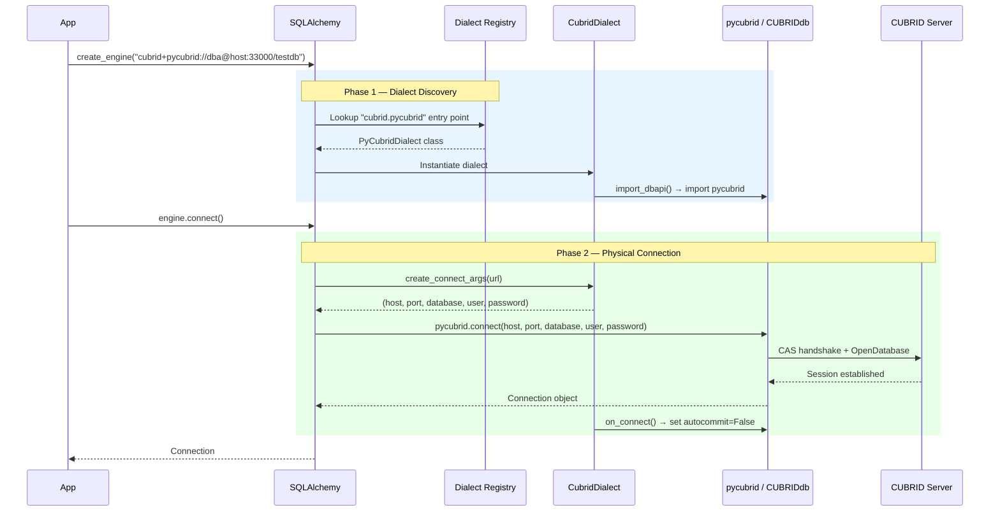
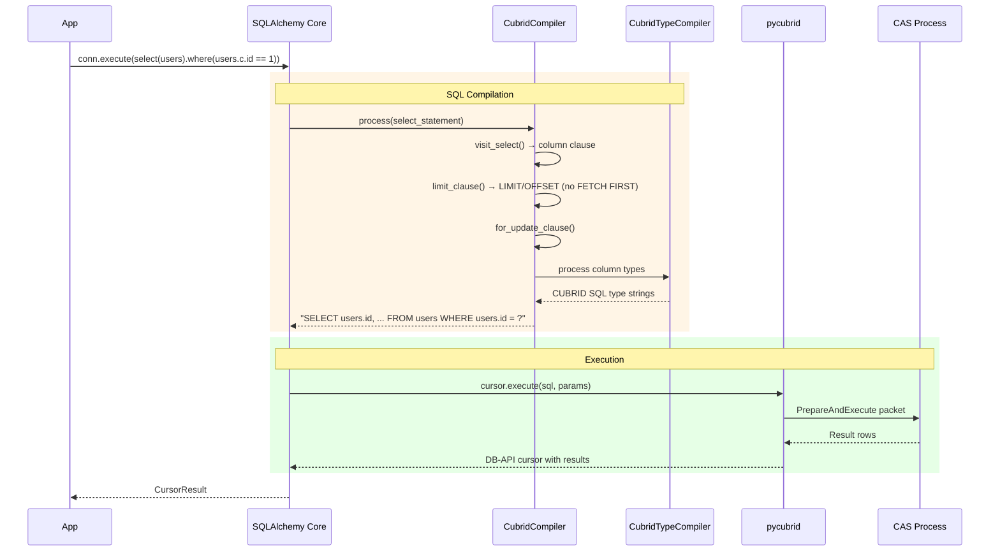
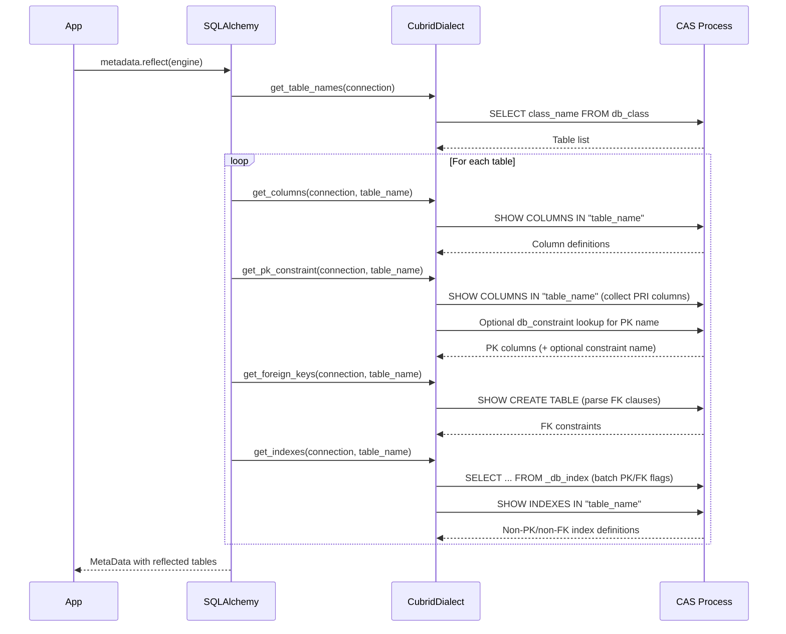
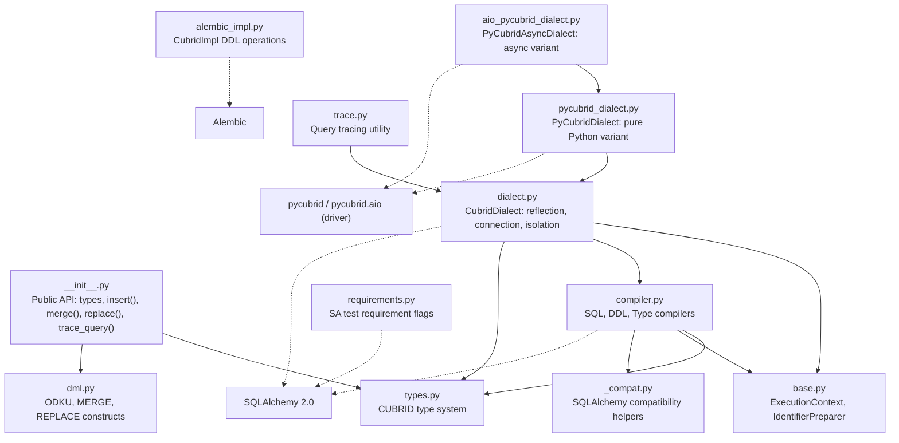
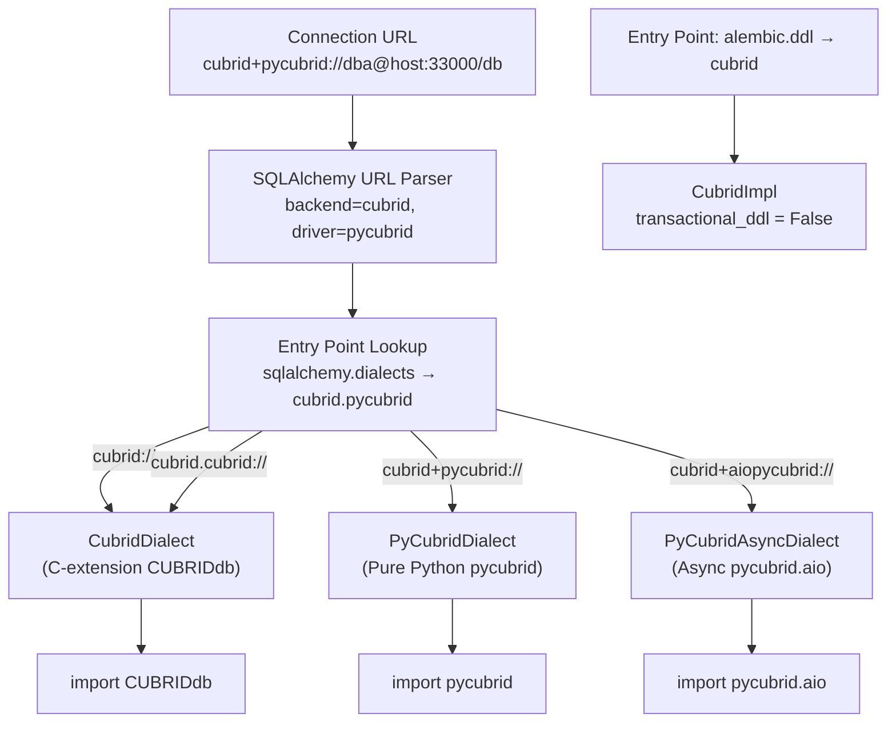
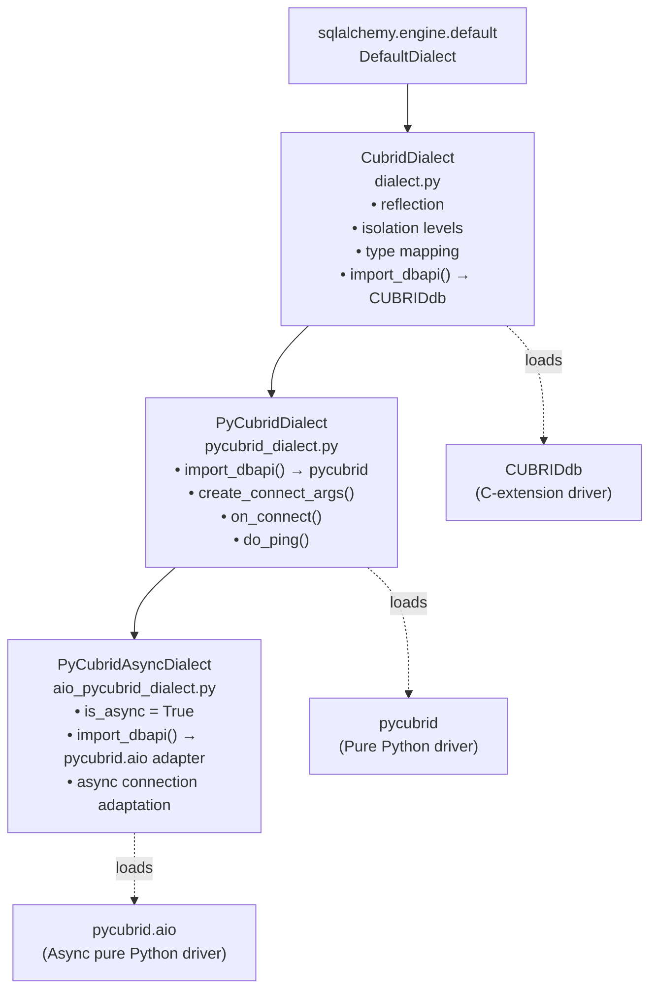

# 아키텍처 (한국어)

> 🌐 [ARCHITECTURE.md](https://github.com/cubrid-lab/sqlalchemy-cubrid/blob/main/docs/ARCHITECTURE.md)의 번역입니다. 영어 원문이 표준이며, 페이지 번역은 경고 수준의 동기화 규칙을 따릅니다.

## 설계 목표

sqlalchemy-cubrid는 SQLAlchemy와 CUBRID 데이터베이스 사이의 견고하고 현대적인 인터페이스를 제공하도록 설계되었습니다. 핵심 설계 목표:

*   완전한 SQLAlchemy 2.0–2.1 방언 구현
*   세 가지 드라이버 모드 (C 확장 CUBRIDdb + 순수 Python pycubrid + 비동기 pycubrid.aio)
*   스키마 리플렉션 (테이블, 컬럼, 제약조건, 인덱스, 코멘트)
*   커스텀 DML 확장 (ON DUPLICATE KEY UPDATE, MERGE, REPLACE)
*   Alembic 마이그레이션 지원
*   PEP 561 타입 지정

## Provenance (출처)

sqlalchemy-cubrid는 SQLAlchemy 2.0을 위해 작성된 독립 구현입니다. 예전 `CUBRID-Python` 드라이버 배포판에 포함됐던 레거시 CUBRID SQLAlchemy 방언의 코드를 포함하지 않으며, 그 포트도 아닙니다. 선택적 `[cubrid]`/`[cubriddb]` extra는 이 방언이 그 레거시 드라이버 *위에서 실행되게* 할 뿐이며, 그 소스는 포함되거나 파생되지 않았습니다.

## 전체 흐름

### 1단계: 엔진 생성과 연결
이 단계는 SQLAlchemy가 CUBRID 방언을 발견하고 CUBRID 서버에 물리적 연결을 수립하는 방식을 다룹니다.



### 2단계: SQL 컴파일
이 단계는 SQLAlchemy 표현 언어 구성이 CUBRID 호환 SQL 문자열로 변환되고 실행되는 과정을 설명합니다.



## 스키마 리플렉션

리플렉션 과정은 SQLAlchemy가 기존 CUBRID 데이터베이스를 검사해 Table 객체를 자동으로 재구성하게 합니다.



## 모듈 경계

패키지는 방언 기능의 특정 측면을 다루는 전문 모듈로 구성됩니다.



### 모듈 설명

#### `__init__.py`
공개 API 경계를 정의하고, CUBRID 전용 타입과 `insert()`, `merge()`, `replace()` 같은 DML 확장을 내보냅니다. 방언 사용자의 주 진입점입니다.

#### `dialect.py`
기본 `CubridDialect` 클래스를 포함하며, 스키마 리플렉션, 연결 관리, 트랜잭션 격리 수준의 핵심 로직을 구현합니다. 리플렉션(`get_columns`, `get_indexes`, `get_foreign_keys`, `get_pk_constraint`, `get_unique_constraints`)이 여기 구현됩니다. 기본적으로 C 확장 드라이버 `CUBRIDdb`를 사용합니다.

#### `pycubrid_dialect.py`
순수 Python `pycubrid` 드라이버를 사용하는 `PyCubridDialect` 변형을 구현합니다. 연결 인자 파싱과 연결 시점 초기화 로직을 오버라이드합니다.

#### `aio_pycubrid_dialect.py`
`cubrid+aiopycubrid://`가 사용하는 비동기 방언 변형 `PyCubridAsyncDialect`를 구현합니다. SQLAlchemy의 비동기 엔진과 `AsyncSession` API에 `pycubrid.aio`를 적용합니다.

#### `compiler.py`
SQL, DDL, 타입 컴파일러를 담습니다. SQLAlchemy의 추상 구문 트리를 CUBRID 전용 SQL 방언으로 번역하며, LIMIT/OFFSET과 FOR UPDATE 절 같은 미묘함을 처리합니다.

#### `_compat.py`
완전한 공개 API가 아닌 SQLAlchemy 속성과 동작(`_for_update_arg`, `_limit_clause`, `_offset_clause`, typed bind 재생성 헬퍼) 주변의 좁은 호환 shim을 제공해, 컴파일러 로직을 중앙집중화하고 SQLAlchemy 릴리스 간 적응을 쉽게 합니다.

#### `base.py`
문장 실행 상태를 위한 `CubridExecutionContext`와 CUBRID의 소문자 식별자 폴딩 및 인용 규칙을 처리하는 `CubridIdentifierPreparer`를 제공합니다.

#### `dml.py`
`ON DUPLICATE KEY UPDATE`(ODKU), `MERGE INTO`, `REPLACE INTO` 같은 CUBRID 전용 기능의 커스텀 DML 구성을 정의합니다.

#### `types.py`
CUBRID 전용 타입 시스템을 구현하며, SQLAlchemy의 일반 타입을 `SET`, `MULTISET`, `BIT` 같은 CUBRID 내부 타입으로 매핑합니다.

#### `trace.py`
문장 실행 주변에서 CUBRID 쿼리 추적을 활성화하고 디버깅·성능 분석을 위한 추적 출력을 반환하는 `trace_query()` 유틸리티를 제공합니다.

#### `requirements.py`
SQLAlchemy 테스트 스위트가 CUBRID 백엔드에서 어떤 동작 테스트를 실행할지 결정하는 기능 플래그를 정의합니다.

#### `alembic_impl.py`
Alembic용 `CubridImpl` 클래스를 제공해 DDL 마이그레이션 지원을 가능하게 하고, CUBRID에 트랜잭션 DDL 기능이 없음을 정의합니다.

## 방언 발견

SQLAlchemy는 엔트리 포인트를 사용해 제공된 연결 URL에 기반해 적절한 방언 클래스를 발견하고 로드합니다.



## 드라이버 아키텍처

방언은 계층적 클래스 구조를 통해 레거시 C 확장 드라이버, 현대적 순수 Python 드라이버, 비동기 pycubrid.aio 변형을 지원합니다.



## 핵심 설계 결정

*   **SQLAlchemy `<2.3` 핀**: `_compat.py` 헬퍼를 통해 남은 세 개의 비공개 SA 속성(`select._limit_clause`, `select._offset_clause`, `select._for_update_arg`)을 compiler.py:93, 104-105에서 사용 — 공개 대안이 나올 때까지 버전 고정 필요.
*   **BOOLEAN → SMALLINT 매핑**: CUBRID에는 네이티브 BOOLEAN이 없음 — 방언이 `SMALLINT`(0/1)로 매핑.
*   **JSON 타입 지원 (v1.2.0+)**: `JSON`, `JSONIndexType`, `JSONPathType`를 포함한 완전한 JSON 타입 매핑. `json_getattr`과 `json_getitem_op`를 통한 경로 접근. CUBRID ≥ 10.2 필요.
*   **`transactional_ddl = False`**: CUBRID는 DDL 문을 자동 커밋 — Alembic이 실패한 마이그레이션을 롤백할 수 없음.
*   **`supports_statement_cache = True`**: SA 2.0 성능에 필요 — 방언은 캐시 안전.
*   **소문자 식별자 폴딩**: CUBRID는 (SQL 표준의 대문자가 아니라) 소문자로 폴딩 — `CubridIdentifierPreparer`가 처리.
*   **RELEASE SAVEPOINT 없음**: CUBRID가 미지원 — `do_release_savepoint()`는 no-op.

## 공개 API 경계

```python
# DML 확장
insert()    # .on_duplicate_key_update()를 갖는 Insert
merge()     # MERGE INTO ... USING ... ON ... WHEN MATCHED/NOT MATCHED
replace()   # REPLACE INTO
trace_query() # 쿼리 추적 유틸리티

# 타입 (CUBRID 전용)
STRING, BIT, CLOB, BLOB, SET, MULTISET, SEQUENCE, MONETARY, OBJECT
JSON, JSONIndexType, JSONPathType
NCHAR, NVARCHAR, DOUBLE_PRECISION, REAL

# 타입 (표준, 재내보내기)
SMALLINT, INTEGER, BIGINT, NUMERIC, DECIMAL, FLOAT, DOUBLE
CHAR, VARCHAR, DATE, TIME, TIMESTAMP, DATETIME

# 엔트리 포인트 (pyproject.toml에 등록)
cubrid://          → CubridDialect
cubrid.cubrid://   → CubridDialect
cubrid+pycubrid:// → PyCubridDialect
cubrid+aiopycubrid:// → PyCubridAsyncDialect
cubrid (alembic)   → CubridImpl
```

## 이 패키지가 소유하는 것 / 소유하지 않는 것

### 소유
*   CUBRID용 SQLAlchemy 방언
*   SQL 컴파일 (CUBRID 구문의 SELECT/INSERT/UPDATE/DELETE)
*   DDL 컴파일
*   타입 매핑
*   스키마 리플렉션
*   DML 확장 (ODKU, MERGE, REPLACE)
*   Alembic DDL 지원
*   식별자 인용

### 소유하지 않음
*   CUBRID 드라이버 자체 (pycubrid 또는 CUBRIDdb 사용)
*   커넥션 풀링 (SQLAlchemy가 처리)
*   ORM 모델 정의 (사용자 코드)
*   CAS 와이어 프로토콜 (pycubrid가 처리)
*   쿼리 최적화 (CUBRID 서버가 처리)

## 관련 문서
*   [연결 가이드](CONNECTION.md)
*   [타입 시스템](TYPES.md)
*   [격리 수준](ISOLATION_LEVELS.md)
*   [DML 확장](DML_EXTENSIONS.md)
*   [Alembic 가이드](ALEMBIC.md)
*   [기능 지원](FEATURE_SUPPORT.md)
*   [지원 매트릭스](SUPPORT_MATRIX.md)
*   [드라이버 호환성](DRIVER_COMPAT.md)
