# 개발 가이드 (한국어)

> 🌐 [DEVELOPMENT.md](https://github.com/cubrid-lab/sqlalchemy-cubrid/blob/main/docs/DEVELOPMENT.md)의 번역입니다. 영어 원문이 표준이며, 페이지 번역은 경고 수준의 동기화 규칙을 따릅니다.

개발 환경 설정, 테스트 실행, sqlalchemy-cubrid 기여에 필요한 모든 것.

---

## 목차

- [사전 준비](#사전-준비)
- [설치](#설치)
- [프로젝트 구조](#프로젝트-구조)
- [Make 타깃](#make-타깃)
- [테스트 실행](#테스트-실행)
- [Docker 통합 테스트](#docker-통합-테스트)
- [다중 버전 테스트](#다중-버전-테스트)
- [코드 커버리지](#코드-커버리지)
- [코드 스타일](#코드-스타일)
- [Pre-Commit 훅](#pre-commit-훅)
- [CI/CD 파이프라인](#cicd-파이프라인)

---

## 사전 준비

| 요구사항 | 버전 |
|---|---|
| Python | 3.10+ |
| Git | 아무 버전 |
| Docker | 아무 버전 (통합 테스트용) |
| Docker Compose | v2+ |

---

## 설치

### 빠른 설정

```bash
git clone https://github.com/cubrid-lab/sqlalchemy-cubrid.git
cd sqlalchemy-cubrid
make install
```

`make install`이 수행하는 것:
1. `pip install -e ".[dev]"` — dev 의존성과 함께 편집 가능 설치
2. `pip install pytest-cov pre-commit tox` — 테스트 도구
3. `pre-commit install` — git 훅 설정

### 수동 설정

```bash
# 가상 환경 생성 및 활성화
python3 -m venv venv
source venv/bin/activate  # Linux/macOS
# venv\Scripts\activate   # Windows

# dev 의존성과 함께 편집 가능 모드로 설치
pip install -e ".[dev]"

# 테스트 커버리지 및 다중 버전 도구 설치
pip install pytest-cov tox

# (선택) pre-commit 훅 설치
pip install pre-commit
pre-commit install
```

---

## 프로젝트 구조

```mermaid
graph TD
    root["sqlalchemy-cubrid/"]

    pkg["sqlalchemy_cubrid/ - Main package"]
    tests["test/ - Test suite"]
    docs["docs/ - Documentation"]
    samples["samples/ - Usage examples"]
    pyproject["pyproject.toml - Project config, dependencies"]
    tox["tox.ini - Multi-Python test config"]
    docker["docker-compose.yml - CUBRID Docker setup"]
    makefile["Makefile - Development shortcuts"]
    contributing["CONTRIBUTING.md - Contribution guidelines"]

    root --> pkg
    root --> tests
    root --> docs
    root --> samples
    root --> pyproject
    root --> tox
    root --> docker
    root --> makefile
    root --> contributing

    pkg --> init["__init__.py - Public API, version, type exports"]
    pkg --> base["base.py - ExecutionContext, IdentifierPreparer"]
    pkg --> compiler["compiler.py - SQL/DDL/Type compilers"]
    pkg --> dialect["dialect.py - CubridDialect (reflection, connection, etc.)"]
    pkg --> pycubrid_dialect["pycubrid_dialect.py - Pure Python driver dialect"]
    pkg --> aio_dialect["aio_pycubrid_dialect.py - Async pycubrid.aio dialect"]
    pkg --> dml["dml.py - ON DUPLICATE KEY UPDATE, MERGE constructs"]
    pkg --> trace["trace.py - Query tracing utility"]
    pkg --> types["types.py - CUBRID type system"]
    pkg --> req["requirements.py - SA 2.0 test requirement flags"]
    pkg --> alembic["alembic_impl.py - Alembic migration support"]
    pkg --> typed["py.typed - PEP 561 marker"]

    tests --> tcomp["test_compiler.py - SQL compilation tests"]
    tests --> ttypes["test_types.py - Type system tests"]
    tests --> tdialect["test_dialect_offline.py - Dialect tests (no DB)"]
    tests --> tbase["test_base.py - Base module tests"]
    tests --> treq["test_requirements.py - SA requirement flag tests"]
    tests --> tdml["test_dml.py - DML construct tests"]
    tests --> talembic["test_alembic.py - Alembic integration tests"]
    tests --> taio["test_aio_pycubrid_dialect.py - Async dialect tests"]
    tests --> taioint["test_aio_integration.py - Async integration tests"]
    tests --> tjson["test_json.py - JSON type and path tests"]
    tests --> tpackaging["test_packaging.py - Packaging and entry point tests"]
    tests --> tshowcreate["test_show_create_table.py - Reflection parser tests"]
    tests --> ttrace["test_trace.py - Query trace tests"]
    tests --> tintegration["test_integration.py - Live DB integration tests"]
    tests --> tsuite["test_suite.py - SA test suite runner"]
    tests --> tconftest["conftest.py - Test fixtures"]
```



---

## Make 타깃

모든 흔한 개발 작업은 `make`로 사용할 수 있습니다:

```bash
make help          # 사용 가능한 모든 타깃 표시
make install       # 모든 의존성과 함께 개발 모드 설치
make lint          # ruff 린터 + 포맷 검사 실행
make format        # 린트 문제 자동 수정 및 코드 포맷
make test          # 커버리지와 함께 오프라인 테스트 실행 (95% 임계값)
make test-all      # 모든 Python 버전에서 tox 실행
make integration   # Docker 시작 → 통합 테스트 실행 → Docker 중지
make docker-up     # CUBRID Docker 컨테이너 시작
make docker-down   # CUBRID Docker 컨테이너 중지 및 제거
make clean         # 빌드 산출물과 캐시 제거
```

---

## 테스트 실행

### 오프라인 테스트 (데이터베이스 불필요)

대부분의 테스트 스위트는 라이브 CUBRID 인스턴스 없이 실행됩니다:

```bash
# 모든 오프라인 테스트 실행
pytest test/ -v --ignore=test/test_integration.py --ignore=test/test_suite.py \
  --ignore=test/test_aio_integration.py

# 커버리지 리포트와 함께 실행
pytest test/ -v --ignore=test/test_integration.py --ignore=test/test_suite.py \
  --ignore=test/test_aio_integration.py \
  --cov=sqlalchemy_cubrid --cov-report=term-missing

# 특정 테스트 파일 실행
pytest test/test_compiler.py -v

# 단일 테스트 실행
pytest test/test_compiler.py::TestCubridSQLCompiler::test_select_limit -v
```

### 통합 테스트 (CUBRID 필요)

```bash
# CUBRID 컨테이너 시작
docker compose up -d

# CUBRID 준비 대기 (헬스체크: ~30초)
docker compose logs -f cubrid

# 연결 URL 설정
export CUBRID_TEST_URL="cubrid://dba@localhost:33000/testdb"

# 통합 테스트 실행
pytest test/test_integration.py -v

# 비동기 통합 테스트 실행
pytest test/test_aio_integration.py -v

# 컨테이너 중지
docker compose down -v
```

### 전체 SA 테스트 스위트

```bash
# 실행 중인 CUBRID 인스턴스 필요
pytest --dburi cubrid://dba@localhost:33000/testdb
```

---

## Docker 통합 테스트

### docker-compose.yml

프로젝트에는 로컬 CUBRID 인스턴스를 위한 `docker-compose.yml`이 포함되어 있습니다:

```yaml
services:
  cubrid:
    image: cubrid/cubrid:${CUBRID_VERSION:-11.2}
    environment:
      CUBRID_DB: testdb
    ports:
      - "33000:33000"
    healthcheck:
      test: ["CMD", "csql", "-u", "dba", "testdb", "-c", "SELECT 1"]
      interval: 15s
      timeout: 10s
      retries: 10
      start_period: 30s
```

### 다른 CUBRID 버전에 대한 테스트

```bash
# 기본 (11.2)
docker compose up -d

# 특정 버전
CUBRID_VERSION=11.4 docker compose up -d
CUBRID_VERSION=11.0 docker compose up -d
CUBRID_VERSION=10.2 docker compose up -d
```

### 지원되는 CUBRID 버전

| 버전 | Docker 이미지 |
|---|---|
| 11.4 | `cubrid/cubrid:11.4` |
| 11.2 | `cubrid/cubrid:11.2` (기본) |
| 11.0 | `cubrid/cubrid:11.0` |
| 10.2 | `cubrid/cubrid:10.2` |

### 빠른 통합 워크플로

```bash
# 원커맨드: 시작, 테스트, 중지
make integration
```

---

## 다중 버전 테스트

### tox 구성

`tox.ini`는 Python 3.10–3.13의 로컬 환경을 정의합니다. GitHub Actions도 Python 3.14에서 오프라인 스위트를 실행합니다.

```ini
[tox]
envlist = lint, py310, py311, py312, py313
skip_missing_interpreters = true
```

### tox 실행

```bash
# tox 설치
pip install tox

# 모든 환경 실행
tox

# 특정 Python 버전 실행
tox -e py312

# 린트 검사만 실행
tox -e lint
```

### CI 매트릭스

CI 파이프라인은 다음 매트릭스를 테스트합니다:

| | Python 3.10 | Python 3.11 | Python 3.12 | Python 3.13 | Python 3.14 |
|---|:---:|:---:|:---:|:---:|:---:|
| **오프라인 테스트** | ✅ | ✅ | ✅ | ✅ | ✅ |
| **CUBRID 11.4** | ✅ | — | — | — | ✅ |
| **CUBRID 11.2** | ✅ | — | — | — | ✅ |
| **CUBRID 11.0** | ✅ | — | — | — | ✅ |
| **CUBRID 10.2** | ✅ | — | — | — | ✅ |

---

## 코드 커버리지

### 요구사항

- **최소 임계값**: 라인 커버리지 95%
- **현재 CI 오프라인 수집**: 603개 테스트 (`test_integration.py`, `test_suite.py`, `test_aio_integration.py` 제외한 `pytest --collect-only` — `.github/workflows/ci.yml` 및 `make test`와 일치)
- **현재 라인 커버리지**: CI/make test 구성에서 오프라인 ~98.26%
- CI는 `--cov-fail-under=95`로 임계값을 강제

### 커버리지 실행

```bash
# 커버리지 리포트와 함께
pytest test/ -v \
  --ignore=test/test_integration.py \
  --ignore=test/test_suite.py \
  --ignore=test/test_aio_integration.py \
  --cov=sqlalchemy_cubrid \
  --cov-report=term-missing \
  --cov-fail-under=95

# 또는 make로
make test
```

### 알려진 도달 불가능 라인

`compiler.py`의 세 라인과 `dml.py`의 한 라인은 설계상 도달 불가능으로 검증되어 있습니다 (SA 공개 API로는 발동할 수 없는 방어적 폴백):

| 파일 | 라인 | 설명 |
|---|---|---|
| `compiler.py` | 72 | `for_update_clause`가 `""` 반환 |
| `compiler.py` | 84 | `limit_clause`가 `""` 반환 |
| `compiler.py` | 298--300 | DDL 컴파일의 방어적 분기 |
| `dml.py` | 310 | 타입 정규화의 `else` 분기 |

---

## 코드 스타일

### Ruff

이 프로젝트는 린팅과 포맷팅 모두에 [Ruff](https://docs.astral.sh/ruff/)를 사용합니다.

| 설정 | 값 |
|---|---|
| 행 길이 | 100자 |
| 대상 Python | 3.10+ |
| 린터 | `ruff check` |
| 포매터 | `ruff format` |

### 검사 실행

```bash
# 린트 검사
ruff check sqlalchemy_cubrid/ test/

# 린트 문제 자동 수정
ruff check --fix sqlalchemy_cubrid/ test/

# 포맷 검사
ruff format --check sqlalchemy_cubrid/ test/

# 포맷 적용
ruff format sqlalchemy_cubrid/ test/

# make로 전체 검사
make lint
```

---

## Pre-Commit 훅

Pre-commit 훅은 `git commit` 시 린트와 포맷 검사를 자동 실행합니다.

### 설정

```bash
pip install pre-commit
pre-commit install
```

### 수동 실행

```bash
# 모든 파일에 모든 훅 실행
pre-commit run --all-files
```

---

## CI/CD 파이프라인

### GitHub Actions 워크플로

| 워크플로 | 파일 | 트리거 |
|---|---|---|
| CI | `.github/workflows/ci.yml` | main 푸시, PR |
| Publish | `.github/workflows/publish-pypi.yml` | GitHub Release |

### CI 파이프라인 단계

1. **Lint** — Ruff check + 포맷 검증
2. **오프라인 테스트** — Python 3.10, 3.11, 3.12, 3.13, 3.14 × 오프라인 테스트 스위트
3. **통합 테스트** — Python {3.10, 3.14} × CUBRID {10.2, 11.0, 11.2, 11.4}, 비동기 통합 커버리지 포함
4. **커버리지** — ≥ 95% 임계값 강제

### Publish 파이프라인

GitHub Release 생성 시 트리거. 패키지를 빌드해 PyPI에 게시합니다.

---

*참고: [기여 가이드](https://github.com/cubrid-lab/sqlalchemy-cubrid/blob/main/CONTRIBUTING.md) · [기능 지원](FEATURE_SUPPORT.md) · [연결 가이드](CONNECTION.md)*
