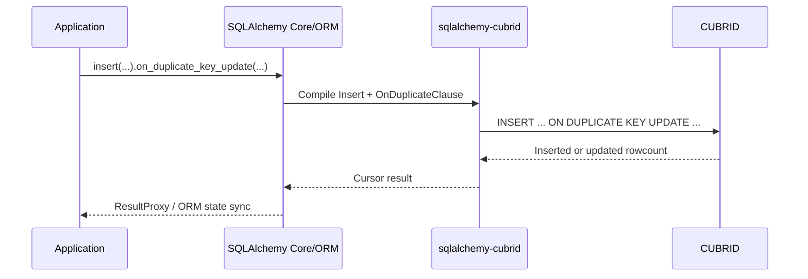
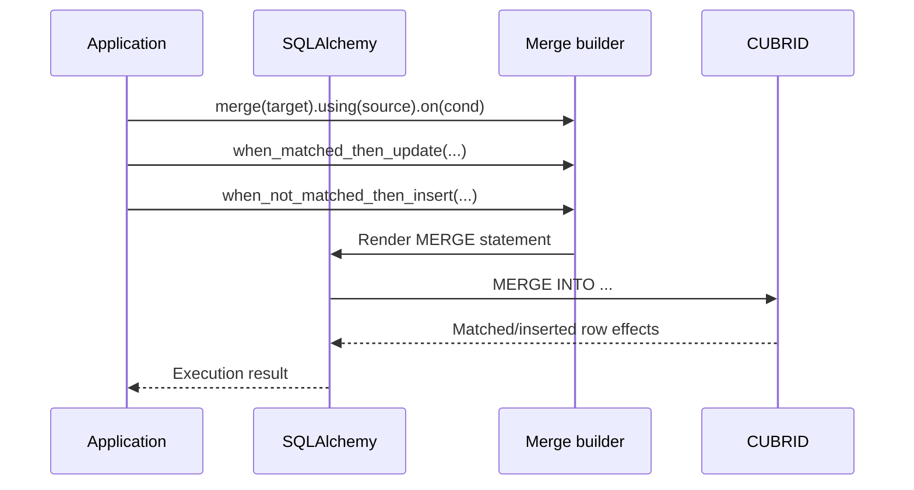

# CUBRID 전용 DML 구성 (한국어)

> 🌐 [DML_EXTENSIONS.md](https://github.com/cubrid-lab/sqlalchemy-cubrid/blob/main/docs/DML_EXTENSIONS.md)의 번역입니다. 영어 원문이 표준이며, 페이지 번역은 경고 수준의 동기화 규칙을 따릅니다.

이 방언은 표준 SQLAlchemy API를 넘어서는 CUBRID 전용 DML(Data Manipulation Language) 기능을 위한 커스텀 SQLAlchemy 구성을 제공합니다.

---

## 목차

- [ON DUPLICATE KEY UPDATE](#on-duplicate-key-update)
  - [기본 사용](#기본-사용)
  - [삽입되는 값 참조](#삽입되는-값-참조)
  - [인자 형태](#인자-형태)
- [REPLACE INTO](#replace-into)
  - [기본 사용](#기본-사용-2)
  - [동작 참고](#동작-참고)
- [MERGE 문](#merge-문)
  - [기본 사용](#기본-사용-3)
  - [WHERE 절을 가진 MERGE](#where-절을-가진-merge)
  - [DELETE WHERE를 가진 MERGE](#delete-where를-가진-merge)
  - [빌더 메서드](#빌더-메서드)
- [GROUP_CONCAT](#group_concat)
- [TRUNCATE TABLE](#truncate-table)
- [FOR UPDATE](#for-update)
- [LIMIT를 가진 UPDATE](#limit를-가진-update)
- [인덱스 힌트](#인덱스-힌트)
  - [USING INDEX](#using-index)
  - [USE / FORCE / IGNORE INDEX](#use--force--ignore-index)
- [쿼리 추적](#쿼리-추적)

---

## ON DUPLICATE KEY UPDATE

CUBRID는 MySQL 8.0 이전 구문과 동일하게 `VALUES()` 참조를 갖춘 `INSERT … ON DUPLICATE KEY UPDATE`를 지원합니다.

### 기본 사용

```python
from sqlalchemy_cubrid import insert

stmt = insert(users).values(id=1, name="alice", email="alice@example.com")
stmt = stmt.on_duplicate_key_update(name="updated_alice")
```

**생성 SQL:**

```sql
INSERT INTO users (id, name, email)
VALUES (1, 'alice', 'alice@example.com')
ON DUPLICATE KEY UPDATE name = 'updated_alice'
```

### 삽입되는 값 참조

`stmt.inserted`를 사용해 삽입되는 값을 참조하세요 — SQL에서 `VALUES(column_name)`으로 렌더링됩니다:

```python
from sqlalchemy_cubrid import insert

stmt = insert(users).values(id=1, name="alice", email="alice@example.com")
stmt = stmt.on_duplicate_key_update(
    name=stmt.inserted.name,      # → VALUES(name)
    email=stmt.inserted.email,    # → VALUES(email)
)
```

**생성 SQL:**

```sql
INSERT INTO users (id, name, email)
VALUES (1, 'alice', 'alice@example.com')
ON DUPLICATE KEY UPDATE name = VALUES(name), email = VALUES(email)
```

### 인자 형태

`on_duplicate_key_update()` 메서드는 세 가지 인자 형태를 받습니다:

```python
# 1. 키워드 인자
stmt.on_duplicate_key_update(name="value", email="value")

# 2. 딕셔너리
stmt.on_duplicate_key_update({"name": "value", "email": "value"})

# 3. 튜플 리스트 (컬럼 순서 보존)
stmt.on_duplicate_key_update([
    ("name", "value"),
    ("email", "value"),
])
```

> **참고**: 키워드 인자와 위치 인자(dict/list)를 혼용할 수 없습니다. 호출마다 하나의 형태를 선택하세요.

### ON DUPLICATE KEY UPDATE에서 서브쿼리 값

CUBRID는 ON DUPLICATE KEY UPDATE 절의 갱신 값으로 서브쿼리 표현식 사용을 지원합니다:

```python
from sqlalchemy_cubrid import insert
import sqlalchemy as sa

stmt = insert(users).values(id=1, name="alice", email="alice@example.com")
stmt = stmt.on_duplicate_key_update(
    name=sa.select(sa.func.max(users.c.name)).scalar_subquery()
)
```

**생성 SQL:**

```sql
INSERT INTO users (id, name, email)
VALUES (1, 'alice', 'alice@example.com')
ON DUPLICATE KEY UPDATE name = (SELECT max(users.name) FROM users)
```

> **참고**: `stmt.inserted.<column>`는 `VALUES(<column>)`로 컴파일되며, ON DUPLICATE KEY UPDATE 절에서 들어오는 행을 참조하는 방언의 지원되는 방식입니다.

---

## REPLACE INTO

CUBRID는 INSERT 유사 구문을 사용하고 중복 키 충돌 시 기존 행을 교체하는 `REPLACE INTO`를 지원합니다.

### 기본 사용

```python
from sqlalchemy_cubrid import replace

stmt = replace(users).values(id=1, name="alice", email="alice@example.com")
```

**생성 SQL:**

```sql
REPLACE INTO users (id, name, email)
VALUES (1, 'alice', 'alice@example.com')
```

### 동작 참고

- `REPLACE INTO`는 모든 표준 INSERT 값 패턴(`values`, `from_select` 등)을 사용합니다
- 중복 키 충돌 시 CUBRID는 기존 행을 새 행으로 교체합니다
- `REPLACE INTO`는 `ON DUPLICATE KEY UPDATE`를 지원하지 않습니다. 제자리 갱신에는 `insert(...).on_duplicate_key_update(...)`를 사용하세요

---

## MERGE 문

CUBRID는 단일 연산으로 조건부 INSERT/UPDATE를 수행하는 완전한 SQL `MERGE` 문을 지원합니다.

### 기본 사용

```python
from sqlalchemy_cubrid.dml import merge

stmt = (
    merge(target_table)
    .using(source_table)
    .on(target_table.c.id == source_table.c.id)
    .when_matched_then_update(
        {"name": source_table.c.name, "email": source_table.c.email}
    )
    .when_not_matched_then_insert(
        {
            "id": source_table.c.id,
            "name": source_table.c.name,
            "email": source_table.c.email,
        }
    )
)
```

**생성 SQL:**

```sql
MERGE INTO target_table
USING source_table
ON (target_table.id = source_table.id)
WHEN MATCHED THEN UPDATE SET name = source_table.name, email = source_table.email
WHEN NOT MATCHED THEN INSERT (id, name, email)
  VALUES (source_table.id, source_table.name, source_table.email)
```

### WHERE 절을 가진 MERGE

`WHEN MATCHED`와 `WHEN NOT MATCHED` 절 모두 선택적 `WHERE` 필터를 지원합니다:

```python
stmt = (
    merge(target_table)
    .using(source_table)
    .on(target_table.c.id == source_table.c.id)
    .when_matched_then_update(
        {"name": source_table.c.name},
        where=source_table.c.name.is_not(None),  # null이 아닌 이름만 갱신
    )
    .when_not_matched_then_insert(
        {"id": source_table.c.id, "name": source_table.c.name},
        where=source_table.c.name.is_not(None),  # null이 아닌 이름만 삽입
    )
)
```

**생성 SQL:**

```sql
MERGE INTO target_table
USING source_table
ON (target_table.id = source_table.id)
WHEN MATCHED THEN UPDATE SET name = source_table.name
  WHERE source_table.name IS NOT NULL
WHEN NOT MATCHED THEN INSERT (id, name)
  VALUES (source_table.id, source_table.name)
  WHERE source_table.name IS NOT NULL
```

### DELETE WHERE를 가진 MERGE

CUBRID는 `WHEN MATCHED` 절 내에서 조건부 행 삭제를 위한 `DELETE WHERE`를 지원합니다:

```python
stmt = (
    merge(target_table)
    .using(source_table)
    .on(target_table.c.id == source_table.c.id)
    .when_matched_then_update(
        {"name": source_table.c.name},
        delete_where=target_table.c.active == False,
    )
    .when_not_matched_then_insert(
        {"id": source_table.c.id, "name": source_table.c.name}
    )
)
```

**생성 SQL:**

```sql
MERGE INTO target_table
USING source_table
ON (target_table.id = source_table.id)
WHEN MATCHED THEN UPDATE SET name = source_table.name
  DELETE WHERE target_table.active = 0
WHEN NOT MATCHED THEN INSERT (id, name)
  VALUES (source_table.id, source_table.name)
```

`when_matched_then_delete()`로 `DELETE WHERE`를 별도로 추가할 수도 있습니다:

```python
stmt = (
    merge(target_table)
    .using(source_table)
    .on(target_table.c.id == source_table.c.id)
    .when_matched_then_update({"name": source_table.c.name})
    .when_matched_then_delete(where=target_table.c.active == False)
    .when_not_matched_then_insert(
        {"id": source_table.c.id, "name": source_table.c.name}
    )
)
```

### 빌더 메서드

| 메서드                                                       | 설명                                    |
|--------------------------------------------------------------|--------------------------------------------|
| `merge(target)`                                              | 팩토리 함수 — 대상 테이블 설정             |
| `.using(source)`                                             | 소스 테이블 또는 서브쿼리                  |
| `.on(condition)`                                             | 조인 조건                                  |
| `.when_matched_then_update(values, where=, delete_where=)`   | WHEN MATCHED → UPDATE SET 절               |
| `.when_matched_then_delete(where=)`                          | 기존 WHEN MATCHED에 DELETE WHERE 추가      |
| `.when_not_matched_then_insert(values, where=)`              | WHEN NOT MATCHED → INSERT 절               |

**요구사항:**
- `using()`과 `on()`은 필수
- `when_matched_then_update` 또는 `when_not_matched_then_insert` 중 최소 하나는 지정해야 함
- `when_matched_then_delete`는 `when_matched_then_update` 이후에만 호출 가능

**컬럼 키 해석:**

`when_matched_then_update()`와 `when_not_matched_then_insert()` 딕셔너리의 컬럼 키는 다음과 같이 해석됩니다:

1. **문자열 키** — 대상 테이블의 컬럼 이름과 일치해야 함. 일치하는 컬럼이 없으면 `CompileError` 발생.
2. **Column 객체** — 컬럼이 대상 테이블에 속하면 DB 수준 이름을 직접 사용. 다른 테이블에 속하지만 같은 키의 컬럼이 대상에 있으면 대상 컬럼 이름을 사용.

```python
# 유효: 문자열 키가 대상 컬럼과 일치
.when_matched_then_update({"name": source_table.c.name})

# 유효: 대상 테이블의 Column 객체
.when_matched_then_update({target_table.c.name: source_table.c.name})

# 무효: 대상 테이블에 없는 문자열 키 → CompileError
.when_matched_then_update({"nonexistent_col": source_table.c.name})
```

**컴파일 시점 오류:**

| 오류 | 원인 |
|-------|------|
| `MERGE statement requires a target table` | 대상 테이블 미지정 |
| `MERGE statement requires a USING source` | `.using()` 미호출 |
| `MERGE statement requires an ON condition` | `.on()` 미호출 |
| `MERGE: column 'X' not found in target table` | 문자열/Column 키가 대상 컬럼으로 해석되지 않음 |

---

## GROUP_CONCAT

CUBRID는 집계 함수로 `GROUP_CONCAT`을 지원합니다:

```python
import sqlalchemy as sa

# 기본 GROUP_CONCAT
stmt = sa.select(sa.func.group_concat(users.c.name))
# → SELECT GROUP_CONCAT(users.name) FROM users

# GROUP BY와 함께
stmt = (
    sa.select(
        users.c.department,
        sa.func.group_concat(users.c.name),
    )
    .group_by(users.c.department)
)
# → SELECT users.department, GROUP_CONCAT(users.name)
#   FROM users GROUP BY users.department
```

CUBRID의 `GROUP_CONCAT`은 SQL 수준에서 `DISTINCT`, `ORDER BY`, `SEPARATOR` 수정자를 지원하지만, 표준 `sa.func.group_concat()` API는 기본 사용법만 제공합니다.

---

## TRUNCATE TABLE

CUBRID는 모든 행을 제거하는 `DELETE`보다 빠른 `TRUNCATE TABLE`을 지원합니다:

```python
from sqlalchemy import text

with engine.begin() as conn:
    conn.execute(text("TRUNCATE TABLE temp_data"))
```

방언은 `TRUNCATE`를 오토커밋 감지 패턴에 포함하므로, 오토커밋 활성화 상태로 실행됩니다 (CUBRID의 암시적 DDL 커밋 동작과 일치).

---

## FOR UPDATE

CUBRID는 행 수준 잠금을 위한 `SELECT … FOR UPDATE`를 지원합니다:

```python
import sqlalchemy as sa

# 기본 FOR UPDATE
stmt = sa.select(users).where(users.c.id == 1).with_for_update()
# → SELECT ... FROM users WHERE users.id = 1 FOR UPDATE

# 특정 컬럼의 FOR UPDATE OF
stmt = (
    sa.select(users)
    .where(users.c.id == 1)
    .with_for_update(of=[users.c.name, users.c.email])
)
# → SELECT ... FROM users WHERE users.id = 1 FOR UPDATE OF users.name, users.email
```

> **참고**: CUBRID는 `NOWAIT`이나 `SKIP LOCKED` 수정자를 지원하지 **않습니다**. 사용해도 효과가 없습니다.

---

## LIMIT를 가진 UPDATE

CUBRID는 영향받는 행 수를 제한하는 `UPDATE … LIMIT n`을 지원합니다:

```python
from sqlalchemy import update

stmt = (
    update(users)
    .values(status="inactive")
    .where(users.c.last_login < "2025-01-01")
)
stmt.kwargs["cubrid_limit"] = 100
# → UPDATE users SET status = 'inactive'
#   WHERE users.last_login < '2025-01-01'
#   LIMIT 100
```

> **참고**: 컴파일러가 이 확장을 위해 `stmt.kwargs["cubrid_limit"]`을 읽습니다. 이것은 CUBRID/MySQL 확장이며, PostgreSQL과 SQLite는 `UPDATE … LIMIT`을 지원하지 않습니다.

---

## 인덱스 힌트

CUBRID는 SELECT 쿼리에서 인덱스 힌트를 지원합니다. SQLAlchemy 내장 힌트 메커니즘을 사용하세요 — 커스텀 방언 구성이 필요 없습니다.

### USING INDEX

```python
import sqlalchemy as sa

# with_hint 사용 (방언 전용 — CUBRID에만 출력)
stmt = (
    sa.select(users)
    .with_hint(users, "USING INDEX idx_users_name", dialect_name="cubrid")
)

# suffix_with 사용 (항상 출력)
stmt = sa.select(users).suffix_with("USING INDEX idx_users_name")
```

### USE / FORCE / IGNORE INDEX

```python
# USE INDEX
stmt = (
    sa.select(users)
    .with_hint(users, "USE INDEX (idx_users_name)", dialect_name="cubrid")
)

# FORCE INDEX
stmt = (
    sa.select(users)
    .with_hint(users, "FORCE INDEX (idx_users_email)", dialect_name="cubrid")
)

# IGNORE INDEX
stmt = (
    sa.select(users)
    .with_hint(users, "IGNORE INDEX (idx_users_old)", dialect_name="cubrid")
)
```

> **이식성 팁**: `with_hint(dialect_name="cubrid")`를 사용하면 힌트는 CUBRID 방언으로 컴파일할 때만 출력됩니다. 다른 방언은 이를 무시하므로, 코드가 데이터베이스 백엔드 간에 안전하게 이식 가능합니다.

---

## 쿼리 추적

CUBRID는 표준 SQL `EXPLAIN` 문을 지원하지 않습니다. 대신 `SET TRACE ON` / `SHOW TRACE` 명령을 통한 세션 수준 추적 기능을 제공합니다.

`trace_query()` 유틸리티가 이 워크플로를 감쌉니다:

```python
from sqlalchemy import create_engine, text
from sqlalchemy_cubrid.trace import trace_query

engine = create_engine("cubrid://dba@localhost:33000/demodb")
with engine.connect() as conn:
    traces = trace_query(conn, text("SELECT * FROM users WHERE id = 1"))
    for line in traces:
        print(line)
```

**동작 방식:**

1. `SET TRACE ON` — 세션의 추적 수집 활성화
2. 제공된 SQL 문 실행
3. `SHOW TRACE` — 추적 통계 조회
4. `SET TRACE OFF` — 추적 비활성화 (오류 시에도 항상)

**추적 출력**에는 쿼리 시간, fetch 횟수, I/O 연산 같은 실행 통계가 포함됩니다.

> **참고**: `trace_query()`는 라이브 CUBRID 연결이 필요합니다. 오프라인(컴파일 전용) 모드에서는 사용할 수 없습니다. 추적은 세션 범위이며 다른 연결에 영향을 주지 않습니다.

---

## 쿡북: 프로덕션 DML 패턴

### 1) `ON DUPLICATE KEY UPDATE`로 원자적 카운터

```python
from sqlalchemy import func
from sqlalchemy_cubrid import insert

stmt = (
    insert(daily_metrics)
    .values(metric_date="2026-04-06", page_views=1)
    .on_duplicate_key_update(
        page_views=daily_metrics.c.page_views + 1,
        updated_at=func.current_datetime(),
    )
)
```

읽기-후-쓰기 없이 멱등한 이벤트 집계에 이 패턴을 사용하세요.

### 2) 컬럼 갱신 순서 보존

`on_duplicate_key_update()`는 튜플 리스트를 받아 SQL 컬럼 순서를 결정적으로 만듭니다:

```python
stmt = (
    insert(accounts)
    .values(id=100, status="active", updated_by="system")
    .on_duplicate_key_update([
        ("status", "active"),
        ("updated_by", "system"),
    ])
)
```

이것은 `OnDuplicateClause`의 내부 `_parameter_ordering` 동작을 반영합니다.

### 3) 들어오는 값으로 멱등 동기화

```python
stmt = insert(users).values(id=1, name="Alice", email="alice@example.com")
stmt = stmt.on_duplicate_key_update(
    name=stmt.inserted.name,
    email=stmt.inserted.email,
)
```

### 4) `MERGE`로 스테이징 테이블에서 배치 수집

```python
from sqlalchemy import select
from sqlalchemy_cubrid import merge

source = (
    select(staging_users.c.user_id, staging_users.c.name, staging_users.c.email)
    .where(staging_users.c.is_valid == 1)
    .subquery()
)

stmt = (
    merge(users)
    .using(source)
    .on(users.c.id == source.c.user_id)
    .when_matched_then_update(
        {
            "name": source.c.name,
            "email": source.c.email,
        },
        where=source.c.email.is_not(None),
    )
    .when_not_matched_then_insert(
        {
            "id": source.c.user_id,
            "name": source.c.name,
            "email": source.c.email,
        }
    )
)
```

### 5) `MERGE` 중 무효한 행 소프트 삭제

```python
stmt = (
    merge(products)
    .using(source_products)
    .on(products.c.sku == source_products.c.sku)
    .when_matched_then_update(
        {"name": source_products.c.name},
        delete_where=source_products.c.discontinued == 1,
    )
    .when_not_matched_then_insert(
        {
            "sku": source_products.c.sku,
            "name": source_products.c.name,
        }
    )
)
```

### 6) 불변 스냅샷을 위한 안전한 `REPLACE INTO`

```python
from sqlalchemy_cubrid import replace

stmt = replace(user_daily_snapshot).values(
    user_id=42,
    snapshot_date="2026-04-06",
    payload="{...}",
)
```

삭제+삽입 의미론이 허용되는 전체 행 교체 워크로드에는 `REPLACE`를 사용하세요.

---

## DML 실행 흐름

### `ON DUPLICATE KEY UPDATE`



### `MERGE`



---

## 주의점과 한계

!!! warning "빈 갱신 매핑을 전달하지 마세요"
    `on_duplicate_key_update({})`는 오류를 발생시킵니다.
    비어 있지 않은 dict, `ColumnCollection`, 또는 `(key, value)` 튜플 리스트를 전달하세요.

!!! warning "위치 인자와 키워드 인자를 혼용하지 마세요"
    `on_duplicate_key_update()`는 단일 입력 스타일을 강제합니다:
    위치(`dict`/`list[tuple]`) 또는 키워드 인자 중 하나.

!!! warning "MERGE에는 `using()`과 `on()` 필요"
    `using()`이나 `on()`이 없으면 무효한 SQL이 생성됩니다. 실행 전 항상 둘 다 제공하세요.

!!! warning "`when_matched_then_delete()`는 선행 갱신 절 필요"
    이 방언 구현에서 `when_matched_then_delete()`는 `when_matched_then_update()` 이후에 호출되어야 합니다.

!!! tip "고빈도 단일 행 upsert에는 ODKU 선호"
    키 기반 단일 업데이트에는 `ON DUPLICATE KEY UPDATE`가 보통 `MERGE`보다 간단하고 오버헤드가 낮습니다.

---

## 성능 참고

| 패턴 | 최적 용도 | 상대 비용 | 비고 |
|---|---|---|---|
| `INSERT ... ON DUPLICATE KEY UPDATE` | 유니크 키의 단일 행/소량 upsert | 낮음 | 하나의 문장으로 효율적 충돌 처리. |
| `MERGE` | 소스 테이블/서브쿼리의 집합 기반 동기화 | 중간 | 가장 표현력 있음. 조건자로 갱신/삽입/삭제 가능. |
| `REPLACE INTO` | 전체 행 교체 의미론 | 중간-높음 | 삭제+삽입 동작은 더 많은 인덱스·FK 작업을 유발할 수 있음. |

실용 가이드:

1. 대표적인 카디널리티와 인덱스 레이아웃으로 벤치마크하세요.
2. 매치 조건자를 sargable하게 유지하세요 (`ON` 키에 인덱스).
3. 결정적 SQL 텍스트가 문장 캐시 동작에 도움이 될 때 ODKU에서 튜플 순서를 사용하세요.

---

*참고: [기능 지원](FEATURE_SUPPORT.md) · [타입 매핑](TYPES.md) · [연결 설정](CONNECTION.md)*
