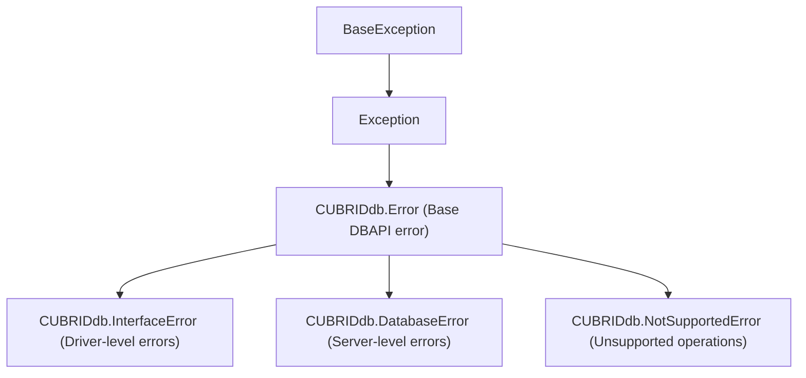

# CUBRID-Python 드라이버 호환성 (한국어)

> 🌐 [DRIVER_COMPAT.md](https://github.com/cubrid-lab/sqlalchemy-cubrid/blob/main/docs/DRIVER_COMPAT.md)의 번역입니다. 영어 원문이 표준이며, 페이지 번역은 경고 수준의 동기화 규칙을 따릅니다.

이 문서는 `sqlalchemy-cubrid`와 CUBRID Python 드라이버(`CUBRIDdb`), CUBRID 서버 버전 간의 테스트된 호환성 매트릭스를 설명합니다.

---

## 목차

- [드라이버 개요](#드라이버-개요)
- [버전 호환성 매트릭스](#버전-호환성-매트릭스)
- [예외 계층](#예외-계층)
- [드라이버 API 사용](#드라이버-api-사용)
- [알려진 문제](#알려진-문제)
- [설치 참고](#설치-참고)

---

## 드라이버 개요

| 속성 | 값 |
|---|---|
| PyPI 패키지 | `CUBRID-Python` |
| 임포트 이름 | `CUBRIDdb` |
| 타입 | C 확장 (CPython 전용) |
| DBAPI 수준 | DB-API 2.0 (PEP 249) |
| 파라미터 방식 | `qmark` |
| 소스 | [github.com/CUBRID/cubrid-python](https://github.com/CUBRID/cubrid-python) |

이 드라이버는 CUBRID CCI(C Client Interface) 라이브러리를 감쌉니다. 순수 Python 드라이버가 **아니며** CCI 헤더에 대한 컴파일이 필요합니다.

---

## 버전 호환성 매트릭스

### 테스트된 구성

| sqlalchemy-cubrid | CUBRID-Python 드라이버 | CUBRID 서버 | Python | 상태 |
|---|---|---|---|---|
| 0.4.0 | v11.3.0.51 | 11.4 | 3.10 – 3.14 | ✅ CI에서 테스트 |
| 0.4.0 | v11.3.0.51 | 11.2 | 3.10 – 3.14 | ✅ CI에서 테스트 |
| 0.4.0 | v11.3.0.51 | 11.0 | 3.10 – 3.14 | ✅ CI에서 테스트 |
| 0.4.0 | v11.3.0.51 | 10.2 | 3.10 – 3.14 | ✅ CI에서 테스트 |
| 0.3.x | v11.3.0.51 | 10.2 – 11.4 | 3.10 – 3.13 | ✅ 테스트됨 |

### CUBRID 서버 버전 지원

| 서버 버전 | 드라이버 버전 | 비고 |
|---|---|---|
| 11.4 | v11.3.0.51 | 최신 안정 |
| 11.2 | v11.3.0.51 | LTS 릴리스 |
| 11.0 | v11.3.0.51 | 레거시 지원 |
| 10.2 | v11.3.0.51 | 최소 지원 |
| 12.x | — | 미출시. 출시되면 테스트 예정 |

### Python 버전 지원

| Python | 상태 | 비고 |
|---|---|---|
| 3.10 | ✅ 완전 지원 | 최소 버전 |
| 3.11 | ✅ 완전 지원 | |
| 3.12 | ✅ 완전 지원 | |
| 3.13 | ✅ 완전 지원 | |
| 3.14 | 🔄 CI 매트릭스 추가됨 | 프리릴리스. 드라이버 C 확장 호환성에 따라 |

---

## 예외 계층

CUBRIDdb는 PEP 249 대비 **제한된** 예외 계층을 노출합니다:



**누락된 PEP 249 예외** (드라이버가 제공하지 않음):
- `OperationalError` — `DatabaseError`에 흡수됨
- `ProgrammingError` — `DatabaseError`에 흡수됨
- `InternalError` — `DatabaseError`에 흡수됨
- `DataError` — `DatabaseError`에 흡수됨
- `IntegrityError` — `DatabaseError`에 흡수됨

즉, 모든 데이터베이스 수준 오류(제약 위반, 구문 오류, 연결 문제)가 `DatabaseError`로 발생합니다. `sqlalchemy-cubrid` 방언은 연결 해제 오류를 다른 실패와 구별하기 위해 **문자열 기반 메시지 매칭**을 사용합니다.

---

## 드라이버 API 사용

방언이 의존하는 드라이버 전용 API:

### 연결 메서드

| 메서드 | 용도 | 사용처 |
|---|---|---|
| `conn.ping()` | 연결 생존 확인 | `CubridDialect.do_ping()` |
| `conn.get_last_insert_id()` | auto-increment 값 조회 | `CubridExecutionContext.get_lastrowid()` |
| `conn.set_autocommit(bool)` | 오토커밋 제어 | `CubridDialect.on_connect()` |
| `conn.cursor()` | 커서 생성 | 표준 DB-API |

### 오류 코드 추출

```python
# 오류 코드는 exception.args[0]에 있음
try:
    cursor.execute("invalid sql")
except CUBRIDdb.DatabaseError as e:
    code = e.args[0]  # int 또는 str
```

방언의 `_extract_error_code()`는 정수 코드와 문자열에 박힌 코드(예: `"-21003 Cannot communicate with broker"`) 모두 처리합니다.

---

## 알려진 문제

### 1. 연결 해제 감지를 위한 `OperationalError` 없음

드라이버가 `OperationalError`를 제공하지 않으므로, 방언은 MySQL 방언처럼 `isinstance(e, dbapi.OperationalError)`를 쓸 수 없습니다. 대신:
- 알려진 연결 해제 메시지 15종에 대한 문자열 패턴 매칭
- CCI 통신 오류에 대한 숫자 오류 코드 매칭

### 2. CCI 라이브러리 의존성

드라이버는 CCI 라이브러리를 소스에서 컴파일해야 합니다. CI에서는 다음으로 처리:
```bash
git clone --branch v11.3.0.51 --depth 1 https://github.com/CUBRID/cubrid-python.git
cd cubrid-python/cci-src && mkdir build_x86_64_release && cd build_x86_64_release
cmake ../ && make -j$(nproc)
```

### 3. `cursor.lastrowid` 사용 불가

표준 DB-API의 `cursor.lastrowid` 속성이 구현되어 있지 않습니다. 방언은 `connection.get_last_insert_id()`를 대신 사용하며, `SELECT LAST_INSERT_ID()` SQL 폴백을 둡니다.

### 4. CUBRID 12.x 호환성

CUBRID 12는 아직 출시되지 않았습니다. 출시되면 드라이버와 방언을 테스트하고 CI 매트릭스를 갱신할 예정입니다. 잠재 우려:
- CCI API 변경 시 드라이버 재컴파일 필요 가능성
- 새 SQL 기능 시 컴파일러 갱신 필요 가능성
- 새 데이터 타입 시 타입 매핑 추가 필요 가능성

---

## 설치 참고

순수 Python pycubrid 방언 변형은 `pycubrid>=1.3.2,<2.0`과 함께 `sqlalchemy-cubrid[pycubrid]`를 설치하세요. 그 최소 버전은 `pool_pre_ping`이 사용하는 네이티브 동기·비동기 `ping(False)` 지원에 필요합니다.

### 소스에서 설치 (CI에 필요)

```bash
# 드라이버 클론
git clone --branch v11.3.0.51 --depth 1 \
  https://github.com/CUBRID/cubrid-python.git

# CCI 라이브러리 빌드
cd cubrid-python/cci-src
mkdir -p build_x86_64_release && cd build_x86_64_release
cmake ../ && make -j$(nproc)

# 설치
cd /path/to/cubrid-python
pip install .
```

### 설치 확인

```python
import CUBRIDdb
print(CUBRIDdb.__version__)  # 버전 문자열이 출력되어야 함
```

---

*참고: [연결 가이드](CONNECTION.md) · [개발 가이드](DEVELOPMENT.md) · [기능 지원](FEATURE_SUPPORT.md)*
