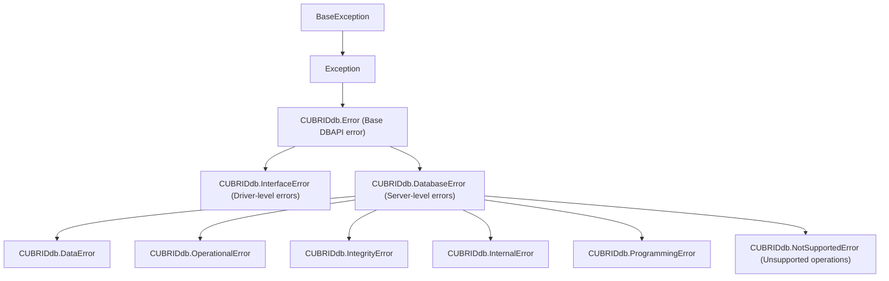

# CUBRID-Python 드라이버 호환성 (한국어)

> 🌐 [DRIVER_COMPAT.md](https://github.com/cubrid-lab/sqlalchemy-cubrid/blob/main/docs/DRIVER_COMPAT.md)의 번역입니다. 영어 원문이 표준이며, 페이지 번역은 경고 수준의 동기화 규칙을 따릅니다.

이 문서는 `sqlalchemy-cubrid`와 CUBRID Python 드라이버(`CUBRIDdb`), CUBRID 서버 버전 간의 테스트된 호환성 매트릭스를 설명합니다.

---

## 목차

- [드라이버 개요](#드라이버-개요)
- [버전 호환성 매트릭스](#버전-호환성-매트릭스)
- [예외 계층](#예외-계층)
- [드라이버 API 사용](#드라이버-api-사용)
- [알려진 문제](#알려진-문제)
- [설치 참고](#설치-참고)

---

## 드라이버 개요

| 속성 | 값 |
|---|---|
| PyPI 패키지 | `CUBRID-Python` |
| 임포트 이름 | `CUBRIDdb` |
| 타입 | C 확장 (CPython 전용) |
| DBAPI 수준 | DB-API 2.0 (PEP 249) |
| 파라미터 방식 | `qmark` |
| 소스 | [github.com/CUBRID/cubrid-python](https://github.com/CUBRID/cubrid-python) |

이 드라이버는 CUBRID CCI(C Client Interface) 라이브러리를 감쌉니다. 순수 Python 드라이버가 **아니며** CCI 헤더에 대한 컴파일이 필요합니다.

---

## 버전 호환성 매트릭스

### 테스트된 구성

| sqlalchemy-cubrid | CUBRID-Python 드라이버 | CUBRID 서버 | Python | 상태 |
|---|---|---|---|---|
| 0.4.0 | v11.3.0.51 | 11.4 | 3.10 – 3.14 | ✅ CI에서 테스트 |
| 0.4.0 | v11.3.0.51 | 11.2 | 3.10 – 3.14 | ✅ CI에서 테스트 |
| 0.4.0 | v11.3.0.51 | 11.0 | 3.10 – 3.14 | ✅ CI에서 테스트 |
| 0.4.0 | v11.3.0.51 | 10.2 | 3.10 – 3.14 | ✅ CI에서 테스트 |
| 0.3.x | v11.3.0.51 | 10.2 – 11.4 | 3.10 – 3.13 | ✅ 테스트됨 |

### CUBRID 서버 버전 지원

| 서버 버전 | 드라이버 버전 | 비고 |
|---|---|---|
| 11.4 | v11.3.0.51 | 최신 안정 |
| 11.2 | v11.3.0.51 | LTS 릴리스 |
| 11.0 | v11.3.0.51 | 레거시 지원 |
| 10.2 | v11.3.0.51 | 최소 지원 |
| 12.x | — | 미출시. 출시되면 테스트 예정 |

### Python 버전 지원

| Python | 상태 | 비고 |
|---|---|---|
| 3.10 | ✅ 완전 지원 | 최소 버전 |
| 3.11 | ✅ 완전 지원 | |
| 3.12 | ✅ 완전 지원 | |
| 3.13 | ✅ 완전 지원 | |
| 3.14 | 🔄 CI 매트릭스 추가됨 | 프리릴리스. 드라이버 C 확장 호환성에 따라 |

---

## 예외 계층

CUBRIDdb 11.3.0.51(모듈 `_cubrid`)은 `Warning`을 제외한 모든 PEP 249 예외 클래스를 제공합니다:


```mermaid
graph TD
    base["BaseException"] --> exc["Exception"]
    exc --> err["CUBRIDdb.Error (Base DBAPI error)"]
    err --> iface["CUBRIDdb.InterfaceError (Driver-level errors)"]
    err --> db["CUBRIDdb.DatabaseError (Server-level errors)"]
    db --> data["CUBRIDdb.DataError"]
    db --> op["CUBRIDdb.OperationalError"]
    db --> integ["CUBRIDdb.IntegrityError"]
    db --> internal["CUBRIDdb.InternalError"]
    db --> prog["CUBRIDdb.ProgrammingError"]
    db --> ns["CUBRIDdb.NotSupportedError (Unsupported operations)"]
```

서버 오류가 어떤 클래스가 되는지는 드라이버의 오류 코드 매핑이 결정합니다. CUBRID 11.4에서 관찰한 결과:

| 오류 (네이티브 코드) | CUBRIDdb 클래스 |
|---|---|
| 구문 오류 또는 알 수 없는 테이블 (-493) | `ProgrammingError` |
| NOT NULL (-631), 외래 키 (-922), 고유 (-670) | `IntegrityError` |
| 0으로 나누기 (-494) | `IntegrityError` |
| 실패한 `CAST` (-181) | `DatabaseError` |
| `rollback()` 이후 결과 읽기 (CCI -20040) | `InterfaceError` |

SQLAlchemy는 전달받은 클래스를 감싸므로 `cubrid://`는 제약 위반에 `sqlalchemy.exc.IntegrityError`를 발생시킵니다. pycubrid는 [알려진 문제 9](#9-pycubrid-171-이하의-not-null--외래-키-위반)를 참고하세요. `sqlalchemy-cubrid` 방언은 연결 해제 오류를 다른 실패와 구별하기 위해 **문자열 기반 메시지 매칭**을 사용합니다.

---

## 드라이버 API 사용

방언이 의존하는 드라이버 전용 API:

### 연결 메서드

| 메서드 | 용도 | 사용처 |
|---|---|---|
| `conn.ping()` | 연결 생존 확인 | `CubridDialect.do_ping()` |
| `conn.get_last_insert_id()` | auto-increment 값 조회 | `CubridExecutionContext.get_lastrowid()` |
| `conn.set_autocommit(bool)` / `conn.autocommit` | 오토커밋 제어 | `CubridDialect.on_connect()`, `set_isolation_level()`(`AUTOCOMMIT` 전환과 복귀), `detect_autocommit_setting()` |
| `conn.cursor()` | 커서 생성 | 표준 DB-API |

### 오류 코드 추출

```python
# 오류 코드는 exception.args[0]에 있음
try:
    cursor.execute("invalid sql")
except CUBRIDdb.DatabaseError as e:
    code = e.args[0]  # int 또는 str
```

방언의 `_extract_error_code()`는 정수 코드와 문자열에 박힌 코드(예: `"-20004 Cannot communicate with server"`) 모두 처리합니다.

pycubrid는 `args`에 메시지만 담고 서버 오류 코드는 `errno`(및 `code`)에 담습니다. `is_disconnect()`는 [알려진 문제 1](#1-연결-해제-감지에-operationalerror를-사용하지-않음)에 나열된 서버 코드에 대해 `errno`를 읽습니다. pycubrid의 `str()`은 `errno`의 설명(예: -4와 -671의 `Communication error`)도 덧붙이므로, 메시지 패턴은 드라이버 자체 메시지인 `args[0]`과 비교합니다.

---

## 알려진 문제

### 1. 연결 해제 감지에 `OperationalError`를 사용하지 않음

CUBRIDdb 11.3.0.51은 `OperationalError`를 정의하지만([예외 계층](#예외-계층) 참고), 방언의 `is_disconnect()`는 예외 클래스로 연결 해제를 분류하지 않습니다. 대신:
- 알려진 연결 해제 메시지 16종에 대한 문자열 패턴 매칭
- 끊겼거나 쓸 수 없는 연결의 CCI·CAS 코드에 대한 `args[0]`(CUBRIDdb 전용) 숫자 오류 코드 매칭: -20004(`CCI_ER_COMMUNICATION`), -10003(`CAS_ER_COMMUNICATION`, CCI는 두 코드를 통신 오류로 취급), -20002(`CCI_ER_CON_HANDLE`), -20016(`CCI_ER_CONNECT`), -10002(`CAS_ER_NO_MORE_MEMORY`; CAS가 이 코드를 보낸 뒤 연결을 닫음). 1.8.0까지의 릴리스는 대신 -4, -10005, -10007, -21003, -21005를 나열했습니다(#572). -4는 서버의 `ER_INTERRUPTED`(`KILL QUERY`로 중단된 쿼리)여서 CUBRIDdb는 멀쩡한 연결을 무효화했고, -10005와 -10007은 `CAS_ER_TRAN_TYPE`과 `CAS_ER_NUM_BIND`, -21003과 -21005는 어느 Python 드라이버도 내지 않는 CUBRID JDBC 코드입니다. CUBRIDdb가 트랜잭션 중 CAS가 죽었을 때 내는 -20004와 -10002는 빠져 있었습니다(#578).
- CAS의 `cub_server` 세션이 사라져 브로커가 CAS를 리셋하는 서버 오류에 대한 숫자 오류 코드 매칭(두 드라이버 모두): -111(`ER_TM_SERVER_DOWN_UNILATERALLY_ABORTED`), -199(`ER_NET_SERVER_CRASHED`), -224(`ER_OBJ_NO_CONNECT`), -677(`ER_BO_CONNECT_FAILED`). `cub_server`가 중지되거나 비정상 종료되면 트랜잭션 중인 연결은 -111을 받고, 이후 트랜잭션이 끝날 때까지 서버가 다시 올라와도 모든 문장에서 -224를 받습니다(#565). -671(`ER_CSS_RECV_OR_SEND`)은 브로커가 CAS를 리셋하지 않으므로 포함하지 않습니다. [문제 해결](TROUBLESHOOTING.md#cub_server-재시작-또는-장애-후-오류) 참고.

### 2. CCI 라이브러리 의존성

드라이버는 CCI 라이브러리를 소스에서 컴파일해야 합니다. CI에서는 다음으로 처리:
```bash
git clone --branch v11.3.0.51 --depth 1 https://github.com/CUBRID/cubrid-python.git
cd cubrid-python/cci-src && mkdir build_x86_64_release && cd build_x86_64_release
cmake ../ && make -j$(nproc)
```

### 3. `cursor.lastrowid` 사용 불가

표준 DB-API의 `cursor.lastrowid` 속성이 구현되어 있지 않습니다. 방언은 `connection.get_last_insert_id()`를 대신 사용하며, `SELECT LAST_INSERT_ID()` SQL 폴백을 둡니다.

### 4. CUBRID 12.x 호환성

CUBRID 12는 아직 출시되지 않았습니다. 출시되면 드라이버와 방언을 테스트하고 CI 매트릭스를 갱신할 예정입니다. 잠재 우려:
- CCI API 변경 시 드라이버 재컴파일 필요 가능성
- 새 SQL 기능 시 컴파일러 갱신 필요 가능성
- 새 데이터 타입 시 타입 매핑 추가 필요 가능성

### 5. `NUMERIC` / `DECIMAL` 소수부 정밀도 손실

`CUBRIDdb` C-확장 드라이버는 `NUMERIC` / `DECIMAL` 값의 소수부를 DB-API 계층 *아래에서* 잘라냅니다: `15.7563`을 저장한 컬럼이 `15`로 돌아옵니다. 드라이버 내부에서 SQLAlchemy가 값을 받기 전에 자릿수가 버려지므로, 어떤 방언 result processor도 이를 복원할 수 없습니다. 이는 방언 버그가 아니라 상류 드라이버의 한계입니다.

정확한 `Decimal` 라운드트립이 필요하면 순수 파이썬 `cubrid+pycubrid://` 드라이버를 사용하세요 — 전체 정밀도로 `Decimal` 값을 네이티브 반환합니다(CUBRID 11.4에서 확인). 이것이 신규 프로젝트에 `pycubrid`를 권장하는 이유 중 하나입니다.

### 6. `BLOB` / `CLOB` 조회는 LOB 로케이터를 반환

CUBRID 10.2 및 11.4에서 실제로 검증했습니다(#485). 모든 릴리스된 드라이버에서 `BLOB` / `CLOB` 컬럼에 `bytes` / `str`을 바인딩하면 전체 값이 저장되고 `NULL`은 `None`으로 왕복됩니다. 그러나 NULL이 아닌 `BLOB` / `CLOB` 컬럼을 조회하면 `bytes` / `str` 대신 드라이버의 LOB 로케이터가 반환됩니다:

| 드라이버 URL | NULL이 아닌 `BLOB` / `CLOB` 조회 결과 |
|---|---|
| `cubrid://` (`CUBRIDdb` 11.3) | 서버 파일 로케이터 `str` (`'file:...'`) |
| `cubrid+pycubrid://` (pycubrid 1.3.2 ~ 1.7.1) | LOB 핸들 `dict` (`lob_type`, `lob_length`, `file_locator`, ...) |
| `cubrid+aiopycubrid://` (pycubrid 1.7.1) | LOB 핸들 `dict` (`None`을 포함한 `LargeBinary` / `BLOB` 값 바인딩은 #500부터 정상 동작) |

`LargeBinary` / `BLOB`의 경우 SQLAlchemy 결과 프로세서가 `TypeError`를 발생시킵니다. 내용을 읽으려면 서버에서 변환(`CLOB_TO_CHAR(col)`, `BLOB_TO_BIT(col)`)하거나, 대용량 텍스트는 `str`로 왕복되는 `sqlalchemy.Text`(CUBRID `STRING`)에 저장하세요. pycubrid의 공식 LOB 조회는 cubrid-lab/pycubrid#441에서 추적합니다. [타입](TYPES.md)도 참고하세요.

### 7. `executemany`가 `None`에 이전 행의 값을 재사용 (방언 가드)

`CUBRIDdb` 11.3.0.51(`cubrid://` 드라이버)의 `executemany()`에는 두 가지 버그가 있습니다:

- **잘못된 데이터.** `_bind_params`가 `None`을 건너뛰고 `executemany`는 문장을 한 번만 준비(prepare)합니다. 따라서 `None` 파라미터에는 이전 행에서 바인딩된 값이 그대로 남아, `[(1, 'a'), (2, None)]`이 `(2, 'a')`로 저장됩니다.
- **잘못된 rowcount.** `cursor.rowcount`가 마지막 행의 개수만 보고합니다.

SQLAlchemy를 통하면 `text()` 및 Core `UPDATE`/`DELETE` executemany가 잘못된 데이터를 저장했고, ORM의 일괄 UPDATE는 `StaleDataError`(`expected to update 3 row(s); 1 were matched`)를 발생시켰습니다. `bind_param(i, None)`이 `SystemError`를 발생시키므로 드라이버 외부에서 우회할 수도 없습니다.

**방언 가드(#502).** `CubridDialect.do_executemany`는 각 파라미터 세트를 `cursor.execute()`로 실행하고 `cursor.rowcount`를 합계로 설정합니다. 각 `execute()`가 문장을 다시 준비하므로 바인딩되지 않은 `None`은 NULL이 됩니다. 마지막 행 rowcount는 모든 문장에서 틀리므로, 가드는 `None`이 있는 행에만이 아니라 항상 적용됩니다. 가드 덕분에 `supports_sane_multi_rowcount`는 두 드라이버 모두에서 정확합니다. 대가는 일반 executemany에서 행마다 한 번의 문장 준비입니다. insertmanyvalues를 사용하는 여러 행의 Core `insert()`는 `do_execute`를 거치므로 가드를 사용하지 않습니다. 타입이 `bind_expression()`을 정의하는 컬럼이 있는 테이블에 대한 INSERT는 executemany로 대체되므로(#421) `cubrid://`에서는 행 단위 가드를 사용합니다. SQLAlchemy 없이 `CUBRIDdb`의 `cursor.executemany()`를 직접 호출하는 코드는 여전히 영향을 받습니다.

`cubrid+pycubrid://`와 `cubrid+aiopycubrid://`는 `None`을 올바르게 바인딩하고 rowcount를 합산하므로 드라이버의 한 번만 준비하는 `executemany`를 그대로 사용합니다.

수정된 `CUBRIDdb` 릴리스가 최소 지원 버전이 되면 가드를 제거합니다. CUBRID/cubrid-python에 대한 상류 보고는 아직 제출 전이며 #502에서 추적합니다.

### 8. `commit()` / `rollback()` 이후 다 읽지 않은 결과

여러 번의 FETCH 왕복이 필요한 500행 결과로 CUBRID 10.2 및 11.4에서 실제로 검증했습니다(#481). pycubrid는 배치당 100행을 가져오며, 브로커의 첫 응답에는 1000바이트 행이 16개만 담겼습니다. `Connection.commit()` / `rollback()` 이후 동기 `Result`의 나머지를 읽을 때 동작은 드라이버마다 다릅니다:

| 드라이버 | `commit()` 이후 | `rollback()` 이후 |
|---|---|---|
| `cubrid://` (`CUBRIDdb` 11.3) | 모든 행 | `InterfaceError` (CCI -20040) |
| `cubrid+pycubrid://` (pycubrid 1.7.1) | 이전 쿼리를 완료한 연결(풀링된 연결의 일반적인 상태)에서는 **이미 버퍼에 있는 행만 오류 없이 반환**, 그 외에는 `OperationalError` | commit과 동일 |
| `cubrid+aiopycubrid://` | 모든 행: `AsyncConnection.execute()`가 반환 전에 전체 결과를 버퍼링 | 모든 행 |
| 원시 `pycubrid.aio` 커서 (pycubrid 1.7.1) | **버퍼에 있는 행만 오류 없이 반환** | commit과 동일 |

**pycubrid 1.8.0에서 수정됨:** cubrid-lab/pycubrid#395는 pycubrid가 부분 결과를 반환하는 대신 `InterfaceError`를 발생시키도록 하며, 계약 테스트는 이 동작을 요구합니다. pycubrid 1.7.1 이하에서는 트랜잭션을 끝내기 전에 결과를 모두 소비하세요. 방언이 서버 측 커서를 지원하지 않으므로 `AsyncConnection.stream()`은 사용할 수 없습니다.

### 9. pycubrid 1.7.1 이하의 NOT NULL / 외래 키 위반

CUBRID 10.2 및 11.4에서 실제로 검증했습니다(#480). SQLAlchemy는 전달받은 DB-API 예외 클래스를 그대로 감싸므로, SQLAlchemy 예외 클래스는 드라이버에 따라 달라집니다:

| 위반 (네이티브 코드) | `cubrid://` (`CUBRIDdb` 11.3) | `cubrid+pycubrid://` / `cubrid+aiopycubrid://` (pycubrid 1.7.1) |
|---|---|---|
| NOT NULL (-631) | `IntegrityError` | `DatabaseError` |
| 외래 키 (-922) | `IntegrityError` | `DatabaseError` |
| 고유 / 기본 키 (-670) | `IntegrityError` | `IntegrityError` |

**pycubrid 1.8.0에서 수정됨:** cubrid-lab/pycubrid#390으로 NOT NULL 및 외래 키 위반이 `CUBRIDdb`와 같이 `IntegrityError`로 발생하며, 계약 테스트는 이 동작을 요구합니다. pycubrid 1.7.1 이하에서는 pycubrid를 통한 NOT NULL 및 외래 키 실패를 `sqlalchemy.exc.DatabaseError`(`IntegrityError`의 기반 클래스)로 잡으세요. 방언은 의도적으로 메시지 기반으로 예외를 재분류하지 않습니다. 모든 드라이버에서 `rollback()` 후 연결이나 `Session`을 계속 사용할 수 있습니다.

### 10. pycubrid는 CAS 재시작 후 세션을 교체 (방언이 격리 수준을 다시 적용)

**pycubrid 1.8.0에서 수정되었습니다** (cubrid-lab/pycubrid#468, #472). 1.8.0이 지원하는 최소 버전입니다. 1.8.0 이전에는 드라이버의 `commit()` / `rollback()`마다(이때 브로커는 CAS를 트랜잭션 밖으로 보고합니다) pycubrid가 새 브로커 세션을 열었기 때문에, 격리 수준이 서버 기본값(READ COMMITTED)으로 돌아가고 세션 변수가 사라졌습니다(#505). pycubrid 1.8.0은 `commit()` / `rollback()` 이후와 오토커밋 모드에서도 CAS 세션을 유지합니다. 다음 요청 전에 트랜잭션 밖의 CAS를 `CHECK_CAS`로 확인하고, CAS가 사라졌을 때만 재연결합니다. `CUBRIDdb`는 항상 같은 세션을 유지했습니다.

**잔여 사례: 교체된 CAS.** CAS가 실제로 사라지면(예: `APPL_SERVER_MAX_SIZE` 메모리 재시작처럼 트랜잭션 후의 CAS 재시작, 또는 브로커 리셋) pycubrid 1.8.0은 새 세션을 엽니다. 그 세션은 서버 기본 격리 수준으로 시작하고, pycubrid는 `autocommit`만 복원하며, 원시 SQL로 설정한 세션 상태(`SET @var`, 직접 실행한 `SET TRANSACTION` 문)는 사라집니다. 방언 없이도 이 경우에 격리 수준이 유지되어야 한다면 서버 쪽에서 설정하세요(`cubrid.conf`의 `isolation_level`).

**방언의 다시 적용.** `cubrid+pycubrid://`와 `cubrid+aiopycubrid://`는 각 연결에 설정한 격리 수준을 기억했다가, 수준을 설정한 연결에서만 commit과 rollback마다 다시 적용합니다(`SET TRANSACTION ISOLATION LEVEL` + `COMMIT`). 엔진 수준 `isolation_level`은 commit, rollback, 풀 반환 후에도 유지됩니다. 연결 수준 `execution_options(isolation_level=...)`는 해당 `Connection`이 열려 있는 동안 commit과 rollback 후에도 유지되며, 풀 반환 시에는 SQLAlchemy가 엔진 수준(설정이 없으면 서버 기본값)을 복원하고, 엔진 수준 설정이 없는 엔진에서는 풀 반환 시 해당 연결의 다시 적용이 중단됩니다. 다시 적용은 트랜잭션이 끝난 뒤의 첫 요청이므로, 그 시점에 CAS가 교체되면 새 세션에서 실행되어 격리 수준이 유지됩니다(CUBRID 11.4와 pycubrid 1.8.0에서 `commit()` 직후 CAS를 종료해 검증했습니다. 격리 수준은 SERIALIZABLE로 유지되었고, 다시 적용이 없으면 READ COMMITTED로 떨어졌습니다). 다시 적용 자체가 실패해도 commit이나 rollback은 성공으로 보고되고(rollback을 일으킨 원래 예외도 그대로 전달됨), 실패는 경고로 기록된 뒤 다음 트랜잭션 시작 시 재시도되며, 거기서 다시 실패하면 문장 실행 전에 예외가 발생합니다.

**수준을 설정한 유휴 연결.** 다시 적용의 SQL `COMMIT`은 CAS를 트랜잭션 중으로 표시해 두므로, 브로커는 풀링된 연결이 유휴 상태인 동안에도 그 CAS를 연결에 묶어 둡니다(`cubrid broker status`에서 `CLIENT_WAIT`, 수준 설정이 없으면 `CLOSE_WAIT`). 풀 크기에 맞게 브로커의 `MAX_NUM_APPL_SERVER`를 잡으세요. 또한 이런 연결의 CAS가 유휴 중에 종료되면 pycubrid가 스스로 재연결하지 않습니다. 다음 문장은 `OperationalError`를 발생시키고, 방언은 이를 연결 끊김으로 보고하므로 SQLAlchemy는 서버 기본 수준으로 조용히 실행하는 대신 그 연결을 버립니다. `create_engine(..., pool_pre_ping=True)`를 사용하면 풀이 체크아웃 시 연결을 교체하고, 새 연결은 엔진 수준을 받습니다.

**pycubrid의 `AUTOCOMMIT`.** pycubrid 1.8.0은 오토커밋 모드에서도 세션을 유지하므로, `CUBRIDdb`와 마찬가지로 문장은 적용 중이던 서버 수준을 유지하고 세션 변수도 문장 사이에 유지됩니다. 연결을 `AUTOCOMMIT`으로 바꾸면 방언은 격리 수준 다시 적용을 멈춥니다.

---

## 설치 참고

순수 Python pycubrid 방언 변형은 `pycubrid>=1.8.0,<2.0`과 함께 `sqlalchemy-cubrid[pycubrid]`를 설치하세요. pycubrid 1.8.0이 최소 버전인 이유는 `commit()` / `rollback()` 이후에도 CAS 세션을 유지하고, 계약 테스트가 요구하는 수정을 포함하기 때문입니다([알려진 문제 8~10](#8-commit--rollback-이후-다-읽지-않은-결과)). `pool_pre_ping`이 사용하는 네이티브 동기·비동기 `ping(False)`도 제공합니다.

`[pycubrid]` extra는 동기·비동기 연결을 모두 지원하며, SQLAlchemy 2.0과 2.1에서
`greenlet`을 제공하는 `SQLAlchemy[asyncio]`를 포함합니다. `[dev]` extra도 비동기
테스트 import를 위해 이 브리지를 포함합니다. 기본 설치의 SQLAlchemy 의존성은
유지됩니다. pycubrid 드라이버 자체는 순수 Python이지만, 호환 wheel이 없으면
`greenlet` 설치에 빌드 도구가 필요할 수 있습니다.

### 소스에서 설치 (CI에 필요)

```bash
# 드라이버 클론
git clone --branch v11.3.0.51 --depth 1 \
  https://github.com/CUBRID/cubrid-python.git

# CCI 라이브러리 빌드
cd cubrid-python/cci-src
mkdir -p build_x86_64_release && cd build_x86_64_release
cmake ../ && make -j$(nproc)

# 설치
cd /path/to/cubrid-python
pip install .
```

### 설치 확인

```python
import CUBRIDdb
print(CUBRIDdb.__version__)  # 버전 문자열이 출력되어야 함
```

---

*참고: [연결 가이드](CONNECTION.md) · [개발 가이드](DEVELOPMENT.md) · [기능 지원](FEATURE_SUPPORT.md)*
