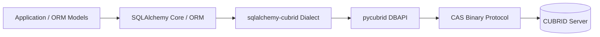
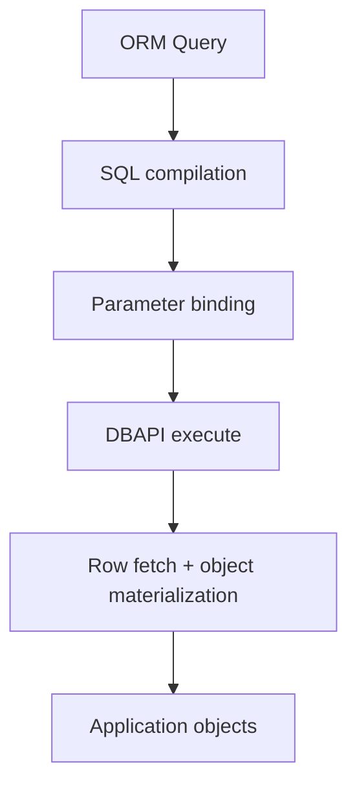
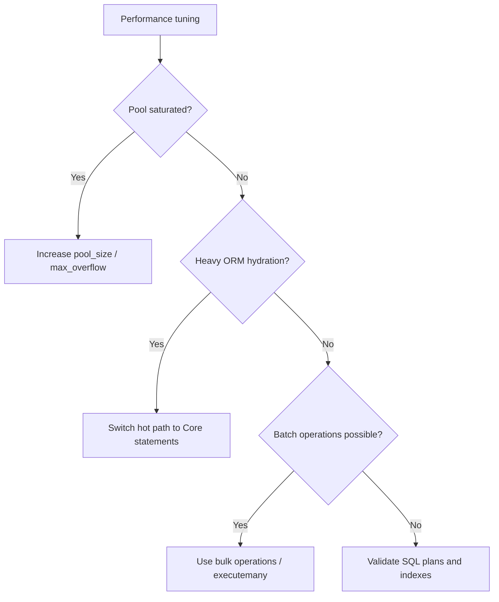

# 성능 가이드 (한국어)

> 🌐 [PERFORMANCE.md](https://github.com/cubrid-lab/sqlalchemy-cubrid/blob/main/docs/PERFORMANCE.md)의 번역입니다. 영어 원문이 표준이며, 페이지 번역은 경고 수준의 동기화 규칙을 따릅니다.

이 가이드는 `sqlalchemy-cubrid`의 관측된 성능과 실용적인 최적화 패턴을 다룹니다.

---

## 목차

- [개요](#개요)
- [벤치마크 결과](#벤치마크-결과)
- [성능 특성](#성능-특성)
- [최적화 팁](#최적화-팁)
- [벤치마크 실행](#벤치마크-실행)

---

## 개요

`sqlalchemy-cubrid`는 CUBRID Python 드라이버 위에 SQLAlchemy Core/ORM 동작을 얹습니다.

---

## 벤치마크 결과

출처: [cubrid-benchmark](https://github.com/cubrid-lab/cubrid-benchmark)

환경: Intel Core i5-9400F @ 2.90GHz, 6코어, Linux x86_64, Docker 컨테이너.

기준 드라이버 워크로드: Python `pycubrid` vs `PyMySQL`, 10000행 × 5라운드.

| 시나리오 | CUBRID (pycubrid 기준) | MySQL (PyMySQL) | 비율 (CUBRID/MySQL) |
|---|---:|---:|---:|
| insert_sequential | 10.47s | 1.74s | 6.0x |
| select_by_pk | 15.99s | 3.52s | 4.5x |
| select_full_scan | 10.31s | 1.86s | 5.5x |
| update_indexed | 10.70s | 2.19s | 4.9x |
| delete_sequential | 10.75s | 2.10s | 5.1x |

참고: SQLAlchemy는 SQL 컴파일, ORM 아이덴티티 매핑, 객체 생성에 추가 오버헤드를 더합니다.

### 이슈 #104 — ORM 방언 프로파일과 최적화

이슈 #104에 사용된 로컬 벤치마크 환경에서 측정:

| 시나리오 | 이전 | 이후 | 변화 |
|---|---:|---:|---:|
| Tier 2 단일 행 CRUD (평균) | 155.99 ms | 268.41 ms | 72.1% 느림* |
| Tier 2 대량 삽입 100행 (평균) | 370.33 ms | 356.09 ms | **3.9% 빠름** |
| Tier 2 대량 삽입 1000행 (평균) | 2864.56 ms | 2511.52 ms | **12.3% 빠름** |
| Tier 2 쿼리 빌더 전체 조회 (평균) | 39.76 ms | 31.83 ms | **19.9% 빠름** |

`scripts/profile_orm.py`로 프로파일링한 결과, CRUD 위주 ORM 경로에서 방언 계층 자기 시간은 총 요청 시간의 매우 작은 비율이었고, 경과 시간 대부분은 여전히 SQLAlchemy ORM/Core 조율과 `pycubrid` 드라이버에서 소비됐습니다. 이슈 #104에서 캡처된 워크로드 프로파일:

- 방언 계층 자기 시간은 **총 요청 시간의 0.0009%**
- SQLAlchemy Core 자기 시간은 **총 요청 시간의 6.55%**
- `pycubrid` 자기 시간은 **총 요청 시간의 7.01%**
- raw SQL select 대비 ORM select 오버헤드는 **ORM select 시간의 18.08%**

컴파일 중심 프로파일러 패스에서 방언 계층 상위 핫스팟:

1. `compiler.py:visit_on_duplicate_key_update`
2. `compiler.py:limit_clause`
3. `compiler.py:update_limit_clause`
4. `compiler.py:<dictcomp>` (visit_on_duplicate_key_update 내부)
5. `compiler.py:replace` (visit_on_duplicate_key_update 내부)

출하된 최적화:

- CUBRID 방언에 SQLAlchemy 2.x `insertmanyvalues` 활성화(`use_insertmanyvalues=True` 및 `use_insertmanyvalues_wo_returning=True`) — 공개 API 변경 없이 ORM 대량 삽입이 multi-values INSERT 형태로 배치되게 함.

\* 단일 행 CRUD 벤치마크는 이 로컬 실행에서 높은 분산을 보였으므로, 이 변경 세트에서 명확히 반복 가능한 개선은 단일 unit-of-work 지연이 아니라 대량 삽입 경로입니다.

---

## 성능 특성

- 방언은 `pycubrid` 전송 동작과 CAS 프로토콜 비용을 상속합니다.
- Core 쿼리 컴파일은 빠르지만 0은 아닙니다. 반복되는 동적 SQL은 오버헤드가 누적될 수 있습니다.
- ORM 경로는 raw DBAPI 사용 대비 아이덴티티 맵과 모델 구체화 비용을 더합니다.
- 풀 구성은 동시성 하에서 지연 시간에 큰 영향을 줍니다.
- 대량 API와 Core 문은 일반적으로 행별 ORM unit-of-work 패턴보다 빠릅니다.

---

## 최점화 팁

- 풀링을 명시적으로 구성하세요 (예: `pool_size`, `max_overflow`, `pool_pre_ping=True`).
- 대용량 대량 쓰기와 큰 읽기 파이프라인에는 SQLAlchemy Core를 사용하세요.
- 삽입/갱신 폭주에는 `executemany` 친화적 패턴을 사용하세요.
- 트랜잭션을 명시적으로 유지하고 오토커밋식 초소형 트랜잭션을 피하세요.
- 스칼라/튜플 출력만 필요할 때 ORM 객체 수화(hydration)를 제한하세요.

---

## 벤치마크 실행

1. 클론: `git clone https://github.com/cubrid-lab/cubrid-benchmark`.
2. 벤치마크 문서에 따라 벤치마크 데이터베이스 컨테이너를 시작하세요.
3. DBAPI 기준 지표를 확립하려면 Python 벤치마크 스위트를 실행하세요.
4. 같은 호스트와 데이터셋 형태에서 SQLAlchemy 전용 시나리오를 실행하세요.
5. 프레임워크 오버헤드를 분리하려면 드라이버 기준과 ORM/Core 실행을 비교하세요.

정확한 명령 집합과 러너 스크립트는 벤치마크 저장소 문서를 사용하세요.
