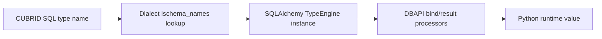

# 타입 매핑 (한국어)

> 🌐 [TYPES.md](https://github.com/cubrid-lab/sqlalchemy-cubrid/blob/main/docs/TYPES.md)의 번역입니다. 영어 원문이 표준이며, 페이지 번역은 경고 수준의 동기화 규칙을 따릅니다.

이 문서는 SQLAlchemy 타입과 CUBRID SQL 타입, 그리고 이 방언이 제공하는 CUBRID 전용 타입 확장 간의 완전한 매핑을 다룹니다.

---

## 목차

- [표준 SQL 타입](#표준-sql-타입)
- [CUBRID 전용 타입](#cubrid-전용-타입)
  - [숫자 타입](#숫자-타입)
  - [문자열 타입](#문자열-타입)
  - [비트 문자열 타입](#비트-문자열-타입)
  - [LOB 타입](#lob-타입)
  - [컬렉션 타입](#컬렉션-타입)
- [타입 리플렉션 (ischema_names)](#타입-리플렉션-ischema_names)
- [불리언 처리](#불리언-처리)
- [Text와 STRING](#text와-string)
- [사용 예제](#사용-예제)

---

## 표준 SQL 타입

방언은 표준 SQLAlchemy 타입을 CUBRID SQL 타입으로 매핑합니다:

| SQLAlchemy 타입      | CUBRID SQL 타입    | 비고                                        |
|----------------------|-------------------|---------------------------------------------|
| `Integer`            | `INTEGER`         | 32비트 부호 있는 정수                       |
| `SmallInteger`       | `SMALLINT`        | 16비트 부호 있는 정수                       |
| `BigInteger`         | `BIGINT`          | 64비트 부호 있는 정수                       |
| `Float`              | `FLOAT`           | 7자리 정밀도 (단정밀도)                    |
| `Double` / `REAL`    | `DOUBLE`          | 15자리 정밀도 (배정밀도)                   |
| `Numeric(p, s)`      | `NUMERIC(p, s)`   | 정확한 숫자, 최대 38자리                    |
| `String(n)`          | `VARCHAR(n)`      | 가변 길이 문자 데이터                       |
| `Text`               | `STRING`          | `VARCHAR(1,073,741,823)`의 별칭             |
| `Unicode(n)`         | `NVARCHAR(n)`     | 국가 문자 집합                              |
| `UnicodeText`        | `NVARCHAR`        | 국가 문자, 최대 길이                        |
| `LargeBinary`        | `BLOB`            | Binary Large Object                         |
| `Boolean`            | `SMALLINT`        | ⚠️ 네이티브 불리언 없음 — 0/1로 매핑        |
| `Date`               | `DATE`            | 달력 날짜                                   |
| `Time`               | `TIME`            | 시각                                        |
| `DateTime`           | `DATETIME`        | 날짜와 시간 결합                            |
| `TIMESTAMP`          | `TIMESTAMP`       | 자동 갱신 동작을 갖는 타임스탬프            |

> **VARCHAR 기본 길이**: 길이 없이 `String()`을 사용하면 방언은 기본적으로 `VARCHAR(4096)`을 사용합니다.

---

## CUBRID 전용 타입

CUBRID 전용 타입은 방언 패키지에서 임포트하세요:

```python
from sqlalchemy_cubrid import (
    # 숫자
    SMALLINT, BIGINT, NUMERIC, DECIMAL, FLOAT, REAL,
    DOUBLE, DOUBLE_PRECISION,
    # 문자열
    CHAR, VARCHAR, NCHAR, NVARCHAR, STRING,
    # 바이너리
    BIT,
    # LOB
    BLOB, CLOB,
    # 컬렉션
    SET, MULTISET, SEQUENCE,
    # JSON
    JSON,
)
```

### 숫자 타입

| 타입                | CUBRID SQL        | 설명                                         |
|--------------------|-------------------|----------------------------------------------|
| `SMALLINT`         | `SMALLINT`        | 16비트 부호 있는 정수 (-32,768 ~ 32,767)     |
| `BIGINT`           | `BIGINT`          | 64비트 부호 있는 정수                        |
| `NUMERIC(p, s)`    | `NUMERIC(p, s)`   | 정밀도(1–38)와 스케일을 가진 정확한 숫자     |
| `DECIMAL(p, s)`    | `DECIMAL(p, s)`   | `NUMERIC`의 동의어                           |
| `FLOAT(p)`         | `FLOAT(p)`        | 근사 숫자, 기본 정밀도 7                     |
| `REAL`             | `REAL`            | 단정밀도 float의 동의어                      |
| `DOUBLE`           | `DOUBLE`          | 배정밀도 부동소수점                          |
| `DOUBLE_PRECISION` | `DOUBLE PRECISION`| `DOUBLE`의 동의어                            |

```python
from sqlalchemy import Column, MetaData, Table
from sqlalchemy_cubrid import NUMERIC, DOUBLE, BIGINT

metadata = MetaData()
products = Table(
    "products", metadata,
    Column("id", BIGINT, primary_key=True),
    Column("price", NUMERIC(10, 2)),
    Column("weight", DOUBLE),
)
```

### 문자열 타입

| 타입          | CUBRID SQL                  | 설명                                       |
|---------------|-----------------------------|---------------------------------------------|
| `CHAR(n)`     | `CHAR(n)`                   | 고정 길이 문자 데이터                       |
| `VARCHAR(n)`  | `VARCHAR(n)`                | 가변 길이 문자 데이터                       |
| `NCHAR(n)`    | `NCHAR(n)`                  | 고정 길이 국가 문자 데이터                  |
| `NVARCHAR(n)` | `NCHAR VARYING(n)`          | 가변 길이 국가 문자 데이터                  |
| `STRING`      | `STRING`                    | `VARCHAR(1,073,741,823)` — 최대 길이        |

```python
from sqlalchemy_cubrid import CHAR, VARCHAR, NVARCHAR, STRING

metadata = MetaData()
users = Table(
    "users", metadata,
    Column("code", CHAR(10)),
    Column("name", VARCHAR(255)),
    Column("name_ko", NVARCHAR(255)),
    Column("bio", STRING),
)
```

> **NCHAR / NVARCHAR**: CUBRID는 다국어 지원을 위한 일급 국가 문자 타입을 가집니다. 방언은 CUBRID의 선호 DDL 구문에 맞춰 `NVARCHAR(n)`를 `NCHAR VARYING(n)`으로 렌더링합니다.

### 비트 문자열 타입

| 타입                    | CUBRID SQL         | 설명                        |
|-------------------------|--------------------|------------------------------|
| `BIT(n)`                | `BIT(n)`           | 고정 길이 비트 문자열        |
| `BIT(n, varying=True)`  | `BIT VARYING(n)`   | 가변 길이 비트 문자열        |

```python
from sqlalchemy_cubrid import BIT

metadata = MetaData()
flags = Table(
    "flags", metadata,
    Column("fixed_bits", BIT(8)),          # BIT(8)
    Column("var_bits", BIT(256, varying=True)),  # BIT VARYING(256)
)
```

### LOB 타입

| 타입   | CUBRID SQL | 설명                       |
|--------|------------|-----------------------------|
| `BLOB` | `BLOB`     | Binary Large Object         |
| `CLOB` | `CLOB`     | Character Large Object      |

```python
from sqlalchemy_cubrid import BLOB, CLOB

metadata = MetaData()
documents = Table(
    "documents", metadata,
    Column("content", CLOB),
    Column("attachment", BLOB),
)
```

### 컬렉션 타입

CUBRID는 표준 SQL에 직접 대응물이 없는 세 가지 컬렉션 타입을 제공합니다:

| 타입              | CUBRID SQL         | 설명                                            |
|-------------------|--------------------|--------------------------------------------------|
| `SET(type)`       | `SET(type)`        | **유일한** 원소의 순서 없는 컬렉션              |
| `MULTISET(type)`  | `MULTISET(type)`   | 순서 없는 컬렉션, **중복 허용**                 |
| `SEQUENCE(type)`  | `SEQUENCE(type)`   | **순서 있는** 컬렉션, **중복 허용**             |

```python
from sqlalchemy_cubrid import SET, MULTISET, SEQUENCE, VARCHAR

metadata = MetaData()
tagged_items = Table(
    "tagged_items", metadata,
    Column("tags", SET("VARCHAR")),
    Column("scores", MULTISET("INTEGER")),
    Column("history", SEQUENCE("DOUBLE")),
)
```

**DDL 출력:**

```sql
CREATE TABLE tagged_items (
    tags SET(VARCHAR),
    scores MULTISET(INTEGER),
    history SEQUENCE(DOUBLE)
)
```

> **참고**: 컬렉션 타입은 CUBRID 전용입니다. 표준 SQL은 `ARRAY[]`(PostgreSQL)를 사용하거나 컬렉션 지원이 없습니다. 이식성이 걱정되면 CUBRID를 대상으로 할 때만 `SET`/`MULTISET`/`SEQUENCE`를 사용하세요.

> **`LIST`는 `SEQUENCE`의 동의어입니다.** CUBRID는 DDL에서 `LIST(type)`을 받지만 파싱 시점에 `SEQUENCE`로 정규화합니다 — `LIST(INTEGER)` 컬럼은 `SEQUENCE OF INTEGER`로 저장·리플렉트됩니다 (CUBRID 11.2에서 검증). 따라서 방언은 정규 타입인 `SEQUENCE`만 노출합니다. 모델에서 `SEQUENCE(...)`를 선언하면 리플렉션이 깨끗하게 왕복합니다. `LIST(...)`로 컴파일되는 타입을 만들면 리플렉트된 `SEQUENCE(...)`와의 사이에서 가짜 Alembic autogenerate diff가 생기므로, 별도의 `LIST` 타입은 의도적으로 없습니다.

### JSON 타입

CUBRID 10.2+는 네이티브 JSON(RFC 7159)을 지원합니다. 방언은 완전한 JSON 타입 지원을 제공합니다:

| 타입              | CUBRID SQL | 설명                                     |
|-------------------|------------|-------------------------------------------|
| `JSON`            | `JSON`     | 네이티브 JSON 저장 (RFC 7159 준수)        |
| `JSONIndexType`   | —          | 단일 키 경로 형식 (`$."key"`)             |
| `JSONPathType`    | —          | 다단계 경로 형식                          |

```python
from sqlalchemy_cubrid import JSON
from sqlalchemy import Column, Integer, Table, MetaData, func, select

metadata = MetaData()
events = Table(
    "events", metadata,
    Column("id", Integer, primary_key=True),
    Column("payload", JSON),
)
```

**경로 표현식**은 내부적으로 `JSON_EXTRACT`를 사용합니다:

```python
# 단일 키 접근: col["key"] → JSON_EXTRACT(col, '$."key"')
stmt = select(events.c.payload["type"])

# 중첩 경로: col[("a", "b")] → JSON_EXTRACT(col, '$."a"."b"')
stmt = select(events.c.payload[("data", "name")])

# null 처리를 갖춘 타입별 접근
stmt = select(events).where(
    events.c.payload["status"].as_string() == "active"
)

# 직접 함수 사용
stmt = select(func.JSON_EXTRACT(events.c.payload, "$.type"))
```

> **참고**: 일반 `sa.JSON`은 `colspecs`를 통해 CUBRID의 `JSON` 타입으로 자동 적용됩니다. JSON 컬럼은 기존 테이블에서 올바르게 리플렉트됩니다.

---

## 타입 리플렉션 (`ischema_names` 전용)

기존 테이블을 리플렉트할 때 방언은 `dialect.ischema_names`에 있는 CUBRID 타입 이름만 SQLAlchemy 타입으로 되돌려 매핑합니다:

| CUBRID 타입 이름     | SQLAlchemy 타입    |
|---------------------|--------------------|
| `SHORT`             | `SMALLINT`         |
| `SMALLINT`          | `SMALLINT`         |
| `INTEGER`           | `INTEGER`          |
| `BIGINT`            | `BIGINT`           |
| `NUMERIC`           | `NUMERIC`          |
| `DECIMAL`           | `DECIMAL`          |
| `FLOAT`             | `FLOAT`            |
| `DOUBLE`            | `DOUBLE`           |
| `DOUBLE PRECISION`  | `DOUBLE_PRECISION` |
| `DATE`              | `DATE`             |
| `TIME`              | `TIME`             |
| `TIMESTAMP`         | `TIMESTAMP`        |
| `DATETIME`          | `DATETIME`         |
| `BIT`               | `BIT`              |
| `BIT VARYING`       | `BIT`              |
| `CHAR`              | `CHAR`             |
| `VARCHAR`           | `VARCHAR`          |
| `NCHAR`             | `NCHAR`            |
| `CHAR VARYING`      | `NVARCHAR`         |
| `STRING`            | `STRING`           |
| `BLOB`              | `BLOB`             |
| `CLOB`              | `CLOB`             |
| `SET`               | `SET`              |
| `MULTISET`          | `MULTISET`         |
| `SEQUENCE`          | `SEQUENCE`         |

다음 방언 타입은 `dialect.ischema_names`에 없기 때문에 **선언/컴파일은 되지만 자동 리플렉트되지 않습니다**: `REAL`, `MONETARY`, `OBJECT`.

---

## 불리언 처리

CUBRID에는 네이티브 `BOOLEAN` 데이터 타입이 없습니다. 방언은 `Boolean`을 `SMALLINT`로 매핑합니다:

```python
from sqlalchemy import Boolean, Column

class User(Base):
    __tablename__ = "users"
    is_active = Column(Boolean)  # DDL에서 → SMALLINT
```

- `True`는 `1`로 저장
- `False`는 `0`으로 저장
- `supports_native_boolean = False` 플래그가 SQLAlchemy에게 변환을 자동 처리하도록 알립니다

---

## Text와 STRING

SQLAlchemy의 `Text` 타입은 CUBRID의 `STRING` 타입으로 매핑됩니다:

```python
from sqlalchemy import Text, Column

class Article(Base):
    __tablename__ = "articles"
    body = Column(Text)  # DDL에서 → STRING
```

CUBRID의 `STRING`은 `VARCHAR(1,073,741,823)` — 가능한 최대 `VARCHAR` 길이의 별칭입니다. 기능적으로 다른 데이터베이스의 `TEXT`와 동등합니다.

---

## 사용 예제

### 혼합 타입으로 테이블 정의

```python
from sqlalchemy import Column, MetaData, Table, Integer, String, DateTime, Text
from sqlalchemy_cubrid import NUMERIC, CLOB, SET

metadata = MetaData()

orders = Table(
    "orders", metadata,
    Column("id", Integer, primary_key=True, autoincrement=True),
    Column("customer_name", String(100), nullable=False),
    Column("total", NUMERIC(12, 2)),
    Column("notes", Text),
    Column("attachments", CLOB),
    Column("tags", SET("VARCHAR")),
    Column("created_at", DateTime),
)
```

### 기존 테이블 리플렉트

```python
from sqlalchemy import MetaData, create_engine

engine = create_engine("cubrid://dba@localhost:33000/testdb")
metadata = MetaData()
metadata.reflect(bind=engine)

# 리플렉트된 테이블 접근
users = metadata.tables["users"]
for col in users.columns:
    print(f"{col.name}: {col.type}")
```

### colspecs로 타입 강제 변환

방언은 일반 SQLAlchemy 타입을 자동 매핑하는 타입 강제 변환(`colspecs`)을 등록합니다:

| 일반 타입          | CUBRID 타입  |
|-------------------|--------------|
| `sqltypes.Numeric`| `NUMERIC`    |
| `sqltypes.Float`  | `FLOAT`      |
| `sqltypes.Time`   | `TIME`       |

즉 `Column(Numeric(10, 2))`은 명시적 임포트 없이 자동으로 CUBRID `NUMERIC` 구현을 사용합니다.

---

## 기계 판독 가능 타입 매핑 매트릭스

아래 표는 도구 파이프라인과 아키텍처 문서에 복사/붙여넣기 용으로 설계되었습니다.

| CUBRID 타입 | SQLAlchemy 타입 | Python 타입 | 비고 |
|---|---|---|---|
| `SHORT` | `sqlalchemy_cubrid.SMALLINT` | `int` | `SMALLINT`의 리플렉트 별칭. |
| `SMALLINT` | `sqlalchemy_cubrid.SMALLINT` | `int` | 16비트 부호 있는 정수. |
| `INTEGER` | `sqlalchemy.Integer` | `int` | 표준 32비트 정수. |
| `BIGINT` | `sqlalchemy_cubrid.BIGINT` | `int` | 64비트 정수 값. |
| `NUMERIC(p,s)` | `sqlalchemy_cubrid.NUMERIC` | `decimal.Decimal` | 정확한 숫자. 정밀도 1-38. |
| `DECIMAL(p,s)` | `sqlalchemy_cubrid.DECIMAL` | `decimal.Decimal` | `NUMERIC`의 동의어. |
| `FLOAT(p)` | `sqlalchemy_cubrid.FLOAT` | `float` | 근사 숫자, 기본 정밀도 7. |
| `REAL` | `sqlalchemy_cubrid.REAL` | `float` | 근사 숫자 단정밀도 의미론. 선언/컴파일 전용. 자동 리플렉트 안 됨. |
| `DOUBLE` | `sqlalchemy_cubrid.DOUBLE` | `float` | 근사 숫자 배정밀도. |
| `DOUBLE PRECISION` | `sqlalchemy_cubrid.DOUBLE_PRECISION` | `float` | 전용 방언 타입으로 리플렉트. |
| `MONETARY` | `sqlalchemy_cubrid.MONETARY` | `float` | 통화 인식 서버 타입. Python에서 숫자 값으로 표현. 선언/컴파일 전용. 자동 리플렉트 안 됨. |
| `DATE` | `sqlalchemy.Date` | `datetime.date` | 달력 날짜만. |
| `TIME` | `sqlalchemy.Time` / `sqlalchemy_cubrid.TIME` | `datetime.time` | 시각만. |
| `DATETIME` | `sqlalchemy.DateTime` / `sqlalchemy_cubrid.DATETIME` | `datetime.datetime` | 하나의 값으로 날짜 + 시간. |
| `TIMESTAMP` | `sqlalchemy.TIMESTAMP` / `sqlalchemy_cubrid.TIMESTAMP` | `datetime.datetime` | CUBRID 타임스탬프 의미론은 스키마 기본값에 따라 자동 갱신될 수 있음. |
| `BIT(n)` | `sqlalchemy_cubrid.BIT(length=n, varying=False)` | `bytes` / `str` | 표현은 DBAPI 드라이버에 따라 다를 수 있음. |
| `BIT VARYING(n)` | `sqlalchemy_cubrid.BIT(length=n, varying=True)` | `bytes` / `str` | 가변 길이 비트 문자열. |
| `CHAR(n)` | `sqlalchemy_cubrid.CHAR` | `str` | 고정 길이 문자 데이터. |
| `VARCHAR(n)` | `sqlalchemy_cubrid.VARCHAR` / `sqlalchemy.String` | `str` | 가변 길이 문자열. |
| `NCHAR(n)` | `sqlalchemy_cubrid.NCHAR` | `str` | 국가 문자 집합 타입. |
| `CHAR VARYING(n)` | `sqlalchemy_cubrid.NVARCHAR` | `str` | 이 방언에서 NVARCHAR로 리플렉트. |
| `STRING` | `sqlalchemy_cubrid.STRING` / `sqlalchemy.Text` | `str` | 매우 큰 `VARCHAR`와 동등. |
| `CLOB` | `sqlalchemy_cubrid.CLOB` / `sqlalchemy.Text` | `str` | 문자 LOB. 대용량 텍스트 페이로드. |
| `BLOB` | `sqlalchemy_cubrid.BLOB` / `sqlalchemy.LargeBinary` | `bytes` | 바이너리 LOB 저장. |
| `SET(...)` | `sqlalchemy_cubrid.SET` | 드라이버 의존 컬렉션 페이로드 | CUBRID 전용 컬렉션. 유일한 순서 없는 원소. |
| `MULTISET(...)` | `sqlalchemy_cubrid.MULTISET` | 드라이버 의존 컬렉션 페이로드 | CUBRID 전용 컬렉션. 중복 허용. |
| `SEQUENCE(...)` | `sqlalchemy_cubrid.SEQUENCE` | 드라이버 의존 컬렉션 페이로드 | CUBRID 전용 컬렉션. 중복을 허용하는 순서 있음. |
| `OBJECT` | `sqlalchemy_cubrid.OBJECT` | 드라이버 의존 객체 참조 | OID 참조 타입. 데이터베이스 전용. 선언/컴파일 전용. 자동 리플렉트 안 됨. |
| `BOOLEAN` (에뮬레이트) | `sqlalchemy.Boolean` -> `SMALLINT` | `bool` | `1` / `0`으로 저장; `supports_native_boolean=False`. |

### 타입 해석 흐름



!!! warning "정밀도와 반올림"
    금융 값에는 `NUMERIC`/`DECIMAL`을 사용하세요. `FLOAT`/`DOUBLE`은 근사값이며 집계에서 반올림 오차를 유발할 수 있습니다.

!!! warning "문자 집합과 국가 문자열 컬럼"
    `NCHAR`/`NVARCHAR`는 국가 문자 의미론을 사용합니다. 예상치 못한 비교/정렬을 피하려면 애플리케이션 인코딩과 데이터베이스 콜레이션을 정렬하세요.

!!! warning "LOB와 컬렉션 페이로드 형태는 드라이버마다 다를 수 있음"
    `CUBRIDdb`와 `pycubrid`는 `BLOB`/`CLOB`과 컬렉션 값을 다르게 노출할 수 있습니다.
    선택한 드라이버에 대해 통합 테스트에서 페이로드 타입(`str`, `bytes`, 매핑형 메타데이터)을 검증하세요.

---

*참고: [기능 지원](FEATURE_SUPPORT.md) · [DML 확장](DML_EXTENSIONS.md) · [연결 설정](CONNECTION.md)*
