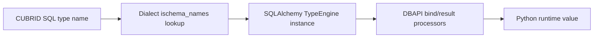

# 타입 매핑 (한국어)

> 🌐 [TYPES.md](https://github.com/cubrid-lab/sqlalchemy-cubrid/blob/main/docs/TYPES.md)의 번역입니다. 영어 원문이 표준이며, 페이지 번역은 경고 수준의 동기화 규칙을 따릅니다.

이 문서는 SQLAlchemy 타입과 CUBRID SQL 타입, 그리고 이 방언이 제공하는 CUBRID 전용 타입 확장 간의 완전한 매핑을 다룹니다.

---

## 목차

- [표준 SQL 타입](#표준-sql-타입)
- [CUBRID 전용 타입](#cubrid-전용-타입)
  - [숫자 타입](#숫자-타입)
  - [문자열 타입](#문자열-타입)
  - [비트 문자열 타입](#비트-문자열-타입)
  - [LOB 타입](#lob-타입)
  - [컬렉션 타입](#컬렉션-타입)
- [타입 리플렉션 (ischema_names)](#타입-리플렉션-ischema_names)
- [불리언 처리](#불리언-처리)
- [Text와 STRING](#text와-string)
- [사용 예제](#사용-예제)

---

## 표준 SQL 타입

방언은 표준 SQLAlchemy 타입을 CUBRID SQL 타입으로 매핑합니다:

| SQLAlchemy 타입      | CUBRID SQL 타입    | 비고                                        |
|----------------------|-------------------|---------------------------------------------|
| `Integer`            | `INTEGER`         | 32비트 부호 있는 정수                       |
| `SmallInteger`       | `SMALLINT`        | 16비트 부호 있는 정수                       |
| `BigInteger`         | `BIGINT`          | 64비트 부호 있는 정수                       |
| `Float`              | `FLOAT`           | 7자리 정밀도 (단정밀도)                    |
| `Double` / `REAL`    | `DOUBLE`          | 15자리 정밀도 (배정밀도)                   |
| `Numeric(p, s)`      | `NUMERIC(p, s)`   | 정확한 숫자, 최대 38자리                    |
| `String(n)`          | `VARCHAR(n)`      | 가변 길이 문자 데이터                       |
| `Text`               | `STRING`          | `VARCHAR(1,073,741,823)`의 별칭             |
| `Unicode(n)`         | `VARCHAR(n)`      | 데이터베이스 문자셋 (`NCHAR` 불필요)        |
| `UnicodeText`        | `STRING`          | `Text`와 동일, CUBRID에는 `TEXT` 타입 없음  |
| `LargeBinary`        | `BLOB`            | Binary Large Object                         |
| `BINARY(n)`          | `BIT(n*8)`        | 고정 길이 바이트, CUBRID에는 `BINARY` 없음  |
| `VARBINARY(n)`       | `BIT VARYING(n*8)`| 가변 길이 바이트, `VARBINARY` 없음          |
| `Uuid` / `UUID`      | `CHAR(32)`        | 네이티브 UUID 없음, 32자 16진 문자열로 저장 |
| `Boolean`            | `SMALLINT`        | ⚠️ 네이티브 불리언 없음 — 0/1로 매핑        |
| `Date`               | `DATE`            | 달력 날짜                                   |
| `Time`               | `TIME`            | 시각                                        |
| `DateTime`           | `DATETIME`        | 날짜와 시간 결합                            |
| `TIMESTAMP`          | `TIMESTAMP`       | 자동 갱신 동작을 갖는 타임스탬프            |

> **VARCHAR 기본 길이**: 길이 없이 `String()`을 사용하면 방언은 기본적으로 `VARCHAR(4096)`을 사용합니다. 길이를 명시적으로 0 이하로 지정하면(`String(0)`, `VARCHAR(0)`, `NVARCHAR(0)`) CUBRID에서 유효한 길이가 아니므로 기본값으로 바뀌지 않고 `CompileError`가 발생합니다.

> **BINARY / VARBINARY**: CUBRID에는 `BINARY`나 `VARBINARY` 타입이 없으므로 방언은 이를 비트 단위 길이를 갖는 비트 문자열로 저장합니다. `BINARY(n)`은 `BIT(n*8)`(`BINARY()`는 `BIT(8)`), `VARBINARY(n)`은 `BIT VARYING(n*8)`, `VARBINARY()`는 `BIT VARYING`(최대 1,073,741,823비트)으로 컴파일됩니다. 값은 두 드라이버 모두에서 `bytes`로 바인딩되고 반환됩니다. `BINARY`는 고정 길이이므로 더 짧은 값은 `\x00` 바이트로 채워져 반환됩니다. 빈 `b""`는 보존되지 않으며, 드라이버에 따라 `None`(pycubrid의 `BINARY`는 0 바이트)으로 조회됩니다. 0 이하의 길이(`BINARY(0)`, `VARBINARY(0)`)은 `CompileError`를 발생시킵니다. 이 컬럼은 `BIT(n*8)` / `BIT VARYING(n*8)`로 리플렉트되므로 Alembic autogenerate가 타입 변경을 보고하지 않습니다.

> **UUID**: CUBRID에는 `UUID` 타입이 없습니다. `sa.Uuid`와 `sa.UUID`는 모두 `CHAR(32)`로 컴파일되며 SQLAlchemy의 비네이티브 UUID 처리를 사용합니다. 값은 32자 16진 문자열로 저장되고, 기본값에서는 `uuid.UUID`로, `as_uuid=False`에서는 하이픈이 포함된 `str`로 조회됩니다. 컬럼은 `CHAR(32)`로 리플렉트됩니다.

> **문자셋과 콜레이션**: 방언은 문자열·텍스트 타입에 컬럼 수준 `CHARSET`이나 `COLLATE` 절을 생성하지 않습니다. `collation=` 인자(예: `String(50, collation="utf8_bin")`, `Text(collation=...)`, `UnicodeText(collation=...)`)는 무시되며, 컬럼은 데이터베이스의 문자셋과 콜레이션을 사용합니다. `Unicode` / `UnicodeText`도 다른 문자셋을 선택하지 않고 `String` / `Text`와 똑같이 `VARCHAR(n)` / `STRING`으로 컴파일되므로, 한국어·일본어·중국어·이모지 같은 비 ASCII 텍스트는 데이터베이스를 UTF-8 문자셋으로 생성한 경우(예: `cubrid createdb testdb en_US.utf8`)에만 그대로 왕복됩니다.

---

## CUBRID 전용 타입

CUBRID 전용 타입은 방언 패키지에서 임포트하세요:

```python
from sqlalchemy_cubrid import (
    # 숫자
    SMALLINT, BIGINT, NUMERIC, DECIMAL, FLOAT, REAL,
    DOUBLE, DOUBLE_PRECISION,
    # 문자열
    CHAR, VARCHAR, NCHAR, NVARCHAR, STRING,
    # 바이너리
    BIT,
    # LOB
    BLOB, CLOB,
    # 컬렉션
    SET, MULTISET, SEQUENCE,
    # JSON
    JSON,
)
```

### 숫자 타입

| 타입                | CUBRID SQL        | 설명                                         |
|--------------------|-------------------|----------------------------------------------|
| `SMALLINT`         | `SMALLINT`        | 16비트 부호 있는 정수 (-32,768 ~ 32,767)     |
| `BIGINT`           | `BIGINT`          | 64비트 부호 있는 정수                        |
| `NUMERIC(p, s)`    | `NUMERIC(p, s)`   | 정밀도(1–38)와 스케일을 가진 정확한 숫자     |
| `DECIMAL(p, s)`    | `DECIMAL(p, s)`   | `NUMERIC`의 동의어                           |
| `FLOAT(p)`         | `FLOAT(p)`        | 근사 숫자, 기본 정밀도 7                     |
| `REAL`             | `REAL`            | 단정밀도 float의 동의어                      |
| `DOUBLE`           | `DOUBLE`          | 배정밀도 부동소수점                          |
| `DOUBLE_PRECISION` | `DOUBLE PRECISION`| `DOUBLE`의 동의어                            |

```python
from sqlalchemy import Column, MetaData, Table
from sqlalchemy_cubrid import NUMERIC, DOUBLE, BIGINT

metadata = MetaData()
products = Table(
    "products", metadata,
    Column("id", BIGINT, primary_key=True),
    Column("price", NUMERIC(10, 2)),
    Column("weight", DOUBLE),
)
```

### 문자열 타입

| 타입          | CUBRID SQL                  | 설명                                       |
|---------------|-----------------------------|---------------------------------------------|
| `CHAR(n)`     | `CHAR(n)`                   | 고정 길이 문자 데이터                       |
| `VARCHAR(n)`  | `VARCHAR(n)`                | 가변 길이 문자 데이터                       |
| `NCHAR(n)`    | `NCHAR(n)`                  | 고정 길이 국가 문자 데이터                  |
| `NVARCHAR(n)` | `NCHAR VARYING(n)`          | 가변 길이 국가 문자 데이터                  |
| `STRING`      | `STRING`                    | `VARCHAR(1,073,741,823)` — 최대 길이        |

```python
from sqlalchemy_cubrid import CHAR, VARCHAR, NVARCHAR, STRING

metadata = MetaData()
users = Table(
    "users", metadata,
    Column("code", CHAR(10)),
    Column("name", VARCHAR(255)),
    Column("name_ko", NVARCHAR(255)),
    Column("bio", STRING),
)
```

> **NCHAR / NVARCHAR**: CUBRID는 다국어 지원을 위한 일급 국가 문자 타입을 가집니다. 방언은 CUBRID의 선호 DDL 구문에 맞춰 `NVARCHAR(n)`를 `NCHAR VARYING(n)`으로 렌더링합니다.

### 비트 문자열 타입

| 타입                    | CUBRID SQL         | 설명                        |
|-------------------------|--------------------|------------------------------|
| `BIT(n)`                | `BIT(n)`           | 고정 길이 비트 문자열        |
| `BIT(n, varying=True)`  | `BIT VARYING(n)`   | 가변 길이 비트 문자열        |

```python
from sqlalchemy_cubrid import BIT

metadata = MetaData()
flags = Table(
    "flags", metadata,
    Column("fixed_bits", BIT(8)),          # BIT(8)
    Column("var_bits", BIT(256, varying=True)),  # BIT VARYING(256)
)
```

### LOB 타입

| 타입   | CUBRID SQL | 설명                       |
|--------|------------|-----------------------------|
| `BLOB` | `BLOB`     | Binary Large Object         |
| `CLOB` | `CLOB`     | Character Large Object      |

```python
from sqlalchemy_cubrid import BLOB, CLOB

metadata = MetaData()
documents = Table(
    "documents", metadata,
    Column("content", CLOB),
    Column("attachment", BLOB),
)
```

### 컬렉션 타입

CUBRID는 표준 SQL에 직접 대응물이 없는 세 가지 컬렉션 타입을 제공합니다:

| 타입              | CUBRID SQL         | 설명                                            |
|-------------------|--------------------|--------------------------------------------------|
| `SET(type)`       | `SET(type)`        | **유일한** 원소의 순서 없는 컬렉션              |
| `MULTISET(type)`  | `MULTISET(type)`   | 순서 없는 컬렉션, **중복 허용**                 |
| `SEQUENCE(type)`  | `SEQUENCE(type)`   | **순서 있는** 컬렉션, **중복 허용**             |

```python
from sqlalchemy_cubrid import SET, MULTISET, SEQUENCE, VARCHAR

metadata = MetaData()
tagged_items = Table(
    "tagged_items", metadata,
    Column("tags", SET("VARCHAR")),
    Column("scores", MULTISET("INTEGER")),
    Column("history", SEQUENCE("DOUBLE")),
)
```

**DDL 출력:**

```sql
CREATE TABLE tagged_items (
    tags SET(VARCHAR),
    scores MULTISET(INTEGER),
    history SEQUENCE(DOUBLE)
)
```

> **참고**: 컬렉션 타입은 CUBRID 전용입니다. 표준 SQL은 `ARRAY[]`(PostgreSQL)를 사용하거나 컬렉션 지원이 없습니다. 이식성이 걱정되면 CUBRID를 대상으로 할 때만 `SET`/`MULTISET`/`SEQUENCE`를 사용하세요.

> **`LIST`는 `SEQUENCE`의 동의어입니다.** CUBRID는 DDL에서 `LIST(type)`을 받지만 파싱 시점에 `SEQUENCE`로 정규화합니다 — `LIST(INTEGER)` 컬럼은 `SEQUENCE OF INTEGER`로 저장·리플렉트됩니다 (CUBRID 11.2에서 검증). 따라서 방언은 정규 타입인 `SEQUENCE`만 노출합니다. 모델에서 `SEQUENCE(...)`를 선언하면 리플렉션이 깨끗하게 왕복합니다. `LIST(...)`로 컴파일되는 타입을 만들면 리플렉트된 `SEQUENCE(...)`와의 사이에서 가짜 Alembic autogenerate diff가 생기므로, 별도의 `LIST` 타입은 의도적으로 없습니다.

#### 컬렉션 값

`SET`이나 `MULTISET` 컬럼의 값은 Python `list`, `tuple`, `set`, `frozenset`으로 바인딩합니다. `SEQUENCE`는 순서가 있으므로 `list`나 `tuple`로 바인딩하세요. pycubrid 드라이버에서 `SEQUENCE` 컬럼에 `set`이나 `frozenset`을 넘기면 pycubrid 버전과 관계없이 `TypeError`("SEQUENCE is ordered; pass a list or tuple", SQLAlchemy의 `StatementError`로 감싸짐)가 발생하며, 방언이 대신 정렬하지 않습니다. 그다음 동작은 드라이버에 따라 다릅니다.

| | 타입 지정 컬렉션 파라미터가 있는 `cubrid+pycubrid://`, `cubrid+aiopycubrid://` (pycubrid main) | 릴리스된 pycubrid 1.8.0 | `cubrid://` (CUBRIDdb) |
|---|---|---|---|
| `list`/`tuple` (`SET`/`MULTISET`은 `set`/`frozenset`도) 바인딩 | 컬럼 타입에 맞는 `pycubrid.types.Set`, `Multiset`, `Sequence`로 감싸 `SET{...}`, `MULTISET{...}`, `SEQUENCE{...}` 리터럴로 전송 | `ProgrammingError` (pycubrid가 컬렉션 파라미터를 거부) | CUBRIDdb가 직접, 항상 SET으로 바인딩: MULTISET은 중복을, SEQUENCE는 순서를 잃음 ([드라이버 호환성, 알려진 문제 11](DRIVER_COMPAT.md#11-컬렉션-파라미터-set-multiset-sequence)) |
| `SET` 조회 | `?decode_collections=true`이면 `frozenset`, 없으면 원시 `bytes` | 같음 | `str`의 `set` |
| `MULTISET` / `SEQUENCE` 조회 | `?decode_collections=true`이면 `list`, 없으면 원시 `bytes` | 같음 | `str`의 `list` |

```python
from sqlalchemy import Column, Integer, MetaData, String, Table, create_engine, select
from sqlalchemy_cubrid import MULTISET, SEQUENCE, SET

engine = create_engine("cubrid+pycubrid://dba@localhost:33000/demodb?decode_collections=true")
items = Table(
    "items", MetaData(),
    Column("id", Integer, primary_key=True),
    Column("tags", SET(String(20))),
    Column("scores", MULTISET(Integer())),
    Column("history", SEQUENCE(Integer())),
)

with engine.begin() as conn:
    conn.execute(items.insert(), {"id": 1, "tags": {"a", "b"}, "scores": [2, 2, 1], "history": [3, 1, 3]})
    row = conn.execute(select(items)).one()
    # row.tags == frozenset({"a", "b"}); sorted(row.scores) == [1, 2, 2]; row.history == [3, 1, 3]
    conn.execute(select(items.c.id).where(items.c.history == [3, 1, 3]))  # SEQUENCE{3, 1, 3}
```

pycubrid에서는:

- 타입 지정 파라미터(cubrid-lab/pycubrid#567)는 pycubrid main에 있으며 아직 pycubrid 릴리스에는 없습니다. 방언은 이를(`pycubrid.types.Set`, `Multiset`, `Sequence`) 감지하며, 이전 pycubrid에서는 값을 드라이버에 그대로 넘기므로 컬렉션 파라미터는 이전처럼 실패합니다.
- 각 원소는 pycubrid가 단독으로 바인딩할 수 있는 값이어야 합니다: `None`, `bool`, `int`, `float`, `Decimal`, `str`, `bytes`, `bytearray`, `date`, `time`, `datetime`. 중첩 컬렉션은 거부됩니다.
- 이미 `pycubrid.types.Set`, `Multiset`, `Sequence`인 값, `None`, 그 밖의 값(예: `str`)은 드라이버에 그대로 전달됩니다.
- 컬렉션 의미는 서버가 유지하며 방언은 바꾸지 않습니다. `SET`은 중복을 제거하고, `MULTISET`은 중복은 유지하지만 순서는 유지하지 않으며(`sorted(...)`로 비교하세요), `SEQUENCE`는 둘 다 유지합니다. 빈 컬렉션은 `frozenset()` 또는 `[]`로, `NULL` 컬럼은 `None`으로, `NULL` 원소는 컬렉션 안의 `None`으로 조회됩니다.
- 방언은 조회한 값을 변환하지 않습니다. 값은 pycubrid가 디코딩한 그대로입니다. `decode_collections=true`가 없으면 pycubrid는 원시 컬렉션 바이트를 반환합니다.
- `SEQUENCE` 컬럼에 바인딩한 `set`/`frozenset`은 모든 pycubrid 버전에서 `TypeError`를 발생시킵니다(위 참고).
- 컬렉션 값은 인라인으로 렌더링할 수 없습니다. `literal_binds`와 `literal_execute`는 `NULL`이 아닌 컬렉션 값에 `CompileError`를 발생시킵니다(`NULL`은 `NULL`로 렌더링). 컬렉션은 파라미터로 바인딩하세요.
- ORM에서는 컬럼을 바꿀 때 새 컬렉션을 대입하세요(`obj.history = [*obj.history, 4]`). SQLAlchemy는 `list`나 `set` 속성의 제자리 변경을 추적하지 않습니다.

이 왕복은 CUBRID 10.2와 11.4에서 pycubrid main으로 라이브 테스트됩니다(Core와 ORM, 동기와 비동기, `test/test_collection_roundtrip.py`).

### JSON 타입

CUBRID 10.2+는 네이티브 JSON(RFC 7159)을 지원합니다. 방언은 완전한 JSON 타입 지원을 제공합니다:

| 타입              | CUBRID SQL | 설명                                     |
|-------------------|------------|-------------------------------------------|
| `JSON`            | `JSON`     | 네이티브 JSON 저장 (RFC 7159 준수)        |
| `JSONIndexType`   | —          | 단일 키 경로 형식 (`$."key"`)             |
| `JSONPathType`    | —          | 다단계 경로 형식                          |

```python
from sqlalchemy_cubrid import JSON
from sqlalchemy import Column, Integer, Table, MetaData, func, select

metadata = MetaData()
events = Table(
    "events", metadata,
    Column("id", Integer, primary_key=True),
    Column("payload", JSON),
)
```

**경로 표현식**은 내부적으로 `JSON_EXTRACT`를 사용합니다:

```python
# 단일 키 접근: col["key"] → JSON_EXTRACT(col, '$."key"')
stmt = select(events.c.payload["type"])

# 중첩 경로: col[("a", "b")] → JSON_EXTRACT(col, '$."a"."b"')
stmt = select(events.c.payload[("data", "name")])

# null 처리를 갖춘 타입별 접근
stmt = select(events).where(
    events.c.payload["status"].as_string() == "active"
)

# 직접 함수 사용
stmt = select(func.JSON_EXTRACT(events.c.payload, "$.type"))
```

> **참고**: 일반 `sa.JSON`은 `colspecs`를 통해 CUBRID의 `JSON` 타입으로 자동 적용됩니다. JSON 컬럼은 기존 테이블에서 올바르게 리플렉트됩니다.

---

## 타입 리플렉션 (`ischema_names` 전용)

기존 테이블을 리플렉트할 때 방언은 `dialect.ischema_names`에 있는 CUBRID 타입 이름만 SQLAlchemy 타입으로 되돌려 매핑합니다:

| CUBRID 타입 이름     | SQLAlchemy 타입    |
|---------------------|--------------------|
| `SHORT`             | `SMALLINT`         |
| `SMALLINT`          | `SMALLINT`         |
| `INTEGER`           | `INTEGER`          |
| `BIGINT`            | `BIGINT`           |
| `NUMERIC`           | `NUMERIC`          |
| `DECIMAL`           | `DECIMAL`          |
| `FLOAT`             | `FLOAT`            |
| `DOUBLE`            | `DOUBLE`           |
| `DOUBLE PRECISION`  | `DOUBLE_PRECISION` |
| `DATE`              | `DATE`             |
| `TIME`              | `TIME`             |
| `TIMESTAMP`         | `TIMESTAMP`        |
| `TIMESTAMPTZ`       | `TIMESTAMPTZ` (`timezone=True`) |
| `TIMESTAMPLTZ`      | `TIMESTAMPLTZ` (`timezone=True`) |
| `DATETIME`          | `DATETIME`         |
| `DATETIMETZ`        | `DATETIMETZ` (`timezone=True`) |
| `DATETIMELTZ`       | `DATETIMELTZ` (`timezone=True`) |
| `BIT(n)`            | `BIT(n)`           |
| `BIT VARYING(n)`    | `BIT(n, varying=True)` |
| `CHAR`              | `CHAR`             |
| `VARCHAR`           | `VARCHAR`          |
| `NCHAR`             | `NCHAR`            |
| `CHAR VARYING`      | `VARCHAR`          |
| `NCHAR VARYING`     | `NVARCHAR`         |
| `STRING`            | `STRING`           |
| `ENUM('a', ...)`    | `ENUM('a', ...)` (DBA. 그 외에는 `NullType` + 경고) |
| `BLOB`              | `BLOB`             |
| `CLOB`              | `CLOB`             |
| `SET`               | `SET`              |
| `MULTISET`          | `MULTISET`         |
| `SEQUENCE`          | `SEQUENCE`         |

다음 방언 타입은 `dialect.ischema_names`에 없기 때문에 **선언/컴파일은 되지만 자동 리플렉트되지 않습니다**: `REAL`, `MONETARY`, `OBJECT`.

**TZ/LTZ 리플렉션** (#181, #442). `TIMESTAMPTZ`, `TIMESTAMPLTZ`, `DATETIMETZ`, `DATETIMELTZ`는 일반 `TIMESTAMP`/`DATETIME`으로 합쳐지지 않고 각각 전용 방언 클래스로 리플렉트되며, 모두 `timezone=True`로 설정되므로 왕복한 `datetime`이 타임존 인식 상태를 유지하고 `metadata.reflect()` + `create_all()`이 원래 컬럼 타입을 그대로 재현합니다. 다만 방언은 명시적 타임존(`TZ`)과 로컬 타임존(`LTZ`)의 *값* 의미론 자체는 Python 레벨에서 구분하지 않습니다 — 둘 다 타임존 인식 `datetime`으로 표현되며, 차이는 리플렉트된 SQLAlchemy 타입 클래스에만 있습니다.

**ENUM 및 컬렉션 컬럼** (#631). `SHOW COLUMNS`는 네이티브 ENUM 값을 이스케이프하지 않아, 값 하나에 `', '`가 들어 있으면 별도 값 두 개와 출력이 같을 수 있습니다. `_db_domain`을 읽을 권한이 있는 사용자(일반적으로 DBA)에 대해서는 이 모호한 문자열을 나누지 않고 도메인 카탈로그에서 정확한 순서의 값을 읽습니다. DBA가 아닌 사용자의 특정 `-494` 권한 거부는 경고와 `NullType`으로 처리하며, 다른 카탈로그 오류는 그대로 전파합니다. 공개된 권한 있는 메타데이터 경로가 마련되기 전까지는 해당 사용자가 모델에 ENUM 타입을 직접 선언해야 합니다.

**DBA가 아닌 사용자의 ENUM 리플렉션: 확인된 제한** (#641). 테스트한 소스 중에는 DBA가 아닌 사용자에게 ENUM 값을 모호하지 않게 제공하는 것이 없습니다. 권한을 부여받지 않은 사용자로 CUBRID 10.2.18, 11.0.16, 11.2.9, 11.4.6에서 자신의 테이블 `ENUM('a'', ''b', 'other')`(값 2개)와 `ENUM('a', 'b', 'other')`(값 3개)를 확인했습니다.

| 후보 소스 | 네 버전 모두의 결과 |
|---|---|
| `SHOW COLUMNS`, `SHOW FULL COLUMNS`, `SHOW CREATE TABLE` | 두 테이블 모두 `ENUM('a', 'b', 'other')`로 출력 |
| `db_attribute` | `data_type`이 `ENUM`일 뿐 값은 없음. 도메인의 값을 담은 다른 공개 카탈로그 뷰도 없음 |
| `_db_domain` | `-494 SELECT is not authorized on _db_domain` |
| 드라이버 메타데이터(pycubrid `cursor.description`, CCI 속성 스키마 정보) | 타입 코드만 있고 값은 없음 |
| 컬럼 타입에 대한 SQL 식(정수와의 `UNION ALL`, `COALESCE`, `IFNULL`, `CASE`, `NVL2`, 값 또는 값이 아닌 문자열과의 비교) | 정수는 정수로, 문자열은 문자열로 남고 값이 아닌 문자열도 허용되므로 값의 위치와 포함 여부를 알 수 없음 |

따라서 이런 컬럼은 계속 경고와 함께 `NullType`으로 리플렉트됩니다. CUBRIDdb와 JDBC의 메타데이터 호출은 테스트하지 않았습니다. 이는 위 버전에서 확인한 동작이며, 이후 서버에 대한 설명은 아닙니다.

`SHOW COLUMNS`는 컬렉션을 `SET OF NUMERIC,VARCHAR`(`MULTISET OF ...`, `SEQUENCE OF ...`도 동일하며 `LIST`는 `SEQUENCE`로 출력) 형태로 출력하고 멤버의 길이·정밀도를 생략하거나 순서를 바꿀 수 있습니다. 공개 뷰 `db_attr_setdomain_elm`은 멤버의 정밀도·스케일·객체 도메인 클래스를 제공합니다. 방언은 이 행들이 출력된 모든 멤버 타입 계열을 설명할 때만 사용합니다. 행이 누락되거나 모순되면 잘못된 DDL을 만드는 대신 경고와 `NullType`을 반환합니다. 클래스가 삭제된(클래스 없이 나열되는) OBJECT 멤버와 방언이 표현할 수 없는 멤버 타입은 경고와 함께 `NullType`을 반환하며, 테이블의 나머지 컬럼은 그대로 리플렉트됩니다. `MONETARY` 멤버는 `MONETARY`로 리플렉트됩니다. `SHOW COLUMNS`가 같은 이름을 두 번 나열하는 컬럼(같은 이름의 `CLASS ATTRIBUTE`)은 ENUM·컬렉션 컬럼일 때 경고와 함께 `NullType`을 반환하며, 카탈로그 조회는 인스턴스 속성만 읽습니다. CUBRID 11.2 이상에서 클래스 소유자가 테이블 소유자와 다른 OBJECT 멤버는 `owner.class`로 리플렉트됩니다. `ENUM` 멤버(`SET(ENUM('x', 'y'))`, 값 없이 나열됨)는 경고와 함께 `NullType`을 반환합니다. 멤버는 뷰가 나열하는 순서를 따르며, 지원 서버에서는 선언 순서입니다. 멤버 콜레이션(`VARCHAR(10) COLLATE utf8_bin`)은 뷰에 없으므로 리플렉트되지 않습니다. 멤버 타입 없이 선언된 컬렉션은 `db_attribute`에서 종류를 읽어 `SET()` / `MULTISET()` / `SEQUENCE()`로 리플렉트합니다. ENUM 카탈로그 접근 권한과 완전한 컬렉션 도메인 정보가 있을 때 `metadata.reflect()` 후 `create_all()`로 CUBRID 10.2, 11.2, 11.4에서 검증한 DDL을 재생성했으며, 11.0은 야간 매트릭스 검증 대상입니다. 이는 DBA가 아닌 사용자의 ENUM 전체 리플렉션을 보장한다는 뜻은 아닙니다.

CUBRID 11.2 이상에서 OBJECT 멤버의 도메인 소유자 또는 리플렉트한 테이블의 소유자를 확인할 수 없어도 경고와 `NullType`을 반환합니다. 소유자 없는 클래스 이름을 출력하면 다른 소유자의 클래스로 해석될 수 있기 때문입니다.

---

## 불리언 처리

CUBRID에는 네이티브 `BOOLEAN` 데이터 타입이 없습니다. 방언은 `Boolean`을 `SMALLINT`로 매핑합니다:

```python
from sqlalchemy import Boolean, Column

class User(Base):
    __tablename__ = "users"
    is_active = Column(Boolean)  # DDL에서 → SMALLINT
```

- `True`는 `1`로 저장
- `False`는 `0`으로 저장
- `supports_native_boolean = False` 플래그가 SQLAlchemy에게 변환을 자동 처리하도록 알립니다

### 불리언 조건식

CUBRID의 `IS`는 `[NOT] NULL`과 `[NOT] TRUE/FALSE`만 받으며, CUBRID 11.2부터 `IS TRUE`/`IS FALSE`의 피연산자는 논리식이어야 합니다(`SMALLINT` 컬럼에 대한 `b IS TRUE`는 실패). SQLAlchemy는 네이티브가 아닌 Boolean의 `col.is_(True)`를 `col IS 1`로 렌더링하는데, CUBRID는 모든 버전에서 이를 거부합니다. 그래서 방언은 값과의 `IS`/`IS NOT`을 `IS [NOT] DISTINCT FROM`과 같이 null-safe 동등 연산자 `<=>`로 렌더링합니다:

| SQLAlchemy | SQL | `1` / `0` / `NULL`에 대한 값 |
|---|---|---|
| `col.is_(True)` | `col <=> 1` | 참 / 거짓 / 거짓 |
| `col.is_(False)` | `col <=> 0` | 거짓 / 참 / 거짓 |
| `col.is_not(True)` | `(col <=> 1) = 0` | 거짓 / 참 / 참 |
| `col.is_not(False)` | `(col <=> 0) = 0` | 참 / 거짓 / 참 |
| `col.is_(None)` / `col == None` | `col IS NULL` | 거짓 / 거짓 / 참 |
| `col == True` / `col` | `col = 1` | 참 / 거짓 / NULL |
| `col == False` / `not_(col)` | `col = 0` | 거짓 / 참 / NULL |
| `true()` / `false()` | `1 = 1` / `0 = 1` (SELECT 목록에서는 `1` / `0`) | 상수 |

`IS TRUE`/`IS FALSE`는 `NULL`을 반환하지 않고, `IS NOT TRUE`/`IS NOT FALSE`는 정확히 그 여집합이므로 `WHERE` 절과 SELECT 목록 모두에서 SQLAlchemy의 3값 논리 의미가 유지됩니다. 임의의 식에도 똑같이 적용되어, 예를 들어 `(col == 5).is_(True)`는 `(col = 5) <=> 1`로 렌더링됩니다. 방언이 아닌 CUBRID의 제약이 하나 있습니다. SELECT 목록에는 논리 연산자를 쓸 수 없으므로 `select(and_(a, b))`, `select(or_(a, b))` 또는 SELECT 목록의 `NOT (...)`은 실패합니다. `WHERE`에서 사용하거나 `case()`로 감싸세요(조건이 `NULL`이면 `else_` 분기가 선택됩니다).

---

## Text와 STRING

SQLAlchemy의 `Text` 타입은 CUBRID의 `STRING` 타입으로 매핑됩니다:

```python
from sqlalchemy import Text, Column

class Article(Base):
    __tablename__ = "articles"
    body = Column(Text)  # DDL에서 → STRING
```

CUBRID의 `STRING`은 `VARCHAR(1,073,741,823)` — 가능한 최대 `VARCHAR` 길이의 별칭입니다. 기능적으로 다른 데이터베이스의 `TEXT`와 동등합니다.

---

## 사용 예제

### 혼합 타입으로 테이블 정의

```python
from sqlalchemy import Column, MetaData, Table, Integer, String, DateTime, Text
from sqlalchemy_cubrid import NUMERIC, CLOB, SET

metadata = MetaData()

orders = Table(
    "orders", metadata,
    Column("id", Integer, primary_key=True, autoincrement=True),
    Column("customer_name", String(100), nullable=False),
    Column("total", NUMERIC(12, 2)),
    Column("notes", Text),
    Column("attachments", CLOB),
    Column("tags", SET("VARCHAR")),
    Column("created_at", DateTime),
)
```

### 기존 테이블 리플렉트

```python
from sqlalchemy import MetaData, create_engine

engine = create_engine("cubrid://dba@localhost:33000/testdb")
metadata = MetaData()
metadata.reflect(bind=engine)

# 리플렉트된 테이블 접근
users = metadata.tables["users"]
for col in users.columns:
    print(f"{col.name}: {col.type}")
```

### colspecs로 타입 강제 변환

방언은 일반 SQLAlchemy 타입을 자동 매핑하는 타입 강제 변환(`colspecs`)을 등록합니다:

| 일반 타입          | CUBRID 타입  |
|-------------------|--------------|
| `sqltypes.Numeric`| `NUMERIC`    |
| `sqltypes.Float`  | `FLOAT`      |
| `sqltypes.Time`   | `TIME`       |

즉 `Column(Numeric(10, 2))`은 명시적 임포트 없이 자동으로 CUBRID `NUMERIC` 구현을 사용합니다.

---

## 기계 판독 가능 타입 매핑 매트릭스

아래 표는 도구 파이프라인과 아키텍처 문서에 복사/붙여넣기 용으로 설계되었습니다.

| CUBRID 타입 | SQLAlchemy 타입 | Python 타입 | 비고 |
|---|---|---|---|
| `SHORT` | `sqlalchemy_cubrid.SMALLINT` | `int` | `SMALLINT`의 리플렉트 별칭. |
| `SMALLINT` | `sqlalchemy_cubrid.SMALLINT` | `int` | 16비트 부호 있는 정수. |
| `INTEGER` | `sqlalchemy.Integer` | `int` | 표준 32비트 정수. |
| `BIGINT` | `sqlalchemy_cubrid.BIGINT` | `int` | 64비트 정수 값. |
| `NUMERIC(p,s)` | `sqlalchemy_cubrid.NUMERIC` | `decimal.Decimal` | 정확한 숫자. 정밀도 1-38. |
| `DECIMAL(p,s)` | `sqlalchemy_cubrid.DECIMAL` | `decimal.Decimal` | `NUMERIC`의 동의어. |
| `FLOAT(p)` | `sqlalchemy_cubrid.FLOAT` | `float` | 근사 숫자, 기본 정밀도 7. |
| `REAL` | `sqlalchemy_cubrid.REAL` | `float` | 근사 숫자 단정밀도 의미론. 선언/컴파일 전용. 자동 리플렉트 안 됨. |
| `DOUBLE` | `sqlalchemy_cubrid.DOUBLE` | `float` | 근사 숫자 배정밀도. |
| `DOUBLE PRECISION` | `sqlalchemy_cubrid.DOUBLE_PRECISION` | `float` | 전용 방언 타입으로 리플렉트. |
| `MONETARY` | `sqlalchemy_cubrid.MONETARY` | `float` | 통화 인식 서버 타입. Python에서 숫자 값으로 표현. 선언/컴파일 전용. 자동 리플렉트 안 됨. |
| `DATE` | `sqlalchemy.Date` | `datetime.date` | 달력 날짜만. |
| `TIME` | `sqlalchemy.Time` / `sqlalchemy_cubrid.TIME` | `datetime.time` | 시각만. |
| `DATETIME` | `sqlalchemy.DateTime` / `sqlalchemy_cubrid.DATETIME` | `datetime.datetime` | 하나의 값으로 날짜 + 시간. |
| `TIMESTAMP` | `sqlalchemy.TIMESTAMP` / `sqlalchemy_cubrid.TIMESTAMP` | `datetime.datetime` | CUBRID 타임스탬프 의미론은 스키마 기본값에 따라 자동 갱신될 수 있음. |
| `TIMESTAMPTZ` | `sqlalchemy_cubrid.TIMESTAMPTZ` | `datetime.datetime` (timezone-aware) | 명시적 타임존 타임스탬프; `timezone=True`. `TIMESTAMP`가 아닌 전용 타입으로 리플렉트 (#181). |
| `TIMESTAMPLTZ` | `sqlalchemy_cubrid.TIMESTAMPLTZ` | `datetime.datetime` (timezone-aware) | 로컬 타임존 타임스탬프; `timezone=True`. `TIMESTAMP`가 아닌 전용 타입으로 리플렉트 (#181). |
| `DATETIMETZ` | `sqlalchemy_cubrid.DATETIMETZ` | `datetime.datetime` (timezone-aware) | 명시적 타임존 datetime; `timezone=True`. `DATETIME`이 아닌 전용 타입으로 리플렉트 (#442). |
| `DATETIMELTZ` | `sqlalchemy_cubrid.DATETIMELTZ` | `datetime.datetime` (timezone-aware) | 로컬 타임존 datetime; `timezone=True`. `DATETIME`이 아닌 전용 타입으로 리플렉트 (#442). |
| `BIT(n)` | `sqlalchemy_cubrid.BIT(length=n, varying=False)` / `sqlalchemy.BINARY(n/8)` | `bytes` | 고정 길이 비트 문자열. `sa.BINARY(n)`은 `BIT(n*8)`로 컴파일. |
| `BIT VARYING(n)` | `sqlalchemy_cubrid.BIT(length=n, varying=True)` / `sqlalchemy.VARBINARY(n/8)` | `bytes` | 가변 길이 비트 문자열. `sa.VARBINARY(n)`은 `BIT VARYING(n*8)`로 컴파일. |
| `CHAR(n)` | `sqlalchemy_cubrid.CHAR` | `str` | 고정 길이 문자 데이터. |
| `VARCHAR(n)` | `sqlalchemy_cubrid.VARCHAR` / `sqlalchemy.String` | `str` | 가변 길이 문자열. |
| `NCHAR(n)` | `sqlalchemy_cubrid.NCHAR` | `str` | 국가 문자 집합 타입. |
| `CHAR VARYING(n)` | `sqlalchemy_cubrid.VARCHAR` | `str` | `VARCHAR(n)`의 동의어. VARCHAR로 리플렉트. |
| `CHAR(32)` (UUID) | `sqlalchemy.Uuid` / `sqlalchemy.UUID` | `uuid.UUID` / `str` | 네이티브 UUID 없음, 32자 16진 문자열. `CHAR(32)`로 리플렉트. |
| `STRING` | `sqlalchemy_cubrid.STRING` / `sqlalchemy.Text` | `str` | 매우 큰 `VARCHAR`와 동등. |
| `CLOB` | `sqlalchemy_cubrid.CLOB` | `str` (문서상) | 문자 LOB. 현재 드라이버는 조회 시 LOB 로케이터를 반환합니다. 아래 경고를 참고하세요. |
| `BLOB` | `sqlalchemy_cubrid.BLOB` / `sqlalchemy.LargeBinary` | `bytes` (문서상) | 바이너리 LOB. 현재 드라이버는 조회 시 LOB 로케이터를 반환합니다. 아래 경고를 참고하세요. |
| `SET(...)` | `sqlalchemy_cubrid.SET` | 드라이버 의존. pycubrid에서 `decode_collections=true`이면 `frozenset` | CUBRID 전용 컬렉션. 유일한 순서 없는 원소. [컬렉션 값](#컬렉션-값) 참고. |
| `MULTISET(...)` | `sqlalchemy_cubrid.MULTISET` | 드라이버 의존. pycubrid에서 `decode_collections=true`이면 `list` | CUBRID 전용 컬렉션. 중복 허용. [컬렉션 값](#컬렉션-값) 참고. |
| `SEQUENCE(...)` | `sqlalchemy_cubrid.SEQUENCE` | 드라이버 의존. pycubrid에서 `decode_collections=true`이면 `list` | CUBRID 전용 컬렉션. 중복을 허용하는 순서 있음. [컬렉션 값](#컬렉션-값) 참고. |
| `OBJECT` | `sqlalchemy_cubrid.OBJECT` | 드라이버 의존 객체 참조 | OID 참조 타입. 데이터베이스 전용. 선언/컴파일 전용. 자동 리플렉트 안 됨. |
| `BOOLEAN` (에뮬레이트) | `sqlalchemy.Boolean` -> `SMALLINT` | `bool` | `1` / `0`으로 저장; `supports_native_boolean=False`. |

### 타입 해석 흐름


```mermaid
flowchart LR
    cubrid[CUBRID SQL type name] --> ischema[Dialect ischema_names lookup]
    ischema --> satype[SQLAlchemy TypeEngine instance]
    satype --> bind[DBAPI bind/result processors]
    bind --> pyval[Python runtime value]
```

!!! warning "정밀도와 반올림"
    금융 값에는 `NUMERIC`/`DECIMAL`을 사용하세요. `FLOAT`/`DOUBLE`은 근사값이며 집계에서 반올림 오차를 유발할 수 있습니다.

!!! warning "문자 집합과 국가 문자열 컬럼"
    `NCHAR`/`NVARCHAR`는 국가 문자 의미론을 사용합니다. 예상치 못한 비교/정렬을 피하려면 애플리케이션 인코딩과 데이터베이스 콜레이션을 정렬하세요.

!!! warning "BLOB/CLOB 조회는 드라이버 LOB 로케이터를 반환함"
    CUBRID 10.2 및 11.4에서 Core/ORM, 동기/비동기 전 조합을 pycubrid 1.8.0(지원 최저 버전), pycubrid main, CUBRIDdb 11.3으로 실제 검증했습니다(#485, `test/test_lob_value_contract.py`). `bytes`/`str` 바인딩은 전체 값을 저장하고 `NULL`은 `None`으로 왕복되지만, NULL이 아닌 `BLOB`/`CLOB` 컬럼을 조회하면 `bytes`/`str` 대신 드라이버의 LOB 로케이터(동기 pycubrid는 `dict` 핸들, `cubrid+aiopycubrid://`는 `file_locator` 문자열, CUBRIDdb는 `'file:...'` 문자열)가 반환됩니다. `LargeBinary`/`BLOB`의 경우 SQLAlchemy 결과 프로세서가 `TypeError`를 발생시킵니다. `cubrid+aiopycubrid://`에서 `None`을 포함한 `LargeBinary`/`BLOB` 값 바인딩은 #500부터 정상 동작합니다.
    내용을 읽으려면 서버에서 변환(`CLOB_TO_CHAR(col)`, `BLOB_TO_BIT(col)`)하거나, 대용량 텍스트는 `str`로 왕복되는 `Text`(CUBRID `STRING`)에 저장하세요. pycubrid의 공식 LOB 조회는 cubrid-lab/pycubrid#441/#442에서 추적하며, pycubrid main에도 아직 구현되어 있지 않아 같은 strict xfail이 양쪽에 적용됩니다 — 해결되는 즉시 xfail이 실패하는 XPASS로 바뀝니다.

!!! warning "LOB와 컬렉션 페이로드 형태는 드라이버마다 다를 수 있음"
    `CUBRIDdb`와 `pycubrid`는 `BLOB`/`CLOB`과 컬렉션 값을 다르게 노출할 수 있습니다.
    선택한 드라이버에 대해 통합 테스트에서 페이로드 타입(`str`, `bytes`, 매핑형 메타데이터)을 검증하세요.

---

*참고: [기능 지원](FEATURE_SUPPORT.md) · [DML 확장](DML_EXTENSIONS.md) · [연결 설정](CONNECTION.md)*
